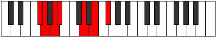
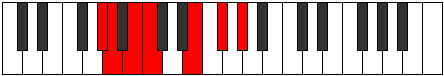
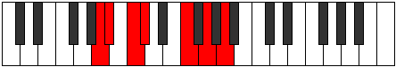
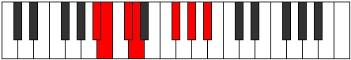
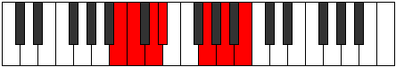

# Mode Katorimic

## Links

- [Documentation](index.md)
- [Scales Index](Scales.md)
- [Modes Index](Modes.md)
- [Chords Index](Chords.md)

## Parent Scale

[Rycrimic](ScaleRycrimic.md)

## Number

[1307](https://ianring.com/musictheory/scales/1307)

## Perfection

- 3 Perfect notes
- 3 Perfect notes

## Perfection Profile

[false true true false true false]

## Permutations

| Tonic | Notes | Signature | Illustration | Audio |
|-------|-------|-----------|--------------|-------|
| [C](ModeCNaturalKatorimic.md) | **C**, Db, Eb, **Fb**, G#, **A#**, **C** | C |  | [midi](https://github.com/edipermadi/music/blob/main/docs/ModeCNaturalKatorimic.mid?raw=true) |
| [C#](ModeCSharpKatorimic.md) | **C#**, D, E, **F**, G##, **A##**, **C#** | C |  | [midi](https://github.com/edipermadi/music/blob/main/docs/ModeCSharpKatorimic.mid?raw=true) |
| [Db](ModeDFlatKatorimic.md) | **Db**, Ebb, Fb, **Gbb**, A, **B**, **Db** | C |  | [midi](https://github.com/edipermadi/music/blob/main/docs/ModeDFlatKatorimic.mid?raw=true) |
| [D](ModeDNaturalKatorimic.md) | **D**, Eb, F, **Gb**, A#, **B#**, **D** | C |  | [midi](https://github.com/edipermadi/music/blob/main/docs/ModeDNaturalKatorimic.mid?raw=true) |
| [D#](ModeDSharpKatorimic.md) | **D#**, E, F#, **G**, A##, **B##**, **D#** | C |  | [midi](https://github.com/edipermadi/music/blob/main/docs/ModeDSharpKatorimic.mid?raw=true) |
| [Eb](ModeEFlatKatorimic.md) | **Eb**, Fb, Gb, **Abb**, B, **C#**, **Eb** | C |  | [midi](https://github.com/edipermadi/music/blob/main/docs/ModeEFlatKatorimic.mid?raw=true) |
| [E](ModeENaturalKatorimic.md) | **E**, F, G, **Ab**, B#, **C##**, **E** | C |  | [midi](https://github.com/edipermadi/music/blob/main/docs/ModeENaturalKatorimic.mid?raw=true) |
| [F](ModeFNaturalKatorimic.md) | **F**, Gb, Ab, **Bbb**, C#, **D#**, **F** | C |  | [midi](https://github.com/edipermadi/music/blob/main/docs/ModeFNaturalKatorimic.mid?raw=true) |
| [F#](ModeFSharpKatorimic.md) | **F#**, G, A, **Bb**, C##, **D##**, **F#** | C |  | [midi](https://github.com/edipermadi/music/blob/main/docs/ModeFSharpKatorimic.mid?raw=true) |
| [Gb](ModeGFlatKatorimic.md) | **Gb**, Abb, Bbb, **Cbb**, D, **E**, **Gb** | C |  | [midi](https://github.com/edipermadi/music/blob/main/docs/ModeGFlatKatorimic.mid?raw=true) |
| [G](ModeGNaturalKatorimic.md) | **G**, Ab, Bb, **Cb**, D#, **E#**, **G** | C |  | [midi](https://github.com/edipermadi/music/blob/main/docs/ModeGNaturalKatorimic.mid?raw=true) |
| [G#](ModeGSharpKatorimic.md) | **G#**, A, B, **C**, D##, **E##**, **G#** | C |  | [midi](https://github.com/edipermadi/music/blob/main/docs/ModeGSharpKatorimic.mid?raw=true) |
| [Ab](ModeAFlatKatorimic.md) | **Ab**, Bbb, Cb, **Dbb**, E, **F#**, **Ab** | C |  | [midi](https://github.com/edipermadi/music/blob/main/docs/ModeAFlatKatorimic.mid?raw=true) |
| [A](ModeANaturalKatorimic.md) | **A**, Bb, C, **Db**, E#, **F##**, **A** | C |  | [midi](https://github.com/edipermadi/music/blob/main/docs/ModeANaturalKatorimic.mid?raw=true) |
| [A#](ModeASharpKatorimic.md) | **A#**, B, C#, **D**, E##, **F###**, **A#** | C |  | [midi](https://github.com/edipermadi/music/blob/main/docs/ModeASharpKatorimic.mid?raw=true) |
| [Bb](ModeBFlatKatorimic.md) | **Bb**, Cb, Db, **Ebb**, F#, **G#**, **Bb** | C |  | [midi](https://github.com/edipermadi/music/blob/main/docs/ModeBFlatKatorimic.mid?raw=true) |
| [B](ModeBNaturalKatorimic.md) | **B**, C, D, **Eb**, F##, **G##**, **B** | C |  | [midi](https://github.com/edipermadi/music/blob/main/docs/ModeBNaturalKatorimic.mid?raw=true) |
