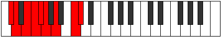

# Mode Katoryllic

## Links

- [Documentation](index.md)
- [Scales Index](Scales.md)
- [Modes Index](Modes.md)
- [Chords Index](Chords.md)

## Parent Scale

[Dagyllic](ScaleDagyllic.md)

## Number

[2427](https://ianring.com/musictheory/scales/2427)

## Perfection

- 6 Perfect notes
- 2 Perfect notes

## Interval Pattern

1, 2, 1, 1, 1, 2, 3, 1

## Perfection Profile

[false true false true true true true true]

## Permutations

| Tonic | Notes | Signature | Illustration | Audio |
|-------|-------|-----------|--------------|-------|
| [C](ModeCNaturalKatoryllic.md) | **C**, C#, **D#**, E, F, F#, G#, B, **C** | C |  | [midi](https://github.com/edipermadi/music/blob/main/docs/ModeCNaturalKatoryllic.mid?raw=true) |
| [C#](ModeCSharpKatoryllic.md) | **C#**, D, **E**, F, F#, G, A, C, **C#** | C |  | [midi](https://github.com/edipermadi/music/blob/main/docs/ModeCSharpKatoryllic.mid?raw=true) |
| [Db](ModeDFlatKatoryllic.md) | **Db**, D, **E**, F, Gb, G, A, C, **Db** | C |  | [midi](https://github.com/edipermadi/music/blob/main/docs/ModeDFlatKatoryllic.mid?raw=true) |
| [D](ModeDNaturalKatoryllic.md) | **D**, D#, **F**, F#, G, G#, A#, C#, **D** | C |  | [midi](https://github.com/edipermadi/music/blob/main/docs/ModeDNaturalKatoryllic.mid?raw=true) |
| [D#](ModeDSharpKatoryllic.md) | **D#**, E, **F#**, G, G#, A, B, D, **D#** | C |  | [midi](https://github.com/edipermadi/music/blob/main/docs/ModeDSharpKatoryllic.mid?raw=true) |
| [Eb](ModeEFlatKatoryllic.md) | **Eb**, E, **Gb**, G, Ab, A, B, D, **Eb** | C |  | [midi](https://github.com/edipermadi/music/blob/main/docs/ModeEFlatKatoryllic.mid?raw=true) |
| [E](ModeENaturalKatoryllic.md) | **E**, F, **G**, G#, A, A#, C, D#, **E** | C |  | [midi](https://github.com/edipermadi/music/blob/main/docs/ModeENaturalKatoryllic.mid?raw=true) |
| [F](ModeFNaturalKatoryllic.md) | **F**, F#, **G#**, A, A#, B, C#, E, **F** | C |  | [midi](https://github.com/edipermadi/music/blob/main/docs/ModeFNaturalKatoryllic.mid?raw=true) |
| [F#](ModeFSharpKatoryllic.md) | **F#**, G, **A**, A#, B, C, D, F, **F#** | C |  | [midi](https://github.com/edipermadi/music/blob/main/docs/ModeFSharpKatoryllic.mid?raw=true) |
| [Gb](ModeGFlatKatoryllic.md) | **Gb**, G, **A**, Bb, B, C, D, F, **Gb** | C |  | [midi](https://github.com/edipermadi/music/blob/main/docs/ModeGFlatKatoryllic.mid?raw=true) |
| [G](ModeGNaturalKatoryllic.md) | **G**, G#, **A#**, B, C, C#, D#, F#, **G** | C |  | [midi](https://github.com/edipermadi/music/blob/main/docs/ModeGNaturalKatoryllic.mid?raw=true) |
| [G#](ModeGSharpKatoryllic.md) | **G#**, A, **B**, C, C#, D, E, G, **G#** | C |  | [midi](https://github.com/edipermadi/music/blob/main/docs/ModeGSharpKatoryllic.mid?raw=true) |
| [Ab](ModeAFlatKatoryllic.md) | **Ab**, A, **B**, C, Db, D, E, G, **Ab** | C |  | [midi](https://github.com/edipermadi/music/blob/main/docs/ModeAFlatKatoryllic.mid?raw=true) |
| [A](ModeANaturalKatoryllic.md) | **A**, A#, **C**, C#, D, D#, F, G#, **A** | C |  | [midi](https://github.com/edipermadi/music/blob/main/docs/ModeANaturalKatoryllic.mid?raw=true) |
| [A#](ModeASharpKatoryllic.md) | **A#**, B, **C#**, D, D#, E, F#, A, **A#** | C |  | [midi](https://github.com/edipermadi/music/blob/main/docs/ModeASharpKatoryllic.mid?raw=true) |
| [Bb](ModeBFlatKatoryllic.md) | **Bb**, B, **Db**, D, Eb, E, Gb, A, **Bb** | C |  | [midi](https://github.com/edipermadi/music/blob/main/docs/ModeBFlatKatoryllic.mid?raw=true) |
| [B](ModeBNaturalKatoryllic.md) | **B**, C, **D**, D#, E, F, G, A#, **B** | C |  | [midi](https://github.com/edipermadi/music/blob/main/docs/ModeBNaturalKatoryllic.mid?raw=true) |
