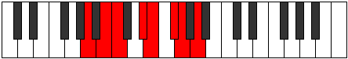

# Mode Katycrian

## Links

- [Documentation](index.md)
- [Scales Index](Scales.md)
- [Modes Index](Modes.md)
- [Chords Index](Chords.md)

## Parent Scale

[Bycrian](ScaleBycrian.md)

## Number

[1741](https://ianring.com/musictheory/scales/1741)

## Perfection

- 4 Perfect notes
- 3 Perfect notes

## Perfection Profile

[true true true false true false false]

## Permutations

| Tonic | Notes | Signature | Illustration | Audio |
|-------|-------|-----------|--------------|-------|
| [C](ModeCNaturalKatycrian.md) | C, D, Eb, **F#**, G, **A**, **Bb**, C | C |  | [midi](ModeCNaturalKatycrian.mid) [ogg](ModeCNaturalKatycrian.ogg) |
| [C#](ModeCSharpKatycrian.md) | C#, D#, E, **F##**, G#, **A#**, **B**, C# | C |  | [midi](ModeCSharpKatycrian.mid) [ogg](ModeCSharpKatycrian.ogg) |
| [Db](ModeDFlatKatycrian.md) | Db, Eb, Fb, **G**, Ab, **Bb**, **Cb**, Db | C |  | [midi](ModeDFlatKatycrian.mid) [ogg](ModeDFlatKatycrian.ogg) |
| [D](ModeDNaturalKatycrian.md) | D, E, F, **G#**, A, **B**, **C**, D | C |  | [midi](ModeDNaturalKatycrian.mid) [ogg](ModeDNaturalKatycrian.ogg) |
| [D#](ModeDSharpKatycrian.md) | D#, E#, F#, **G##**, A#, **B#**, **C#**, D# | C |  | [midi](ModeDSharpKatycrian.mid) [ogg](ModeDSharpKatycrian.ogg) |
| [Eb](ModeEFlatKatycrian.md) | Eb, F, Gb, **A**, Bb, **C**, **Db**, Eb | C |  | [midi](ModeEFlatKatycrian.mid) [ogg](ModeEFlatKatycrian.ogg) |
| [E](ModeENaturalKatycrian.md) | E, F#, G, **A#**, B, **C#**, **D**, E | C |  | [midi](ModeENaturalKatycrian.mid) [ogg](ModeENaturalKatycrian.ogg) |
| [F](ModeFNaturalKatycrian.md) | F, G, Ab, **B**, C, **D**, **Eb**, F | C |  | [midi](ModeFNaturalKatycrian.mid) [ogg](ModeFNaturalKatycrian.ogg) |
| [F#](ModeFSharpKatycrian.md) | F#, G#, A, **B#**, C#, **D#**, **E**, F# | C |  | [midi](ModeFSharpKatycrian.mid) [ogg](ModeFSharpKatycrian.ogg) |
| [Gb](ModeGFlatKatycrian.md) | Gb, Ab, Bbb, **C**, Db, **Eb**, **Fb**, Gb | C |  | [midi](ModeGFlatKatycrian.mid) [ogg](ModeGFlatKatycrian.ogg) |
| [G](ModeGNaturalKatycrian.md) | G, A, Bb, **C#**, D, **E**, **F**, G | C |  | [midi](ModeGNaturalKatycrian.mid) [ogg](ModeGNaturalKatycrian.ogg) |
| [G#](ModeGSharpKatycrian.md) | G#, A#, B, **C##**, D#, **E#**, **F#**, G# | C |  | [midi](ModeGSharpKatycrian.mid) [ogg](ModeGSharpKatycrian.ogg) |
| [Ab](ModeAFlatKatycrian.md) | Ab, Bb, Cb, **D**, Eb, **F**, **Gb**, Ab | C |  | [midi](ModeAFlatKatycrian.mid) [ogg](ModeAFlatKatycrian.ogg) |
| [A](ModeANaturalKatycrian.md) | A, B, C, **D#**, E, **F#**, **G**, A | C |  | [midi](ModeANaturalKatycrian.mid) [ogg](ModeANaturalKatycrian.ogg) |
| [A#](ModeASharpKatycrian.md) | A#, B#, C#, **D##**, E#, **F##**, **G#**, A# | C |  | [midi](ModeASharpKatycrian.mid) [ogg](ModeASharpKatycrian.ogg) |
| [Bb](ModeBFlatKatycrian.md) | Bb, C, Db, **E**, F, **G**, **Ab**, Bb | C |  | [midi](ModeBFlatKatycrian.mid) [ogg](ModeBFlatKatycrian.ogg) |
| [B](ModeBNaturalKatycrian.md) | B, C#, D, **E#**, F#, **G#**, **A**, B | C |  | [midi](ModeBNaturalKatycrian.mid) [ogg](ModeBNaturalKatycrian.ogg) |
