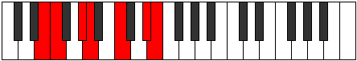

# Mode Katycrimic

## Links

- [Documentation](index.md)
- [Scales Index](Scales.md)
- [Modes Index](Modes.md)
- [Chords Index](Chords.md)

## Parent Scale

[Mydimic](ScaleMydimic.md)

## Number

[2355](https://ianring.com/musictheory/scales/2355)

## Perfection

- 3 Perfect notes
- 3 Perfect notes

## Perfection Profile

[false true true true false false]

## Permutations

| Tonic | Notes | Signature | Illustration | Audio |
|-------|-------|-----------|--------------|-------|
| [C](ModeCNaturalKatycrimic.md) | **C**, Db, E, F, **G#**, **A##**, **C** | C |  | [midi](ModeCNaturalKatycrimic.mid) [ogg](ModeCNaturalKatycrimic.ogg) |
| [C#](ModeCSharpKatycrimic.md) | **C#**, D, E#, F#, **G##**, **A###**, **C#** | C |  | [midi](ModeCSharpKatycrimic.mid) [ogg](ModeCSharpKatycrimic.ogg) |
| [Db](ModeDFlatKatycrimic.md) | **Db**, Ebb, F, Gb, **A**, **B#**, **Db** | C |  | [midi](ModeDFlatKatycrimic.mid) [ogg](ModeDFlatKatycrimic.ogg) |
| [D](ModeDNaturalKatycrimic.md) | **D**, Eb, F#, G, **A#**, **B##**, **D** | C |  | [midi](ModeDNaturalKatycrimic.mid) [ogg](ModeDNaturalKatycrimic.ogg) |
| [D#](ModeDSharpKatycrimic.md) | **D#**, E, F##, G#, **A##**, **B###**, **D#** | C |  | [midi](ModeDSharpKatycrimic.mid) [ogg](ModeDSharpKatycrimic.ogg) |
| [Eb](ModeEFlatKatycrimic.md) | **Eb**, Fb, G, Ab, **B**, **C##**, **Eb** | C |  | [midi](ModeEFlatKatycrimic.mid) [ogg](ModeEFlatKatycrimic.ogg) |
| [E](ModeENaturalKatycrimic.md) | **E**, F, G#, A, **B#**, **C###**, **E** | C |  | [midi](ModeENaturalKatycrimic.mid) [ogg](ModeENaturalKatycrimic.ogg) |
| [F](ModeFNaturalKatycrimic.md) | **F**, Gb, A, Bb, **C#**, **D##**, **F** | C |  | [midi](ModeFNaturalKatycrimic.mid) [ogg](ModeFNaturalKatycrimic.ogg) |
| [F#](ModeFSharpKatycrimic.md) | **F#**, G, A#, B, **C##**, **D###**, **F#** | C |  | [midi](ModeFSharpKatycrimic.mid) [ogg](ModeFSharpKatycrimic.ogg) |
| [Gb](ModeGFlatKatycrimic.md) | **Gb**, Abb, Bb, Cb, **D**, **E#**, **Gb** | C |  | [midi](ModeGFlatKatycrimic.mid) [ogg](ModeGFlatKatycrimic.ogg) |
| [G](ModeGNaturalKatycrimic.md) | **G**, Ab, B, C, **D#**, **E##**, **G** | C |  | [midi](ModeGNaturalKatycrimic.mid) [ogg](ModeGNaturalKatycrimic.ogg) |
| [G#](ModeGSharpKatycrimic.md) | **G#**, A, B#, C#, **D##**, **E###**, **G#** | C |  | [midi](ModeGSharpKatycrimic.mid) [ogg](ModeGSharpKatycrimic.ogg) |
| [Ab](ModeAFlatKatycrimic.md) | **Ab**, Bbb, C, Db, **E**, **F##**, **Ab** | C |  | [midi](ModeAFlatKatycrimic.mid) [ogg](ModeAFlatKatycrimic.ogg) |
| [A](ModeANaturalKatycrimic.md) | **A**, Bb, C#, D, **E#**, **F###**, **A** | C |  | [midi](ModeANaturalKatycrimic.mid) [ogg](ModeANaturalKatycrimic.ogg) |
| [A#](ModeASharpKatycrimic.md) | **A#**, B, C##, D#, **E##**, **Cbbb**, **A#** | C |  | [midi](ModeASharpKatycrimic.mid) [ogg](ModeASharpKatycrimic.ogg) |
| [Bb](ModeBFlatKatycrimic.md) | **Bb**, Cb, D, Eb, **F#**, **G##**, **Bb** | C |  | [midi](ModeBFlatKatycrimic.mid) [ogg](ModeBFlatKatycrimic.ogg) |
| [B](ModeBNaturalKatycrimic.md) | **B**, C, D#, E, **F##**, **G###**, **B** | C |  | [midi](ModeBNaturalKatycrimic.mid) [ogg](ModeBNaturalKatycrimic.ogg) |
