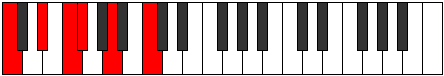
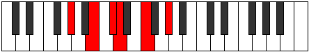
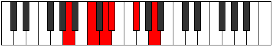

# Mode Katycritonic

## Links

- [Documentation](index.md)
- [Scales Index](Scales.md)
- [Modes Index](Modes.md)
- [Chords Index](Chords.md)

## Parent Scale

[Mixitonic](ScaleMixitonic.md)

## Number

[617](https://ianring.com/musictheory/scales/617)

## Perfection

- 1 Perfect notes
- 4 Perfect notes

## Perfection Profile

[false false true false false]

## Permutations

| Tonic | Notes | Signature | Illustration | Audio |
|-------|-------|-----------|--------------|-------|
| [C](ModeCNaturalKatycritonic.md) | **C**, **D#**, F, **F#**, **A**, **C** | C |  | [midi](ModeCNaturalKatycritonic.mid) [ogg](ModeCNaturalKatycritonic.ogg) |
| [C#](ModeCSharpKatycritonic.md) | **C#**, **E**, F#, **G**, **A#**, **C#** | C |  | [midi](ModeCSharpKatycritonic.mid) [ogg](ModeCSharpKatycritonic.ogg) |
| [Db](ModeDFlatKatycritonic.md) | **Db**, **E**, Gb, **G**, **Bb**, **Db** | C |  | [midi](ModeDFlatKatycritonic.mid) [ogg](ModeDFlatKatycritonic.ogg) |
| [D](ModeDNaturalKatycritonic.md) | **D**, **F**, G, **G#**, **B**, **D** | C |  | [midi](ModeDNaturalKatycritonic.mid) [ogg](ModeDNaturalKatycritonic.ogg) |
| [D#](ModeDSharpKatycritonic.md) | **D#**, **F#**, G#, **A**, **C**, **D#** | C |  | [midi](ModeDSharpKatycritonic.mid) [ogg](ModeDSharpKatycritonic.ogg) |
| [Eb](ModeEFlatKatycritonic.md) | **Eb**, **Gb**, Ab, **A**, **C**, **Eb** | C |  | [midi](ModeEFlatKatycritonic.mid) [ogg](ModeEFlatKatycritonic.ogg) |
| [E](ModeENaturalKatycritonic.md) | **E**, **G**, A, **A#**, **C#**, **E** | C |  | [midi](ModeENaturalKatycritonic.mid) [ogg](ModeENaturalKatycritonic.ogg) |
| [F](ModeFNaturalKatycritonic.md) | **F**, **G#**, A#, **B**, **D**, **F** | C |  | [midi](ModeFNaturalKatycritonic.mid) [ogg](ModeFNaturalKatycritonic.ogg) |
| [F#](ModeFSharpKatycritonic.md) | **F#**, **A**, B, **C**, **D#**, **F#** | C |  | [midi](ModeFSharpKatycritonic.mid) [ogg](ModeFSharpKatycritonic.ogg) |
| [Gb](ModeGFlatKatycritonic.md) | **Gb**, **A**, B, **C**, **Eb**, **Gb** | C |  | [midi](ModeGFlatKatycritonic.mid) [ogg](ModeGFlatKatycritonic.ogg) |
| [G](ModeGNaturalKatycritonic.md) | **G**, **A#**, C, **C#**, **E**, **G** | C |  | [midi](ModeGNaturalKatycritonic.mid) [ogg](ModeGNaturalKatycritonic.ogg) |
| [G#](ModeGSharpKatycritonic.md) | **G#**, **B**, C#, **D**, **F**, **G#** | C |  | [midi](ModeGSharpKatycritonic.mid) [ogg](ModeGSharpKatycritonic.ogg) |
| [Ab](ModeAFlatKatycritonic.md) | **Ab**, **B**, Db, **D**, **F**, **Ab** | C |  | [midi](ModeAFlatKatycritonic.mid) [ogg](ModeAFlatKatycritonic.ogg) |
| [A](ModeANaturalKatycritonic.md) | **A**, **C**, D, **D#**, **F#**, **A** | C |  | [midi](ModeANaturalKatycritonic.mid) [ogg](ModeANaturalKatycritonic.ogg) |
| [A#](ModeASharpKatycritonic.md) | **A#**, **C#**, D#, **E**, **G**, **A#** | C |  | [midi](ModeASharpKatycritonic.mid) [ogg](ModeASharpKatycritonic.ogg) |
| [Bb](ModeBFlatKatycritonic.md) | **Bb**, **Db**, Eb, **E**, **G**, **Bb** | C |  | [midi](ModeBFlatKatycritonic.mid) [ogg](ModeBFlatKatycritonic.ogg) |
| [B](ModeBNaturalKatycritonic.md) | **B**, **D**, E, **F**, **G#**, **B** | C |  | [midi](ModeBNaturalKatycritonic.mid) [ogg](ModeBNaturalKatycritonic.ogg) |
