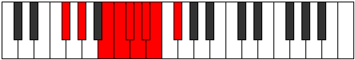

# Mode Katycryllic

## Links

- [Documentation](index.md)
- [Scales Index](Scales.md)
- [Modes Index](Modes.md)
- [Chords Index](Chords.md)

## Parent Scale

[Kataryllic](ScaleKataryllic.md)

## Number

[2021](https://ianring.com/musictheory/scales/2021)

## Perfection

- 5 Perfect notes
- 3 Perfect notes

## Perfection Profile

[true true true false true false false true]

## Permutations

| Tonic | Notes | Signature | Illustration | Audio |
|-------|-------|-----------|--------------|-------|
| [C](ModeCNaturalKatycryllic.md) | C, D, F, **F#**, G, **G#**, **A**, A#, C | C |  | [midi](ModeCNaturalKatycryllic.mid) [ogg](ModeCNaturalKatycryllic.ogg) |
| [C#](ModeCSharpKatycryllic.md) | C#, D#, F#, **G**, G#, **A**, **A#**, B, C# | C |  | [midi](ModeCSharpKatycryllic.mid) [ogg](ModeCSharpKatycryllic.ogg) |
| [Db](ModeDFlatKatycryllic.md) | Db, Eb, Gb, **G**, Ab, **A**, **Bb**, B, Db | C |  | [midi](ModeDFlatKatycryllic.mid) [ogg](ModeDFlatKatycryllic.ogg) |
| [D](ModeDNaturalKatycryllic.md) | D, E, G, **G#**, A, **A#**, **B**, C, D | C |  | [midi](ModeDNaturalKatycryllic.mid) [ogg](ModeDNaturalKatycryllic.ogg) |
| [D#](ModeDSharpKatycryllic.md) | D#, F, G#, **A**, A#, **B**, **C**, C#, D# | C |  | [midi](ModeDSharpKatycryllic.mid) [ogg](ModeDSharpKatycryllic.ogg) |
| [Eb](ModeEFlatKatycryllic.md) | Eb, F, Ab, **A**, Bb, **B**, **C**, Db, Eb | C |  | [midi](ModeEFlatKatycryllic.mid) [ogg](ModeEFlatKatycryllic.ogg) |
| [E](ModeENaturalKatycryllic.md) | E, F#, A, **A#**, B, **C**, **C#**, D, E | C |  | [midi](ModeENaturalKatycryllic.mid) [ogg](ModeENaturalKatycryllic.ogg) |
| [F](ModeFNaturalKatycryllic.md) | F, G, A#, **B**, C, **C#**, **D**, D#, F | C |  | [midi](ModeFNaturalKatycryllic.mid) [ogg](ModeFNaturalKatycryllic.ogg) |
| [F#](ModeFSharpKatycryllic.md) | F#, G#, B, **C**, C#, **D**, **D#**, E, F# | C |  | [midi](ModeFSharpKatycryllic.mid) [ogg](ModeFSharpKatycryllic.ogg) |
| [Gb](ModeGFlatKatycryllic.md) | Gb, Ab, B, **C**, Db, **D**, **Eb**, E, Gb | C |  | [midi](ModeGFlatKatycryllic.mid) [ogg](ModeGFlatKatycryllic.ogg) |
| [G](ModeGNaturalKatycryllic.md) | G, A, C, **C#**, D, **D#**, **E**, F, G | C |  | [midi](ModeGNaturalKatycryllic.mid) [ogg](ModeGNaturalKatycryllic.ogg) |
| [G#](ModeGSharpKatycryllic.md) | G#, A#, C#, **D**, D#, **E**, **F**, F#, G# | C |  | [midi](ModeGSharpKatycryllic.mid) [ogg](ModeGSharpKatycryllic.ogg) |
| [Ab](ModeAFlatKatycryllic.md) | Ab, Bb, Db, **D**, Eb, **E**, **F**, Gb, Ab | C |  | [midi](ModeAFlatKatycryllic.mid) [ogg](ModeAFlatKatycryllic.ogg) |
| [A](ModeANaturalKatycryllic.md) | A, B, D, **D#**, E, **F**, **F#**, G, A | C |  | [midi](ModeANaturalKatycryllic.mid) [ogg](ModeANaturalKatycryllic.ogg) |
| [A#](ModeASharpKatycryllic.md) | A#, C, D#, **E**, F, **F#**, **G**, G#, A# | C |  | [midi](ModeASharpKatycryllic.mid) [ogg](ModeASharpKatycryllic.ogg) |
| [Bb](ModeBFlatKatycryllic.md) | Bb, C, Eb, **E**, F, **Gb**, **G**, Ab, Bb | C |  | [midi](ModeBFlatKatycryllic.mid) [ogg](ModeBFlatKatycryllic.ogg) |
| [B](ModeBNaturalKatycryllic.md) | B, C#, E, **F**, F#, **G**, **G#**, A, B | C |  | [midi](ModeBNaturalKatycryllic.mid) [ogg](ModeBNaturalKatycryllic.ogg) |
