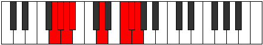

# Mode Katydian

## Links

- [Documentation](index.md)
- [Scales Index](Scales.md)
- [Modes Index](Modes.md)
- [Chords Index](Chords.md)

## Parent Scale

[Thadian](ScaleThadian.md)

## Number

[3215](https://ianring.com/musictheory/scales/3215)

## Perfection

- 3 Perfect notes
- 4 Perfect notes

## Perfection Profile

[true false false true true false false]

## Permutations

| Tonic | Notes | Signature | Illustration | Audio |
|-------|-------|-----------|--------------|-------|
| [C](ModeCNaturalKatydian.md) | C, **Db**, **Ebb**, Fbb, G, **A#**, **B**, C | C |  | [midi](ModeCNaturalKatydian.mid) [ogg](ModeCNaturalKatydian.ogg) |
| [C#](ModeCSharpKatydian.md) | C#, **D**, **Eb**, Fb, G#, **A##**, **B#**, C# | C |  | [midi](ModeCSharpKatydian.mid) [ogg](ModeCSharpKatydian.ogg) |
| [Db](ModeDFlatKatydian.md) | Db, **Ebb**, **Fbb**, Gbbb, Ab, **B**, **C**, Db | C |  | [midi](ModeDFlatKatydian.mid) [ogg](ModeDFlatKatydian.ogg) |
| [D](ModeDNaturalKatydian.md) | D, **Eb**, **Fb**, Gbb, A, **B#**, **C#**, D | C |  | [midi](ModeDNaturalKatydian.mid) [ogg](ModeDNaturalKatydian.ogg) |
| [D#](ModeDSharpKatydian.md) | D#, **E**, **F**, Gb, A#, **B##**, **C##**, D# | C |  | [midi](ModeDSharpKatydian.mid) [ogg](ModeDSharpKatydian.ogg) |
| [Eb](ModeEFlatKatydian.md) | Eb, **Fb**, **Gbb**, Abbb, Bb, **C#**, **D**, Eb | C |  | [midi](ModeEFlatKatydian.mid) [ogg](ModeEFlatKatydian.ogg) |
| [E](ModeENaturalKatydian.md) | E, **F**, **Gb**, Abb, B, **C##**, **D#**, E | C |  | [midi](ModeENaturalKatydian.mid) [ogg](ModeENaturalKatydian.ogg) |
| [F](ModeFNaturalKatydian.md) | F, **Gb**, **Abb**, Bbbb, C, **D#**, **E**, F | C |  | [midi](ModeFNaturalKatydian.mid) [ogg](ModeFNaturalKatydian.ogg) |
| [F#](ModeFSharpKatydian.md) | F#, **G**, **Ab**, Bbb, C#, **D##**, **E#**, F# | C |  | [midi](ModeFSharpKatydian.mid) [ogg](ModeFSharpKatydian.ogg) |
| [Gb](ModeGFlatKatydian.md) | Gb, **Abb**, **Bbbb**, Cbbb, Db, **E**, **F**, Gb | C |  | [midi](ModeGFlatKatydian.mid) [ogg](ModeGFlatKatydian.ogg) |
| [G](ModeGNaturalKatydian.md) | G, **Ab**, **Bbb**, Cbb, D, **E#**, **F#**, G | C |  | [midi](ModeGNaturalKatydian.mid) [ogg](ModeGNaturalKatydian.ogg) |
| [G#](ModeGSharpKatydian.md) | G#, **A**, **Bb**, Cb, D#, **E##**, **F##**, G# | C |  | [midi](ModeGSharpKatydian.mid) [ogg](ModeGSharpKatydian.ogg) |
| [Ab](ModeAFlatKatydian.md) | Ab, **Bbb**, **Cbb**, Dbbb, Eb, **F#**, **G**, Ab | C |  | [midi](ModeAFlatKatydian.mid) [ogg](ModeAFlatKatydian.ogg) |
| [A](ModeANaturalKatydian.md) | A, **Bb**, **Cb**, Dbb, E, **F##**, **G#**, A | C |  | [midi](ModeANaturalKatydian.mid) [ogg](ModeANaturalKatydian.ogg) |
| [A#](ModeASharpKatydian.md) | A#, **B**, **C**, Db, E#, **F###**, **G##**, A# | C |  | [midi](ModeASharpKatydian.mid) [ogg](ModeASharpKatydian.ogg) |
| [Bb](ModeBFlatKatydian.md) | Bb, **Cb**, **Dbb**, Ebbb, F, **G#**, **A**, Bb | C |  | [midi](ModeBFlatKatydian.mid) [ogg](ModeBFlatKatydian.ogg) |
| [B](ModeBNaturalKatydian.md) | B, **C**, **Db**, Ebb, F#, **G##**, **A#**, B | C |  | [midi](ModeBNaturalKatydian.mid) [ogg](ModeBNaturalKatydian.ogg) |
