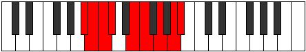

# Mode Katydyllic

## Links

- [Documentation](index.md)
- [Scales Index](Scales.md)
- [Modes Index](Modes.md)
- [Chords Index](Chords.md)

## Parent Scale

[Aeolothyllic](ScaleAeolothyllic.md)

## Number

[2767](https://ianring.com/musictheory/scales/2767)

## Perfection

- 5 Perfect notes
- 3 Perfect notes

## Perfection Profile

[true false true false true true false true]

## Permutations

| Tonic | Notes | Signature | Illustration | Audio |
|-------|-------|-----------|--------------|-------|
| [C](ModeCNaturalKatydyllic.md) | C, **C#**, D, **D#**, F#, G, **A**, B, C | C |  | [midi](ModeCNaturalKatydyllic.mid) [ogg](ModeCNaturalKatydyllic.ogg) |
| [C#](ModeCSharpKatydyllic.md) | C#, **D**, D#, **E**, G, G#, **A#**, C, C# | C |  | [midi](ModeCSharpKatydyllic.mid) [ogg](ModeCSharpKatydyllic.ogg) |
| [Db](ModeDFlatKatydyllic.md) | Db, **D**, Eb, **E**, G, Ab, **Bb**, C, Db | C |  | [midi](ModeDFlatKatydyllic.mid) [ogg](ModeDFlatKatydyllic.ogg) |
| [D](ModeDNaturalKatydyllic.md) | D, **D#**, E, **F**, G#, A, **B**, C#, D | C |  | [midi](ModeDNaturalKatydyllic.mid) [ogg](ModeDNaturalKatydyllic.ogg) |
| [D#](ModeDSharpKatydyllic.md) | D#, **E**, F, **F#**, A, A#, **C**, D, D# | C |  | [midi](ModeDSharpKatydyllic.mid) [ogg](ModeDSharpKatydyllic.ogg) |
| [Eb](ModeEFlatKatydyllic.md) | Eb, **E**, F, **Gb**, A, Bb, **C**, D, Eb | C |  | [midi](ModeEFlatKatydyllic.mid) [ogg](ModeEFlatKatydyllic.ogg) |
| [E](ModeENaturalKatydyllic.md) | E, **F**, F#, **G**, A#, B, **C#**, D#, E | C |  | [midi](ModeENaturalKatydyllic.mid) [ogg](ModeENaturalKatydyllic.ogg) |
| [F](ModeFNaturalKatydyllic.md) | F, **F#**, G, **G#**, B, C, **D**, E, F | C |  | [midi](ModeFNaturalKatydyllic.mid) [ogg](ModeFNaturalKatydyllic.ogg) |
| [F#](ModeFSharpKatydyllic.md) | F#, **G**, G#, **A**, C, C#, **D#**, F, F# | C |  | [midi](ModeFSharpKatydyllic.mid) [ogg](ModeFSharpKatydyllic.ogg) |
| [Gb](ModeGFlatKatydyllic.md) | Gb, **G**, Ab, **A**, C, Db, **Eb**, F, Gb | C |  | [midi](ModeGFlatKatydyllic.mid) [ogg](ModeGFlatKatydyllic.ogg) |
| [G](ModeGNaturalKatydyllic.md) | G, **G#**, A, **A#**, C#, D, **E**, F#, G | C |  | [midi](ModeGNaturalKatydyllic.mid) [ogg](ModeGNaturalKatydyllic.ogg) |
| [G#](ModeGSharpKatydyllic.md) | G#, **A**, A#, **B**, D, D#, **F**, G, G# | C |  | [midi](ModeGSharpKatydyllic.mid) [ogg](ModeGSharpKatydyllic.ogg) |
| [Ab](ModeAFlatKatydyllic.md) | Ab, **A**, Bb, **B**, D, Eb, **F**, G, Ab | C |  | [midi](ModeAFlatKatydyllic.mid) [ogg](ModeAFlatKatydyllic.ogg) |
| [A](ModeANaturalKatydyllic.md) | A, **A#**, B, **C**, D#, E, **F#**, G#, A | C |  | [midi](ModeANaturalKatydyllic.mid) [ogg](ModeANaturalKatydyllic.ogg) |
| [A#](ModeASharpKatydyllic.md) | A#, **B**, C, **C#**, E, F, **G**, A, A# | C |  | [midi](ModeASharpKatydyllic.mid) [ogg](ModeASharpKatydyllic.ogg) |
| [Bb](ModeBFlatKatydyllic.md) | Bb, **B**, C, **Db**, E, F, **G**, A, Bb | C |  | [midi](ModeBFlatKatydyllic.mid) [ogg](ModeBFlatKatydyllic.ogg) |
| [B](ModeBNaturalKatydyllic.md) | B, **C**, C#, **D**, F, F#, **G#**, A#, B | C |  | [midi](ModeBNaturalKatydyllic.mid) [ogg](ModeBNaturalKatydyllic.ogg) |
