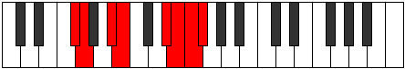

# Mode Katygian

## Links

- [Documentation](index.md)
- [Scales Index](Scales.md)
- [Modes Index](Modes.md)
- [Chords Index](Chords.md)

## Parent Scale

[Thycrian](ScaleThycrian.md)

## Number

[3635](https://ianring.com/musictheory/scales/3635)

## Perfection

- 4 Perfect notes
- 3 Perfect notes

## Perfection Profile

[false false true true true true false]

## Permutations

| Tonic | Notes | Signature | Illustration | Audio |
|-------|-------|-----------|--------------|-------|
| [C](ModeCNaturalKatygian.md) | **C**, **Db**, E, F, G##, A#, **B**, **C** | C |  | [midi](ModeCNaturalKatygian.mid) [ogg](ModeCNaturalKatygian.ogg) |
| [C#](ModeCSharpKatygian.md) | **C#**, **D**, E#, F#, G###, A##, **B#**, **C#** | C |  | [midi](ModeCSharpKatygian.mid) [ogg](ModeCSharpKatygian.ogg) |
| [Db](ModeDFlatKatygian.md) | **Db**, **Ebb**, F, Gb, A#, B, **C**, **Db** | C |  | [midi](ModeDFlatKatygian.mid) [ogg](ModeDFlatKatygian.ogg) |
| [D](ModeDNaturalKatygian.md) | **D**, **Eb**, F#, G, A##, B#, **C#**, **D** | C |  | [midi](ModeDNaturalKatygian.mid) [ogg](ModeDNaturalKatygian.ogg) |
| [D#](ModeDSharpKatygian.md) | **D#**, **E**, F##, G#, A###, B##, **C##**, **D#** | C |  | [midi](ModeDSharpKatygian.mid) [ogg](ModeDSharpKatygian.ogg) |
| [Eb](ModeEFlatKatygian.md) | **Eb**, **Fb**, G, Ab, B#, C#, **D**, **Eb** | C |  | [midi](ModeEFlatKatygian.mid) [ogg](ModeEFlatKatygian.ogg) |
| [E](ModeENaturalKatygian.md) | **E**, **F**, G#, A, B##, C##, **D#**, **E** | C |  | [midi](ModeENaturalKatygian.mid) [ogg](ModeENaturalKatygian.ogg) |
| [F](ModeFNaturalKatygian.md) | **F**, **Gb**, A, Bb, C##, D#, **E**, **F** | C |  | [midi](ModeFNaturalKatygian.mid) [ogg](ModeFNaturalKatygian.ogg) |
| [F#](ModeFSharpKatygian.md) | **F#**, **G**, A#, B, C###, D##, **E#**, **F#** | C |  | [midi](ModeFSharpKatygian.mid) [ogg](ModeFSharpKatygian.ogg) |
| [Gb](ModeGFlatKatygian.md) | **Gb**, **Abb**, Bb, Cb, D#, E, **F**, **Gb** | C |  | [midi](ModeGFlatKatygian.mid) [ogg](ModeGFlatKatygian.ogg) |
| [G](ModeGNaturalKatygian.md) | **G**, **Ab**, B, C, D##, E#, **F#**, **G** | C |  | [midi](ModeGNaturalKatygian.mid) [ogg](ModeGNaturalKatygian.ogg) |
| [G#](ModeGSharpKatygian.md) | **G#**, **A**, B#, C#, D###, E##, **F##**, **G#** | C |  | [midi](ModeGSharpKatygian.mid) [ogg](ModeGSharpKatygian.ogg) |
| [Ab](ModeAFlatKatygian.md) | **Ab**, **Bbb**, C, Db, E#, F#, **G**, **Ab** | C |  | [midi](ModeAFlatKatygian.mid) [ogg](ModeAFlatKatygian.ogg) |
| [A](ModeANaturalKatygian.md) | **A**, **Bb**, C#, D, E##, F##, **G#**, **A** | C |  | [midi](ModeANaturalKatygian.mid) [ogg](ModeANaturalKatygian.ogg) |
| [A#](ModeASharpKatygian.md) | **A#**, **B**, C##, D#, E###, F###, **G##**, **A#** | C |  | [midi](ModeASharpKatygian.mid) [ogg](ModeASharpKatygian.ogg) |
| [Bb](ModeBFlatKatygian.md) | **Bb**, **Cb**, D, Eb, F##, G#, **A**, **Bb** | C |  | [midi](ModeBFlatKatygian.mid) [ogg](ModeBFlatKatygian.ogg) |
| [B](ModeBNaturalKatygian.md) | **B**, **C**, D#, E, F###, G##, **A#**, **B** | C |  | [midi](ModeBNaturalKatygian.mid) [ogg](ModeBNaturalKatygian.ogg) |
