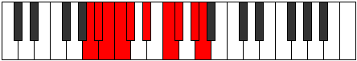

# Mode Katygic

## Links

- [Documentation](index.md)
- [Scales Index](Scales.md)
- [Modes Index](Modes.md)
- [Chords Index](Chords.md)

## Parent Scale

[Bagygic](ScaleBagygic.md)

## Number

[2911](https://ianring.com/musictheory/scales/2911)

## Perfection

- 7 Perfect notes
- 2 Perfect notes

## Perfection Profile

[false true true false true true true true true]

## Permutations

| Tonic | Notes | Signature | Illustration | Audio |
|-------|-------|-----------|--------------|-------|
| [C](ModeCNaturalKatygic.md) | **C**, C#, D, **D#**, E, F#, G#, A, B, **C** | C |  | [midi](https://github.com/edipermadi/music/blob/main/docs/ModeCNaturalKatygic.mid?raw=true) |
| [C#](ModeCSharpKatygic.md) | **C#**, D, D#, **E**, F, G, A, A#, C, **C#** | C |  | [midi](https://github.com/edipermadi/music/blob/main/docs/ModeCSharpKatygic.mid?raw=true) |
| [Db](ModeDFlatKatygic.md) | **Db**, D, Eb, **E**, F, G, A, Bb, C, **Db** | C |  | [midi](https://github.com/edipermadi/music/blob/main/docs/ModeDFlatKatygic.mid?raw=true) |
| [D](ModeDNaturalKatygic.md) | **D**, D#, E, **F**, F#, G#, A#, B, C#, **D** | C |  | [midi](https://github.com/edipermadi/music/blob/main/docs/ModeDNaturalKatygic.mid?raw=true) |
| [D#](ModeDSharpKatygic.md) | **D#**, E, F, **F#**, G, A, B, C, D, **D#** | C |  | [midi](https://github.com/edipermadi/music/blob/main/docs/ModeDSharpKatygic.mid?raw=true) |
| [Eb](ModeEFlatKatygic.md) | **Eb**, E, F, **Gb**, G, A, B, C, D, **Eb** | C |  | [midi](https://github.com/edipermadi/music/blob/main/docs/ModeEFlatKatygic.mid?raw=true) |
| [E](ModeENaturalKatygic.md) | **E**, F, F#, **G**, G#, A#, C, C#, D#, **E** | C |  | [midi](https://github.com/edipermadi/music/blob/main/docs/ModeENaturalKatygic.mid?raw=true) |
| [F](ModeFNaturalKatygic.md) | **F**, F#, G, **G#**, A, B, C#, D, E, **F** | C |  | [midi](https://github.com/edipermadi/music/blob/main/docs/ModeFNaturalKatygic.mid?raw=true) |
| [F#](ModeFSharpKatygic.md) | **F#**, G, G#, **A**, A#, C, D, D#, F, **F#** | C |  | [midi](https://github.com/edipermadi/music/blob/main/docs/ModeFSharpKatygic.mid?raw=true) |
| [Gb](ModeGFlatKatygic.md) | **Gb**, G, Ab, **A**, Bb, C, D, Eb, F, **Gb** | C |  | [midi](https://github.com/edipermadi/music/blob/main/docs/ModeGFlatKatygic.mid?raw=true) |
| [G](ModeGNaturalKatygic.md) | **G**, G#, A, **A#**, B, C#, D#, E, F#, **G** | C |  | [midi](https://github.com/edipermadi/music/blob/main/docs/ModeGNaturalKatygic.mid?raw=true) |
| [G#](ModeGSharpKatygic.md) | **G#**, A, A#, **B**, C, D, E, F, G, **G#** | C |  | [midi](https://github.com/edipermadi/music/blob/main/docs/ModeGSharpKatygic.mid?raw=true) |
| [Ab](ModeAFlatKatygic.md) | **Ab**, A, Bb, **B**, C, D, E, F, G, **Ab** | C |  | [midi](https://github.com/edipermadi/music/blob/main/docs/ModeAFlatKatygic.mid?raw=true) |
| [A](ModeANaturalKatygic.md) | **A**, A#, B, **C**, C#, D#, F, F#, G#, **A** | C |  | [midi](https://github.com/edipermadi/music/blob/main/docs/ModeANaturalKatygic.mid?raw=true) |
| [A#](ModeASharpKatygic.md) | **A#**, B, C, **C#**, D, E, F#, G, A, **A#** | C |  | [midi](https://github.com/edipermadi/music/blob/main/docs/ModeASharpKatygic.mid?raw=true) |
| [Bb](ModeBFlatKatygic.md) | **Bb**, B, C, **Db**, D, E, Gb, G, A, **Bb** | C |  | [midi](https://github.com/edipermadi/music/blob/main/docs/ModeBFlatKatygic.mid?raw=true) |
| [B](ModeBNaturalKatygic.md) | **B**, C, C#, **D**, D#, F, G, G#, A#, **B** | C |  | [midi](https://github.com/edipermadi/music/blob/main/docs/ModeBNaturalKatygic.mid?raw=true) |
