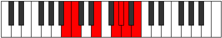

# Mode Katygimic

## Links

- [Documentation](README.md)
- [Scales Index](Scales.md)
- [Modes Index](Modes.md)
- [Chords Index](Chords.md)

## Parent Scale

[Bygimic](ScaleBygimic.md)

## Number

[1827](https://ianring.com/musictheory/scales/1827)

## Luminosity

4

## Transposition

1, 4, 3, 1, 1, 2

## Chord Pattern

III

## Perfection

- 3 Perfect notes
- 3 Perfect notes

## Perfection Profile

false, true, true, false, false, true

## Permutations

| Tonic | Notes | Signature | Illustration | Audio |
|-------|-------|-----------|--------------|-------|
| [C](ModeCNaturalKatygimic.md) | **C**, Db, E#, **F###**, **G##**, A#, **C** | C |  | [midi](https://github.com/edipermadi/music/blob/main/docs/ModeCNaturalKatygimic.mid?raw=true) |
| [C#](ModeCSharpKatygimic.md) | **C#**, D, E##, **Cbbb**, **Cbb**, Dbbb, **C#** | C |  | [midi](https://github.com/edipermadi/music/blob/main/docs/ModeCSharpKatygimic.mid?raw=true) |
| [Db](ModeDFlatKatygimic.md) | **Db**, Ebb, F#, **G##**, **A#**, B, **Db** | C |  | [midi](https://github.com/edipermadi/music/blob/main/docs/ModeDFlatKatygimic.mid?raw=true) |
| [D](ModeDNaturalKatygimic.md) | **D**, Eb, F##, **G###**, **A##**, B#, **D** | C |  | [midi](https://github.com/edipermadi/music/blob/main/docs/ModeDNaturalKatygimic.mid?raw=true) |
| [D#](ModeDSharpKatygimic.md) | **D#**, E, F###, **Cb**, **Dbb**, Ebbb, **D#** | C |  | [midi](https://github.com/edipermadi/music/blob/main/docs/ModeDSharpKatygimic.mid?raw=true) |
| [Eb](ModeEFlatKatygimic.md) | **Eb**, Fb, G#, **A##**, **B#**, C#, **Eb** | C |  | [midi](https://github.com/edipermadi/music/blob/main/docs/ModeEFlatKatygimic.mid?raw=true) |
| [E](ModeENaturalKatygimic.md) | **E**, F, G##, **A###**, **B##**, C##, **E** | C |  | [midi](https://github.com/edipermadi/music/blob/main/docs/ModeENaturalKatygimic.mid?raw=true) |
| [F](ModeFNaturalKatygimic.md) | **F**, Gb, A#, **B##**, **C##**, D#, **F** | C |  | [midi](https://github.com/edipermadi/music/blob/main/docs/ModeFNaturalKatygimic.mid?raw=true) |
| [F#](ModeFSharpKatygimic.md) | **F#**, G, A##, **B###**, **C###**, D##, **F#** | C |  | [midi](https://github.com/edipermadi/music/blob/main/docs/ModeFSharpKatygimic.mid?raw=true) |
| [Gb](ModeGFlatKatygimic.md) | **Gb**, Abb, B, **C##**, **D#**, E, **Gb** | C |  | [midi](https://github.com/edipermadi/music/blob/main/docs/ModeGFlatKatygimic.mid?raw=true) |
| [G](ModeGNaturalKatygimic.md) | **G**, Ab, B#, **C###**, **D##**, E#, **G** | C |  | [midi](https://github.com/edipermadi/music/blob/main/docs/ModeGNaturalKatygimic.mid?raw=true) |
| [G#](ModeGSharpKatygimic.md) | **G#**, A, B##, **D##**, **E#**, F#, **G#** | C |  | [midi](https://github.com/edipermadi/music/blob/main/docs/ModeGSharpKatygimic.mid?raw=true) |
| [Ab](ModeAFlatKatygimic.md) | **Ab**, Bbb, C#, **D##**, **E#**, F#, **Ab** | C |  | [midi](https://github.com/edipermadi/music/blob/main/docs/ModeAFlatKatygimic.mid?raw=true) |
| [A](ModeANaturalKatygimic.md) | **A**, Bb, C##, **D###**, **E##**, F##, **A** | C |  | [midi](https://github.com/edipermadi/music/blob/main/docs/ModeANaturalKatygimic.mid?raw=true) |
| [A#](ModeASharpKatygimic.md) | **A#**, B, C###, **E##**, **F##**, G#, **A#** | C |  | [midi](https://github.com/edipermadi/music/blob/main/docs/ModeASharpKatygimic.mid?raw=true) |
| [Bb](ModeBFlatKatygimic.md) | **Bb**, Cb, D#, **E##**, **F##**, G#, **Bb** | C |  | [midi](https://github.com/edipermadi/music/blob/main/docs/ModeBFlatKatygimic.mid?raw=true) |
| [B](ModeBNaturalKatygimic.md) | **B**, C, D##, **E###**, **F###**, G##, **B** | C |  | [midi](https://github.com/edipermadi/music/blob/main/docs/ModeBNaturalKatygimic.mid?raw=true) |
