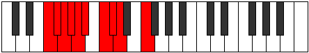

# Mode Katylygic

## Links

- [Documentation](index.md)
- [Scales Index](Scales.md)
- [Modes Index](Modes.md)
- [Chords Index](Chords.md)

## Parent Scale

[Loptygic](ScaleLoptygic.md)

## Number

[959](https://ianring.com/musictheory/scales/959)

## Perfection

- 7 Perfect notes
- 2 Perfect notes

## Perfection Profile

[true true true false false true true true true]

## Permutations

| Tonic | Notes | Signature | Illustration | Audio |
|-------|-------|-----------|--------------|-------|
| [C](ModeCNaturalKatylygic.md) | C, C#, D, **D#**, **E**, F, G, G#, A, C | C |  | [midi](ModeCNaturalKatylygic.mid) [ogg](ModeCNaturalKatylygic.ogg) |
| [C#](ModeCSharpKatylygic.md) | C#, D, D#, **E**, **F**, F#, G#, A, A#, C# | C |  | [midi](ModeCSharpKatylygic.mid) [ogg](ModeCSharpKatylygic.ogg) |
| [Db](ModeDFlatKatylygic.md) | Db, D, Eb, **E**, **F**, Gb, Ab, A, Bb, Db | C |  | [midi](ModeDFlatKatylygic.mid) [ogg](ModeDFlatKatylygic.ogg) |
| [D](ModeDNaturalKatylygic.md) | D, D#, E, **F**, **F#**, G, A, A#, B, D | C |  | [midi](ModeDNaturalKatylygic.mid) [ogg](ModeDNaturalKatylygic.ogg) |
| [D#](ModeDSharpKatylygic.md) | D#, E, F, **F#**, **G**, G#, A#, B, C, D# | C |  | [midi](ModeDSharpKatylygic.mid) [ogg](ModeDSharpKatylygic.ogg) |
| [Eb](ModeEFlatKatylygic.md) | Eb, E, F, **Gb**, **G**, Ab, Bb, B, C, Eb | C |  | [midi](ModeEFlatKatylygic.mid) [ogg](ModeEFlatKatylygic.ogg) |
| [E](ModeENaturalKatylygic.md) | E, F, F#, **G**, **G#**, A, B, C, C#, E | C |  | [midi](ModeENaturalKatylygic.mid) [ogg](ModeENaturalKatylygic.ogg) |
| [F](ModeFNaturalKatylygic.md) | F, F#, G, **G#**, **A**, A#, C, C#, D, F | C |  | [midi](ModeFNaturalKatylygic.mid) [ogg](ModeFNaturalKatylygic.ogg) |
| [F#](ModeFSharpKatylygic.md) | F#, G, G#, **A**, **A#**, B, C#, D, D#, F# | C |  | [midi](ModeFSharpKatylygic.mid) [ogg](ModeFSharpKatylygic.ogg) |
| [Gb](ModeGFlatKatylygic.md) | Gb, G, Ab, **A**, **Bb**, B, Db, D, Eb, Gb | C |  | [midi](ModeGFlatKatylygic.mid) [ogg](ModeGFlatKatylygic.ogg) |
| [G](ModeGNaturalKatylygic.md) | G, G#, A, **A#**, **B**, C, D, D#, E, G | C |  | [midi](ModeGNaturalKatylygic.mid) [ogg](ModeGNaturalKatylygic.ogg) |
| [G#](ModeGSharpKatylygic.md) | G#, A, A#, **B**, **C**, C#, D#, E, F, G# | C |  | [midi](ModeGSharpKatylygic.mid) [ogg](ModeGSharpKatylygic.ogg) |
| [Ab](ModeAFlatKatylygic.md) | Ab, A, Bb, **B**, **C**, Db, Eb, E, F, Ab | C |  | [midi](ModeAFlatKatylygic.mid) [ogg](ModeAFlatKatylygic.ogg) |
| [A](ModeANaturalKatylygic.md) | A, A#, B, **C**, **C#**, D, E, F, F#, A | C |  | [midi](ModeANaturalKatylygic.mid) [ogg](ModeANaturalKatylygic.ogg) |
| [A#](ModeASharpKatylygic.md) | A#, B, C, **C#**, **D**, D#, F, F#, G, A# | C |  | [midi](ModeASharpKatylygic.mid) [ogg](ModeASharpKatylygic.ogg) |
| [Bb](ModeBFlatKatylygic.md) | Bb, B, C, **Db**, **D**, Eb, F, Gb, G, Bb | C |  | [midi](ModeBFlatKatylygic.mid) [ogg](ModeBFlatKatylygic.ogg) |
| [B](ModeBNaturalKatylygic.md) | B, C, C#, **D**, **D#**, E, F#, G, G#, B | C |  | [midi](ModeBNaturalKatylygic.mid) [ogg](ModeBNaturalKatylygic.ogg) |
