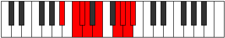

# Mode Katylyllic

## Links

- [Documentation](README.md)
- [Scales Index](Scales.md)
- [Modes Index](Modes.md)
- [Chords Index](Chords.md)

## Parent Scale

[Zagyllic](ScaleZagyllic.md)

## Number

[3677](https://ianring.com/musictheory/scales/3677)

## Interval Pattern

2, 1, 1, 2, 3, 1, 1, 1

## Chord Pattern

i⁰, iii

## Perfection

- 5 Perfect notes
- 3 Perfect notes

## Perfection Profile

[false true true true false true false true]

## Permutations

| Tonic | Notes | Signature | Illustration | Audio |
|-------|-------|-----------|--------------|-------|
| [C](ModeCNaturalKatylyllic.md) | **C**, D, D#, E, **F#**, A, **A#**, B, **C** | C |  | [midi](https://github.com/edipermadi/music/blob/main/docs/ModeCNaturalKatylyllic.mid?raw=true) |
| [C#](ModeCSharpKatylyllic.md) | **C#**, D#, E, F, **G**, A#, **B**, C, **C#** | C |  | [midi](https://github.com/edipermadi/music/blob/main/docs/ModeCSharpKatylyllic.mid?raw=true) |
| [Db](ModeDFlatKatylyllic.md) | **Db**, Eb, E, F, **G**, Bb, **B**, C, **Db** | C |  | [midi](https://github.com/edipermadi/music/blob/main/docs/ModeDFlatKatylyllic.mid?raw=true) |
| [D](ModeDNaturalKatylyllic.md) | **D**, E, F, F#, **G#**, B, **C**, C#, **D** | C |  | [midi](https://github.com/edipermadi/music/blob/main/docs/ModeDNaturalKatylyllic.mid?raw=true) |
| [D#](ModeDSharpKatylyllic.md) | **D#**, F, F#, G, **A**, C, **C#**, D, **D#** | C |  | [midi](https://github.com/edipermadi/music/blob/main/docs/ModeDSharpKatylyllic.mid?raw=true) |
| [Eb](ModeEFlatKatylyllic.md) | **Eb**, F, Gb, G, **A**, C, **Db**, D, **Eb** | C |  | [midi](https://github.com/edipermadi/music/blob/main/docs/ModeEFlatKatylyllic.mid?raw=true) |
| [E](ModeENaturalKatylyllic.md) | **E**, F#, G, G#, **A#**, C#, **D**, D#, **E** | C |  | [midi](https://github.com/edipermadi/music/blob/main/docs/ModeENaturalKatylyllic.mid?raw=true) |
| [F](ModeFNaturalKatylyllic.md) | **F**, G, G#, A, **B**, D, **D#**, E, **F** | C |  | [midi](https://github.com/edipermadi/music/blob/main/docs/ModeFNaturalKatylyllic.mid?raw=true) |
| [F#](ModeFSharpKatylyllic.md) | **F#**, G#, A, A#, **C**, D#, **E**, F, **F#** | C |  | [midi](https://github.com/edipermadi/music/blob/main/docs/ModeFSharpKatylyllic.mid?raw=true) |
| [Gb](ModeGFlatKatylyllic.md) | **Gb**, Ab, A, Bb, **C**, Eb, **E**, F, **Gb** | C |  | [midi](https://github.com/edipermadi/music/blob/main/docs/ModeGFlatKatylyllic.mid?raw=true) |
| [G](ModeGNaturalKatylyllic.md) | **G**, A, A#, B, **C#**, E, **F**, F#, **G** | C |  | [midi](https://github.com/edipermadi/music/blob/main/docs/ModeGNaturalKatylyllic.mid?raw=true) |
| [G#](ModeGSharpKatylyllic.md) | **G#**, A#, B, C, **D**, F, **F#**, G, **G#** | C |  | [midi](https://github.com/edipermadi/music/blob/main/docs/ModeGSharpKatylyllic.mid?raw=true) |
| [Ab](ModeAFlatKatylyllic.md) | **Ab**, Bb, B, C, **D**, F, **Gb**, G, **Ab** | C |  | [midi](https://github.com/edipermadi/music/blob/main/docs/ModeAFlatKatylyllic.mid?raw=true) |
| [A](ModeANaturalKatylyllic.md) | **A**, B, C, C#, **D#**, F#, **G**, G#, **A** | C |  | [midi](https://github.com/edipermadi/music/blob/main/docs/ModeANaturalKatylyllic.mid?raw=true) |
| [A#](ModeASharpKatylyllic.md) | **A#**, C, C#, D, **E**, G, **G#**, A, **A#** | C |  | [midi](https://github.com/edipermadi/music/blob/main/docs/ModeASharpKatylyllic.mid?raw=true) |
| [Bb](ModeBFlatKatylyllic.md) | **Bb**, C, Db, D, **E**, G, **Ab**, A, **Bb** | C |  | [midi](https://github.com/edipermadi/music/blob/main/docs/ModeBFlatKatylyllic.mid?raw=true) |
| [B](ModeBNaturalKatylyllic.md) | **B**, C#, D, D#, **F**, G#, **A**, A#, **B** | C |  | [midi](https://github.com/edipermadi/music/blob/main/docs/ModeBNaturalKatylyllic.mid?raw=true) |
