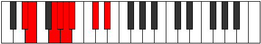

# Mode Katynian

## Links

- [Documentation](index.md)
- [Scales Index](Scales.md)
- [Modes Index](Modes.md)
- [Chords Index](Chords.md)

## Parent Scale

[Katocrian](ScaleKatocrian.md)

## Number

[1267](https://ianring.com/musictheory/scales/1267)

## Perfection

- 4 Perfect notes
- 3 Perfect notes

## Perfection Profile

[true false false true true false true]

## Permutations

| Tonic | Notes | Signature | Illustration | Audio |
|-------|-------|-----------|--------------|-------|
| [C](ModeCNaturalKatynian.md) | C, **Db**, **E**, F, Gb, **Abb**, Bb, C | C |  | [midi](ModeCNaturalKatynian.mid) [ogg](ModeCNaturalKatynian.ogg) |
| [C#](ModeCSharpKatynian.md) | C#, **D**, **E#**, F#, G, **Ab**, B, C# | C |  | [midi](ModeCSharpKatynian.mid) [ogg](ModeCSharpKatynian.ogg) |
| [Db](ModeDFlatKatynian.md) | Db, **Ebb**, **F**, Gb, Abb, **Bbbb**, Cb, Db | C |  | [midi](ModeDFlatKatynian.mid) [ogg](ModeDFlatKatynian.ogg) |
| [D](ModeDNaturalKatynian.md) | D, **Eb**, **F#**, G, Ab, **Bbb**, C, D | C |  | [midi](ModeDNaturalKatynian.mid) [ogg](ModeDNaturalKatynian.ogg) |
| [D#](ModeDSharpKatynian.md) | D#, **E**, **F##**, G#, A, **Bb**, C#, D# | C |  | [midi](ModeDSharpKatynian.mid) [ogg](ModeDSharpKatynian.ogg) |
| [Eb](ModeEFlatKatynian.md) | Eb, **Fb**, **G**, Ab, Bbb, **Cbb**, Db, Eb | C |  | [midi](ModeEFlatKatynian.mid) [ogg](ModeEFlatKatynian.ogg) |
| [E](ModeENaturalKatynian.md) | E, **F**, **G#**, A, Bb, **Cb**, D, E | C |  | [midi](ModeENaturalKatynian.mid) [ogg](ModeENaturalKatynian.ogg) |
| [F](ModeFNaturalKatynian.md) | F, **Gb**, **A**, Bb, Cb, **Dbb**, Eb, F | C |  | [midi](ModeFNaturalKatynian.mid) [ogg](ModeFNaturalKatynian.ogg) |
| [F#](ModeFSharpKatynian.md) | F#, **G**, **A#**, B, C, **Db**, E, F# | C |  | [midi](ModeFSharpKatynian.mid) [ogg](ModeFSharpKatynian.ogg) |
| [Gb](ModeGFlatKatynian.md) | Gb, **Abb**, **Bb**, Cb, Dbb, **Ebbb**, Fb, Gb | C |  | [midi](ModeGFlatKatynian.mid) [ogg](ModeGFlatKatynian.ogg) |
| [G](ModeGNaturalKatynian.md) | G, **Ab**, **B**, C, Db, **Ebb**, F, G | C |  | [midi](ModeGNaturalKatynian.mid) [ogg](ModeGNaturalKatynian.ogg) |
| [G#](ModeGSharpKatynian.md) | G#, **A**, **B#**, C#, D, **Eb**, F#, G# | C |  | [midi](ModeGSharpKatynian.mid) [ogg](ModeGSharpKatynian.ogg) |
| [Ab](ModeAFlatKatynian.md) | Ab, **Bbb**, **C**, Db, Ebb, **Fbb**, Gb, Ab | C |  | [midi](ModeAFlatKatynian.mid) [ogg](ModeAFlatKatynian.ogg) |
| [A](ModeANaturalKatynian.md) | A, **Bb**, **C#**, D, Eb, **Fb**, G, A | C |  | [midi](ModeANaturalKatynian.mid) [ogg](ModeANaturalKatynian.ogg) |
| [A#](ModeASharpKatynian.md) | A#, **B**, **C##**, D#, E, **F**, G#, A# | C |  | [midi](ModeASharpKatynian.mid) [ogg](ModeASharpKatynian.ogg) |
| [Bb](ModeBFlatKatynian.md) | Bb, **Cb**, **D**, Eb, Fb, **Gbb**, Ab, Bb | C |  | [midi](ModeBFlatKatynian.mid) [ogg](ModeBFlatKatynian.ogg) |
| [B](ModeBNaturalKatynian.md) | B, **C**, **D#**, E, F, **Gb**, A, B | C |  | [midi](ModeBNaturalKatynian.mid) [ogg](ModeBNaturalKatynian.ogg) |
