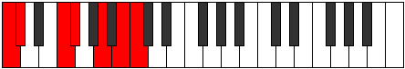
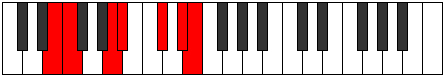

# Mode Katynimic

## Links

- [Documentation](README.md)
- [Scales Index](Scales.md)
- [Modes Index](Modes.md)
- [Chords Index](Chords.md)

## Parent Scale

[Phralimic](ScalePhralimic.md)

## Number

[2659](https://ianring.com/musictheory/scales/2659)

## Interval Pattern

1, 4, 1, 3, 2, 1

## Chord Pattern

III

## Perfection

- 3 Perfect notes
- 3 Perfect notes

## Perfection Profile

[false false true true false true]

## Permutations

| Tonic | Notes | Signature | Illustration | Audio |
|-------|-------|-----------|--------------|-------|
| [C](ModeCNaturalKatynimic.md) | **C**, **Db**, E#, F#, **G##**, A##, **C** | C |  | [midi](https://github.com/edipermadi/music/blob/main/docs/ModeCNaturalKatynimic.mid?raw=true) |
| [C#](ModeCSharpKatynimic.md) | **C#**, **D**, E##, F##, **G###**, A###, **C#** | C |  | [midi](https://github.com/edipermadi/music/blob/main/docs/ModeCSharpKatynimic.mid?raw=true) |
| [Db](ModeDFlatKatynimic.md) | **Db**, **Ebb**, F#, G, **A#**, B#, **Db** | C |  | [midi](https://github.com/edipermadi/music/blob/main/docs/ModeDFlatKatynimic.mid?raw=true) |
| [D](ModeDNaturalKatynimic.md) | **D**, **Eb**, F##, G#, **A##**, B##, **D** | C |  | [midi](https://github.com/edipermadi/music/blob/main/docs/ModeDNaturalKatynimic.mid?raw=true) |
| [D#](ModeDSharpKatynimic.md) | **D#**, **E**, F###, G##, **A###**, B###, **D#** | C |  | [midi](https://github.com/edipermadi/music/blob/main/docs/ModeDSharpKatynimic.mid?raw=true) |
| [Eb](ModeEFlatKatynimic.md) | **Eb**, **Fb**, G#, A, **B#**, C##, **Eb** | C |  | [midi](https://github.com/edipermadi/music/blob/main/docs/ModeEFlatKatynimic.mid?raw=true) |
| [E](ModeENaturalKatynimic.md) | **E**, **F**, G##, A#, **B##**, C###, **E** | C |  | [midi](https://github.com/edipermadi/music/blob/main/docs/ModeENaturalKatynimic.mid?raw=true) |
| [F](ModeFNaturalKatynimic.md) | **F**, **Gb**, A#, B, **C##**, D##, **F** | C |  | [midi](https://github.com/edipermadi/music/blob/main/docs/ModeFNaturalKatynimic.mid?raw=true) |
| [F#](ModeFSharpKatynimic.md) | **F#**, **G**, A##, B#, **C###**, D###, **F#** | C |  | [midi](https://github.com/edipermadi/music/blob/main/docs/ModeFSharpKatynimic.mid?raw=true) |
| [Gb](ModeGFlatKatynimic.md) | **Gb**, **Abb**, B, C, **D#**, E#, **Gb** | C |  | [midi](https://github.com/edipermadi/music/blob/main/docs/ModeGFlatKatynimic.mid?raw=true) |
| [G](ModeGNaturalKatynimic.md) | **G**, **Ab**, B#, C#, **D##**, E##, **G** | C |  | [midi](https://github.com/edipermadi/music/blob/main/docs/ModeGNaturalKatynimic.mid?raw=true) |
| [G#](ModeGSharpKatynimic.md) | **G#**, **A**, B##, C##, **D###**, E###, **G#** | C |  | [midi](https://github.com/edipermadi/music/blob/main/docs/ModeGSharpKatynimic.mid?raw=true) |
| [Ab](ModeAFlatKatynimic.md) | **Ab**, **Bbb**, C#, D, **E#**, F##, **Ab** | C |  | [midi](https://github.com/edipermadi/music/blob/main/docs/ModeAFlatKatynimic.mid?raw=true) |
| [A](ModeANaturalKatynimic.md) | **A**, **Bb**, C##, D#, **E##**, F###, **A** | C |  | [midi](https://github.com/edipermadi/music/blob/main/docs/ModeANaturalKatynimic.mid?raw=true) |
| [A#](ModeASharpKatynimic.md) | **A#**, **B**, C###, D##, **E###**, Cbbb, **A#** | C |  | [midi](https://github.com/edipermadi/music/blob/main/docs/ModeASharpKatynimic.mid?raw=true) |
| [Bb](ModeBFlatKatynimic.md) | **Bb**, **Cb**, D#, E, **F##**, G##, **Bb** | C |  | [midi](https://github.com/edipermadi/music/blob/main/docs/ModeBFlatKatynimic.mid?raw=true) |
| [B](ModeBNaturalKatynimic.md) | **B**, **C**, D##, E#, **F###**, G###, **B** | C |  | [midi](https://github.com/edipermadi/music/blob/main/docs/ModeBNaturalKatynimic.mid?raw=true) |
