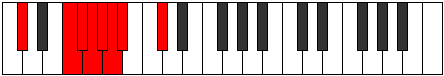

# Mode Katyptian

## Links

- [Documentation](index.md)
- [Scales Index](Scales.md)
- [Modes Index](Modes.md)
- [Chords Index](Chords.md)

## Parent Scale

[Katyptian](ScaleKatyptian.md)

## Number

[1009](https://ianring.com/musictheory/scales/1009)

## Interval Pattern

4, 1, 1, 1, 1, 1, 3

## Chord Pattern

I, I⁺, II⁺, iii, III, iv⁰, VI⁺, vii

## Perfection

- 3 Perfect notes
- 4 Perfect notes

## Perfection Profile

[true false true false false false true]

## Permutations

| Tonic | Notes | Signature | Illustration | Audio |
|-------|-------|-----------|--------------|-------|
| [C](ModeCNaturalKatyptian.md) | C, **D##**, E#, **F#**, **G**, **Ab**, Bbb, C | C |  | [midi](https://github.com/edipermadi/music/blob/main/docs/ModeCNaturalKatyptian.mid?raw=true) |
| [C#](ModeCSharpKatyptian.md) | C#, **D###**, E##, **F##**, **G#**, **A**, Bb, C# | C |  | [midi](https://github.com/edipermadi/music/blob/main/docs/ModeCSharpKatyptian.mid?raw=true) |
| [Db](ModeDFlatKatyptian.md) | Db, **E#**, F#, **G**, **Ab**, **Bbb**, Cbb, Db | C |  | [midi](https://github.com/edipermadi/music/blob/main/docs/ModeDFlatKatyptian.mid?raw=true) |
| [D](ModeDNaturalKatyptian.md) | D, **E##**, F##, **G#**, **A**, **Bb**, Cb, D | C |  | [midi](https://github.com/edipermadi/music/blob/main/docs/ModeDNaturalKatyptian.mid?raw=true) |
| [D#](ModeDSharpKatyptian.md) | D#, **E###**, F###, **G##**, **A#**, **B**, C, D# | C |  | [midi](https://github.com/edipermadi/music/blob/main/docs/ModeDSharpKatyptian.mid?raw=true) |
| [Eb](ModeEFlatKatyptian.md) | Eb, **F##**, G#, **A**, **Bb**, **Cb**, Dbb, Eb | C |  | [midi](https://github.com/edipermadi/music/blob/main/docs/ModeEFlatKatyptian.mid?raw=true) |
| [E](ModeENaturalKatyptian.md) | E, **F###**, G##, **A#**, **B**, **C**, Db, E | C |  | [midi](https://github.com/edipermadi/music/blob/main/docs/ModeENaturalKatyptian.mid?raw=true) |
| [F](ModeFNaturalKatyptian.md) | F, **G##**, A#, **B**, **C**, **Db**, Ebb, F | C |  | [midi](https://github.com/edipermadi/music/blob/main/docs/ModeFNaturalKatyptian.mid?raw=true) |
| [F#](ModeFSharpKatyptian.md) | F#, **G###**, A##, **B#**, **C#**, **D**, Eb, F# | C |  | [midi](https://github.com/edipermadi/music/blob/main/docs/ModeFSharpKatyptian.mid?raw=true) |
| [Gb](ModeGFlatKatyptian.md) | Gb, **A#**, B, **C**, **Db**, **Ebb**, Fbb, Gb | C |  | [midi](https://github.com/edipermadi/music/blob/main/docs/ModeGFlatKatyptian.mid?raw=true) |
| [G](ModeGNaturalKatyptian.md) | G, **A##**, B#, **C#**, **D**, **Eb**, Fb, G | C |  | [midi](https://github.com/edipermadi/music/blob/main/docs/ModeGNaturalKatyptian.mid?raw=true) |
| [G#](ModeGSharpKatyptian.md) | G#, **A###**, B##, **C##**, **D#**, **E**, F, G# | C |  | [midi](https://github.com/edipermadi/music/blob/main/docs/ModeGSharpKatyptian.mid?raw=true) |
| [Ab](ModeAFlatKatyptian.md) | Ab, **B#**, C#, **D**, **Eb**, **Fb**, Gbb, Ab | C |  | [midi](https://github.com/edipermadi/music/blob/main/docs/ModeAFlatKatyptian.mid?raw=true) |
| [A](ModeANaturalKatyptian.md) | A, **B##**, C##, **D#**, **E**, **F**, Gb, A | C |  | [midi](https://github.com/edipermadi/music/blob/main/docs/ModeANaturalKatyptian.mid?raw=true) |
| [A#](ModeASharpKatyptian.md) | A#, **B###**, C###, **D##**, **E#**, **F#**, G, A# | C |  | [midi](https://github.com/edipermadi/music/blob/main/docs/ModeASharpKatyptian.mid?raw=true) |
| [Bb](ModeBFlatKatyptian.md) | Bb, **C##**, D#, **E**, **F**, **Gb**, Abb, Bb | C |  | [midi](https://github.com/edipermadi/music/blob/main/docs/ModeBFlatKatyptian.mid?raw=true) |
| [B](ModeBNaturalKatyptian.md) | B, **C###**, D##, **E#**, **F#**, **G**, Ab, B | C |  | [midi](https://github.com/edipermadi/music/blob/main/docs/ModeBNaturalKatyptian.mid?raw=true) |
