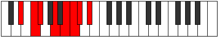

# Mode Katyrian

## Links

- [Documentation](README.md)
- [Scales Index](Scales.md)
- [Modes Index](Modes.md)
- [Chords Index](Chords.md)

## Parent Scale

[Eporian](ScaleEporian.md)

## Number

[1869](https://ianring.com/musictheory/scales/1869)

## Interval Pattern

2, 1, 3, 2, 1, 1, 2

## Chord Pattern

II, iv⁰, vi⁰, VII⁺

## Perfection

- 3 Perfect notes
- 4 Perfect notes

## Perfection Profile

[false true true false true false false]

## Permutations

| Tonic | Notes | Signature | Illustration | Audio |
|-------|-------|-----------|--------------|-------|
| [C](ModeCNaturalKatyrian.md) | **C**, D, Eb, **F#**, G#, **A**, **Bb**, **C** | C |  | [midi](https://github.com/edipermadi/music/blob/main/docs/ModeCNaturalKatyrian.mid?raw=true) |
| [C#](ModeCSharpKatyrian.md) | **C#**, D#, E, **F##**, G##, **A#**, **B**, **C#** | C |  | [midi](https://github.com/edipermadi/music/blob/main/docs/ModeCSharpKatyrian.mid?raw=true) |
| [Db](ModeDFlatKatyrian.md) | **Db**, Eb, Fb, **G**, A, **Bb**, **Cb**, **Db** | C |  | [midi](https://github.com/edipermadi/music/blob/main/docs/ModeDFlatKatyrian.mid?raw=true) |
| [D](ModeDNaturalKatyrian.md) | **D**, E, F, **G#**, A#, **B**, **C**, **D** | C |  | [midi](https://github.com/edipermadi/music/blob/main/docs/ModeDNaturalKatyrian.mid?raw=true) |
| [D#](ModeDSharpKatyrian.md) | **D#**, E#, F#, **G##**, A##, **B#**, **C#**, **D#** | C |  | [midi](https://github.com/edipermadi/music/blob/main/docs/ModeDSharpKatyrian.mid?raw=true) |
| [Eb](ModeEFlatKatyrian.md) | **Eb**, F, Gb, **A**, B, **C**, **Db**, **Eb** | C |  | [midi](https://github.com/edipermadi/music/blob/main/docs/ModeEFlatKatyrian.mid?raw=true) |
| [E](ModeENaturalKatyrian.md) | **E**, F#, G, **A#**, B#, **C#**, **D**, **E** | C |  | [midi](https://github.com/edipermadi/music/blob/main/docs/ModeENaturalKatyrian.mid?raw=true) |
| [F](ModeFNaturalKatyrian.md) | **F**, G, Ab, **B**, C#, **D**, **Eb**, **F** | C |  | [midi](https://github.com/edipermadi/music/blob/main/docs/ModeFNaturalKatyrian.mid?raw=true) |
| [F#](ModeFSharpKatyrian.md) | **F#**, G#, A, **B#**, C##, **D#**, **E**, **F#** | C |  | [midi](https://github.com/edipermadi/music/blob/main/docs/ModeFSharpKatyrian.mid?raw=true) |
| [Gb](ModeGFlatKatyrian.md) | **Gb**, Ab, Bbb, **C**, D, **Eb**, **Fb**, **Gb** | C |  | [midi](https://github.com/edipermadi/music/blob/main/docs/ModeGFlatKatyrian.mid?raw=true) |
| [G](ModeGNaturalKatyrian.md) | **G**, A, Bb, **C#**, D#, **E**, **F**, **G** | C |  | [midi](https://github.com/edipermadi/music/blob/main/docs/ModeGNaturalKatyrian.mid?raw=true) |
| [G#](ModeGSharpKatyrian.md) | **G#**, A#, B, **C##**, D##, **E#**, **F#**, **G#** | C |  | [midi](https://github.com/edipermadi/music/blob/main/docs/ModeGSharpKatyrian.mid?raw=true) |
| [Ab](ModeAFlatKatyrian.md) | **Ab**, Bb, Cb, **D**, E, **F**, **Gb**, **Ab** | C |  | [midi](https://github.com/edipermadi/music/blob/main/docs/ModeAFlatKatyrian.mid?raw=true) |
| [A](ModeANaturalKatyrian.md) | **A**, B, C, **D#**, E#, **F#**, **G**, **A** | C |  | [midi](https://github.com/edipermadi/music/blob/main/docs/ModeANaturalKatyrian.mid?raw=true) |
| [A#](ModeASharpKatyrian.md) | **A#**, B#, C#, **D##**, E##, **F##**, **G#**, **A#** | C |  | [midi](https://github.com/edipermadi/music/blob/main/docs/ModeASharpKatyrian.mid?raw=true) |
| [Bb](ModeBFlatKatyrian.md) | **Bb**, C, Db, **E**, F#, **G**, **Ab**, **Bb** | C |  | [midi](https://github.com/edipermadi/music/blob/main/docs/ModeBFlatKatyrian.mid?raw=true) |
| [B](ModeBNaturalKatyrian.md) | **B**, C#, D, **E#**, F##, **G#**, **A**, **B** | C |  | [midi](https://github.com/edipermadi/music/blob/main/docs/ModeBNaturalKatyrian.mid?raw=true) |
