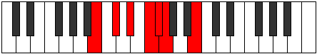

# Mode Katyrimic

## Links

- [Documentation](README.md)
- [Scales Index](Scales.md)
- [Modes Index](Modes.md)
- [Chords Index](Chords.md)

## Parent Scale

[Katanimic](ScaleKatanimic.md)

## Number

[469](https://ianring.com/musictheory/scales/469)

## Transposition

2, 2, 2, 1, 1, 4

## Chord Pattern

I, IIb5

## Perfection

- 2 Perfect notes
- 4 Perfect notes

## Perfection Profile

[true false false false true false]

## Permutations

| Tonic | Notes | Signature | Illustration | Audio |
|-------|-------|-----------|--------------|-------|
| [C](ModeCNaturalKatyrimic.md) | C, **D**, **E**, **F#**, G, **Ab**, C | C |  | [midi](https://github.com/edipermadi/music/blob/main/docs/ModeCNaturalKatyrimic.mid?raw=true) |
| [C#](ModeCSharpKatyrimic.md) | C#, **D#**, **E#**, **F##**, G#, **A**, C# | C |  | [midi](https://github.com/edipermadi/music/blob/main/docs/ModeCSharpKatyrimic.mid?raw=true) |
| [Db](ModeDFlatKatyrimic.md) | Db, **Eb**, **F**, **G**, Ab, **Bbb**, Db | C |  | [midi](https://github.com/edipermadi/music/blob/main/docs/ModeDFlatKatyrimic.mid?raw=true) |
| [D](ModeDNaturalKatyrimic.md) | D, **E**, **F#**, **G#**, A, **Bb**, D | C |  | [midi](https://github.com/edipermadi/music/blob/main/docs/ModeDNaturalKatyrimic.mid?raw=true) |
| [D#](ModeDSharpKatyrimic.md) | D#, **E#**, **F##**, **G##**, A#, **B**, D# | C |  | [midi](https://github.com/edipermadi/music/blob/main/docs/ModeDSharpKatyrimic.mid?raw=true) |
| [Eb](ModeEFlatKatyrimic.md) | Eb, **F**, **G**, **A**, Bb, **Cb**, Eb | C |  | [midi](https://github.com/edipermadi/music/blob/main/docs/ModeEFlatKatyrimic.mid?raw=true) |
| [E](ModeENaturalKatyrimic.md) | E, **F#**, **G#**, **A#**, B, **C**, E | C |  | [midi](https://github.com/edipermadi/music/blob/main/docs/ModeENaturalKatyrimic.mid?raw=true) |
| [F](ModeFNaturalKatyrimic.md) | F, **G**, **A**, **B**, C, **Db**, F | C |  | [midi](https://github.com/edipermadi/music/blob/main/docs/ModeFNaturalKatyrimic.mid?raw=true) |
| [F#](ModeFSharpKatyrimic.md) | F#, **G#**, **A#**, **B#**, C#, **D**, F# | C |  | [midi](https://github.com/edipermadi/music/blob/main/docs/ModeFSharpKatyrimic.mid?raw=true) |
| [Gb](ModeGFlatKatyrimic.md) | Gb, **Ab**, **Bb**, **C**, Db, **Ebb**, Gb | C |  | [midi](https://github.com/edipermadi/music/blob/main/docs/ModeGFlatKatyrimic.mid?raw=true) |
| [G](ModeGNaturalKatyrimic.md) | G, **A**, **B**, **C#**, D, **Eb**, G | C |  | [midi](https://github.com/edipermadi/music/blob/main/docs/ModeGNaturalKatyrimic.mid?raw=true) |
| [G#](ModeGSharpKatyrimic.md) | G#, **A#**, **B#**, **C##**, D#, **E**, G# | C |  | [midi](https://github.com/edipermadi/music/blob/main/docs/ModeGSharpKatyrimic.mid?raw=true) |
| [Ab](ModeAFlatKatyrimic.md) | Ab, **Bb**, **C**, **D**, Eb, **Fb**, Ab | C |  | [midi](https://github.com/edipermadi/music/blob/main/docs/ModeAFlatKatyrimic.mid?raw=true) |
| [A](ModeANaturalKatyrimic.md) | A, **B**, **C#**, **D#**, E, **F**, A | C |  | [midi](https://github.com/edipermadi/music/blob/main/docs/ModeANaturalKatyrimic.mid?raw=true) |
| [A#](ModeASharpKatyrimic.md) | A#, **B#**, **C##**, **D##**, E#, **F#**, A# | C |  | [midi](https://github.com/edipermadi/music/blob/main/docs/ModeASharpKatyrimic.mid?raw=true) |
| [Bb](ModeBFlatKatyrimic.md) | Bb, **C**, **D**, **E**, F, **Gb**, Bb | C |  | [midi](https://github.com/edipermadi/music/blob/main/docs/ModeBFlatKatyrimic.mid?raw=true) |
| [B](ModeBNaturalKatyrimic.md) | B, **C#**, **D#**, **E#**, F#, **G**, B | C |  | [midi](https://github.com/edipermadi/music/blob/main/docs/ModeBNaturalKatyrimic.mid?raw=true) |
