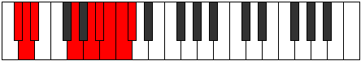

# Mode Katyryllic

## Links

- [Documentation](index.md)
- [Scales Index](Scales.md)
- [Modes Index](Modes.md)
- [Chords Index](Chords.md)

## Parent Scale

[Stycryllic](ScaleStycryllic.md)

## Number

[3911](https://ianring.com/musictheory/scales/3911)

## Interval Pattern

1, 1, 4, 2, 1, 1, 1, 1

## Chord Pattern

III, III⁺, iv⁰, iv, IV, IV⁺, v⁰, VII⁺, viii

## Perfection

- 4 Perfect notes
- 4 Perfect notes

## Perfection Profile

[false true true true false false false true]

## Permutations

| Tonic | Notes | Signature | Illustration | Audio |
|-------|-------|-----------|--------------|-------|
| [C](ModeCNaturalKatyryllic.md) | **C**, C#, D, F#, **G#**, **A**, **A#**, B, **C** | C |  | [midi](https://github.com/edipermadi/music/blob/main/docs/ModeCNaturalKatyryllic.mid?raw=true) |
| [C#](ModeCSharpKatyryllic.md) | **C#**, D, D#, G, **A**, **A#**, **B**, C, **C#** | C |  | [midi](https://github.com/edipermadi/music/blob/main/docs/ModeCSharpKatyryllic.mid?raw=true) |
| [Db](ModeDFlatKatyryllic.md) | **Db**, D, Eb, G, **A**, **Bb**, **B**, C, **Db** | C |  | [midi](https://github.com/edipermadi/music/blob/main/docs/ModeDFlatKatyryllic.mid?raw=true) |
| [D](ModeDNaturalKatyryllic.md) | **D**, D#, E, G#, **A#**, **B**, **C**, C#, **D** | C |  | [midi](https://github.com/edipermadi/music/blob/main/docs/ModeDNaturalKatyryllic.mid?raw=true) |
| [D#](ModeDSharpKatyryllic.md) | **D#**, E, F, A, **B**, **C**, **C#**, D, **D#** | C |  | [midi](https://github.com/edipermadi/music/blob/main/docs/ModeDSharpKatyryllic.mid?raw=true) |
| [Eb](ModeEFlatKatyryllic.md) | **Eb**, E, F, A, **B**, **C**, **Db**, D, **Eb** | C |  | [midi](https://github.com/edipermadi/music/blob/main/docs/ModeEFlatKatyryllic.mid?raw=true) |
| [E](ModeENaturalKatyryllic.md) | **E**, F, F#, A#, **C**, **C#**, **D**, D#, **E** | C |  | [midi](https://github.com/edipermadi/music/blob/main/docs/ModeENaturalKatyryllic.mid?raw=true) |
| [F](ModeFNaturalKatyryllic.md) | **F**, F#, G, B, **C#**, **D**, **D#**, E, **F** | C |  | [midi](https://github.com/edipermadi/music/blob/main/docs/ModeFNaturalKatyryllic.mid?raw=true) |
| [F#](ModeFSharpKatyryllic.md) | **F#**, G, G#, C, **D**, **D#**, **E**, F, **F#** | C |  | [midi](https://github.com/edipermadi/music/blob/main/docs/ModeFSharpKatyryllic.mid?raw=true) |
| [Gb](ModeGFlatKatyryllic.md) | **Gb**, G, Ab, C, **D**, **Eb**, **E**, F, **Gb** | C |  | [midi](https://github.com/edipermadi/music/blob/main/docs/ModeGFlatKatyryllic.mid?raw=true) |
| [G](ModeGNaturalKatyryllic.md) | **G**, G#, A, C#, **D#**, **E**, **F**, F#, **G** | C |  | [midi](https://github.com/edipermadi/music/blob/main/docs/ModeGNaturalKatyryllic.mid?raw=true) |
| [G#](ModeGSharpKatyryllic.md) | **G#**, A, A#, D, **E**, **F**, **F#**, G, **G#** | C |  | [midi](https://github.com/edipermadi/music/blob/main/docs/ModeGSharpKatyryllic.mid?raw=true) |
| [Ab](ModeAFlatKatyryllic.md) | **Ab**, A, Bb, D, **E**, **F**, **Gb**, G, **Ab** | C |  | [midi](https://github.com/edipermadi/music/blob/main/docs/ModeAFlatKatyryllic.mid?raw=true) |
| [A](ModeANaturalKatyryllic.md) | **A**, A#, B, D#, **F**, **F#**, **G**, G#, **A** | C |  | [midi](https://github.com/edipermadi/music/blob/main/docs/ModeANaturalKatyryllic.mid?raw=true) |
| [A#](ModeASharpKatyryllic.md) | **A#**, B, C, E, **F#**, **G**, **G#**, A, **A#** | C |  | [midi](https://github.com/edipermadi/music/blob/main/docs/ModeASharpKatyryllic.mid?raw=true) |
| [Bb](ModeBFlatKatyryllic.md) | **Bb**, B, C, E, **Gb**, **G**, **Ab**, A, **Bb** | C |  | [midi](https://github.com/edipermadi/music/blob/main/docs/ModeBFlatKatyryllic.mid?raw=true) |
| [B](ModeBNaturalKatyryllic.md) | **B**, C, C#, F, **G**, **G#**, **A**, A#, **B** | C |  | [midi](https://github.com/edipermadi/music/blob/main/docs/ModeBNaturalKatyryllic.mid?raw=true) |
