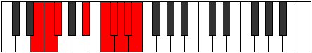

# Mode Katyryllic

## Links

- [Documentation](index.md)
- [Scales Index](Scales.md)
- [Modes Index](Modes.md)
- [Chords Index](Chords.md)

## Parent Scale

[Stycryllic](ScaleStycryllic.md)

## Number

[3911](https://ianring.com/musictheory/scales/3911)

## Perfection

- 4 Perfect notes
- 4 Perfect notes

## Perfection Profile

[false true true true false false false true]

## Permutations

| Tonic | Notes | Signature | Illustration | Audio |
|-------|-------|-----------|--------------|-------|
| [C](ModeCNaturalKatyryllic.md) | **C**, C#, D, F#, **G#**, **A**, **A#**, B, **C** | C |  | [midi](ModeCNaturalKatyryllic.mid) [ogg](ModeCNaturalKatyryllic.ogg) |
| [C#](ModeCSharpKatyryllic.md) | **C#**, D, D#, G, **A**, **A#**, **B**, C, **C#** | C |  | [midi](ModeCSharpKatyryllic.mid) [ogg](ModeCSharpKatyryllic.ogg) |
| [Db](ModeDFlatKatyryllic.md) | **Db**, D, Eb, G, **A**, **Bb**, **B**, C, **Db** | C |  | [midi](ModeDFlatKatyryllic.mid) [ogg](ModeDFlatKatyryllic.ogg) |
| [D](ModeDNaturalKatyryllic.md) | **D**, D#, E, G#, **A#**, **B**, **C**, C#, **D** | C |  | [midi](ModeDNaturalKatyryllic.mid) [ogg](ModeDNaturalKatyryllic.ogg) |
| [D#](ModeDSharpKatyryllic.md) | **D#**, E, F, A, **B**, **C**, **C#**, D, **D#** | C |  | [midi](ModeDSharpKatyryllic.mid) [ogg](ModeDSharpKatyryllic.ogg) |
| [Eb](ModeEFlatKatyryllic.md) | **Eb**, E, F, A, **B**, **C**, **Db**, D, **Eb** | C |  | [midi](ModeEFlatKatyryllic.mid) [ogg](ModeEFlatKatyryllic.ogg) |
| [E](ModeENaturalKatyryllic.md) | **E**, F, F#, A#, **C**, **C#**, **D**, D#, **E** | C |  | [midi](ModeENaturalKatyryllic.mid) [ogg](ModeENaturalKatyryllic.ogg) |
| [F](ModeFNaturalKatyryllic.md) | **F**, F#, G, B, **C#**, **D**, **D#**, E, **F** | C |  | [midi](ModeFNaturalKatyryllic.mid) [ogg](ModeFNaturalKatyryllic.ogg) |
| [F#](ModeFSharpKatyryllic.md) | **F#**, G, G#, C, **D**, **D#**, **E**, F, **F#** | C |  | [midi](ModeFSharpKatyryllic.mid) [ogg](ModeFSharpKatyryllic.ogg) |
| [Gb](ModeGFlatKatyryllic.md) | **Gb**, G, Ab, C, **D**, **Eb**, **E**, F, **Gb** | C |  | [midi](ModeGFlatKatyryllic.mid) [ogg](ModeGFlatKatyryllic.ogg) |
| [G](ModeGNaturalKatyryllic.md) | **G**, G#, A, C#, **D#**, **E**, **F**, F#, **G** | C |  | [midi](ModeGNaturalKatyryllic.mid) [ogg](ModeGNaturalKatyryllic.ogg) |
| [G#](ModeGSharpKatyryllic.md) | **G#**, A, A#, D, **E**, **F**, **F#**, G, **G#** | C |  | [midi](ModeGSharpKatyryllic.mid) [ogg](ModeGSharpKatyryllic.ogg) |
| [Ab](ModeAFlatKatyryllic.md) | **Ab**, A, Bb, D, **E**, **F**, **Gb**, G, **Ab** | C |  | [midi](ModeAFlatKatyryllic.mid) [ogg](ModeAFlatKatyryllic.ogg) |
| [A](ModeANaturalKatyryllic.md) | **A**, A#, B, D#, **F**, **F#**, **G**, G#, **A** | C |  | [midi](ModeANaturalKatyryllic.mid) [ogg](ModeANaturalKatyryllic.ogg) |
| [A#](ModeASharpKatyryllic.md) | **A#**, B, C, E, **F#**, **G**, **G#**, A, **A#** | C |  | [midi](ModeASharpKatyryllic.mid) [ogg](ModeASharpKatyryllic.ogg) |
| [Bb](ModeBFlatKatyryllic.md) | **Bb**, B, C, E, **Gb**, **G**, **Ab**, A, **Bb** | C |  | [midi](ModeBFlatKatyryllic.mid) [ogg](ModeBFlatKatyryllic.ogg) |
| [B](ModeBNaturalKatyryllic.md) | **B**, C, C#, F, **G**, **G#**, **A**, A#, **B** | C |  | [midi](ModeBNaturalKatyryllic.mid) [ogg](ModeBNaturalKatyryllic.ogg) |
