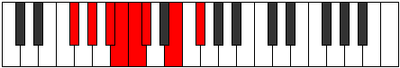

# Mode Katythian

## Links

- [Documentation](index.md)
- [Scales Index](Scales.md)
- [Modes Index](Modes.md)
- [Chords Index](Chords.md)

## Parent Scale

[Phraptian](ScalePhraptian.md)

## Number

[1269](https://ianring.com/musictheory/scales/1269)

## Perfection

- 4 Perfect notes
- 3 Perfect notes

## Perfection Profile

[true false false true false true true]

## Permutations

| Tonic | Notes | Signature | Illustration | Audio |
|-------|-------|-----------|--------------|-------|
| [C](ModeCNaturalKatythian.md) | C, **D**, **E**, F, **Gb**, Abb, Bb, C | C |  | [midi](ModeCNaturalKatythian.mid) [ogg](ModeCNaturalKatythian.ogg) |
| [C#](ModeCSharpKatythian.md) | C#, **D#**, **E#**, F#, **G**, Ab, B, C# | C |  | [midi](ModeCSharpKatythian.mid) [ogg](ModeCSharpKatythian.ogg) |
| [Db](ModeDFlatKatythian.md) | Db, **Eb**, **F**, Gb, **Abb**, Bbbb, Cb, Db | C |  | [midi](ModeDFlatKatythian.mid) [ogg](ModeDFlatKatythian.ogg) |
| [D](ModeDNaturalKatythian.md) | D, **E**, **F#**, G, **Ab**, Bbb, C, D | C |  | [midi](ModeDNaturalKatythian.mid) [ogg](ModeDNaturalKatythian.ogg) |
| [D#](ModeDSharpKatythian.md) | D#, **E#**, **F##**, G#, **A**, Bb, C#, D# | C |  | [midi](ModeDSharpKatythian.mid) [ogg](ModeDSharpKatythian.ogg) |
| [Eb](ModeEFlatKatythian.md) | Eb, **F**, **G**, Ab, **Bbb**, Cbb, Db, Eb | C |  | [midi](ModeEFlatKatythian.mid) [ogg](ModeEFlatKatythian.ogg) |
| [E](ModeENaturalKatythian.md) | E, **F#**, **G#**, A, **Bb**, Cb, D, E | C |  | [midi](ModeENaturalKatythian.mid) [ogg](ModeENaturalKatythian.ogg) |
| [F](ModeFNaturalKatythian.md) | F, **G**, **A**, Bb, **Cb**, Dbb, Eb, F | C |  | [midi](ModeFNaturalKatythian.mid) [ogg](ModeFNaturalKatythian.ogg) |
| [F#](ModeFSharpKatythian.md) | F#, **G#**, **A#**, B, **C**, Db, E, F# | C |  | [midi](ModeFSharpKatythian.mid) [ogg](ModeFSharpKatythian.ogg) |
| [Gb](ModeGFlatKatythian.md) | Gb, **Ab**, **Bb**, Cb, **Dbb**, Ebbb, Fb, Gb | C |  | [midi](ModeGFlatKatythian.mid) [ogg](ModeGFlatKatythian.ogg) |
| [G](ModeGNaturalKatythian.md) | G, **A**, **B**, C, **Db**, Ebb, F, G | C |  | [midi](ModeGNaturalKatythian.mid) [ogg](ModeGNaturalKatythian.ogg) |
| [G#](ModeGSharpKatythian.md) | G#, **A#**, **B#**, C#, **D**, Eb, F#, G# | C |  | [midi](ModeGSharpKatythian.mid) [ogg](ModeGSharpKatythian.ogg) |
| [Ab](ModeAFlatKatythian.md) | Ab, **Bb**, **C**, Db, **Ebb**, Fbb, Gb, Ab | C |  | [midi](ModeAFlatKatythian.mid) [ogg](ModeAFlatKatythian.ogg) |
| [A](ModeANaturalKatythian.md) | A, **B**, **C#**, D, **Eb**, Fb, G, A | C |  | [midi](ModeANaturalKatythian.mid) [ogg](ModeANaturalKatythian.ogg) |
| [A#](ModeASharpKatythian.md) | A#, **B#**, **C##**, D#, **E**, F, G#, A# | C |  | [midi](ModeASharpKatythian.mid) [ogg](ModeASharpKatythian.ogg) |
| [Bb](ModeBFlatKatythian.md) | Bb, **C**, **D**, Eb, **Fb**, Gbb, Ab, Bb | C |  | [midi](ModeBFlatKatythian.mid) [ogg](ModeBFlatKatythian.ogg) |
| [B](ModeBNaturalKatythian.md) | B, **C#**, **D#**, E, **F**, Gb, A, B | C |  | [midi](ModeBNaturalKatythian.mid) [ogg](ModeBNaturalKatythian.ogg) |
