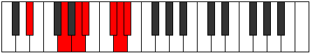
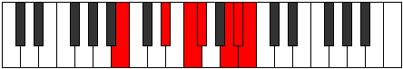

# Mode Katythimic

## Links

- [Documentation](index.md)
- [Scales Index](Scales.md)
- [Modes Index](Modes.md)
- [Chords Index](Chords.md)

## Parent Scale

[Katythimic](ScaleKatythimic.md)

## Number

[3281](https://ianring.com/musictheory/scales/3281)

## Perfection

- 3 Perfect notes
- 3 Perfect notes

## Perfection Profile

[true true false false false true]

## Permutations

| Tonic | Notes | Signature | Illustration | Audio |
|-------|-------|-----------|--------------|-------|
| [C](ModeCNaturalKatythimic.md) | C, D##, **E##**, **F##**, **G###**, A##, C | C |  | [midi](ModeCNaturalKatythimic.mid) [ogg](ModeCNaturalKatythimic.ogg) |
| [C#](ModeCSharpKatythimic.md) | C#, D###, **E###**, **F###**, **Cb**, Dbb, C# | C |  | [midi](ModeCSharpKatythimic.mid) [ogg](ModeCSharpKatythimic.ogg) |
| [Db](ModeDFlatKatythimic.md) | Db, E#, **F##**, **G#**, **A##**, B#, Db | C |  | [midi](ModeDFlatKatythimic.mid) [ogg](ModeDFlatKatythimic.ogg) |
| [D](ModeDNaturalKatythimic.md) | D, E##, **F###**, **G##**, **A###**, B##, D | C |  | [midi](ModeDNaturalKatythimic.mid) [ogg](ModeDNaturalKatythimic.ogg) |
| [D#](ModeDSharpKatythimic.md) | D#, E###, **Cbbb**, **Cbb**, **Db**, Ebb, D# | C |  | [midi](ModeDSharpKatythimic.mid) [ogg](ModeDSharpKatythimic.ogg) |
| [Eb](ModeEFlatKatythimic.md) | Eb, F##, **G##**, **A#**, **B##**, C##, Eb | C |  | [midi](ModeEFlatKatythimic.mid) [ogg](ModeEFlatKatythimic.ogg) |
| [E](ModeENaturalKatythimic.md) | E, F###, **G###**, **A##**, **B###**, C###, E | C |  | [midi](ModeENaturalKatythimic.mid) [ogg](ModeENaturalKatythimic.ogg) |
| [F](ModeFNaturalKatythimic.md) | F, G##, **A##**, **B#**, **C###**, D##, F | C |  | [midi](ModeFNaturalKatythimic.mid) [ogg](ModeFNaturalKatythimic.ogg) |
| [F#](ModeFSharpKatythimic.md) | F#, G###, **A###**, **B##**, **D##**, E#, F# | C |  | [midi](ModeFSharpKatythimic.mid) [ogg](ModeFSharpKatythimic.ogg) |
| [Gb](ModeGFlatKatythimic.md) | Gb, A#, **B#**, **C#**, **D##**, E#, Gb | C |  | [midi](ModeGFlatKatythimic.mid) [ogg](ModeGFlatKatythimic.ogg) |
| [G](ModeGNaturalKatythimic.md) | G, A##, **B##**, **C##**, **D###**, E##, G | C |  | [midi](ModeGNaturalKatythimic.mid) [ogg](ModeGNaturalKatythimic.ogg) |
| [G#](ModeGSharpKatythimic.md) | G#, A###, **B###**, **C###**, **E##**, F##, G# | C |  | [midi](ModeGSharpKatythimic.mid) [ogg](ModeGSharpKatythimic.ogg) |
| [Ab](ModeAFlatKatythimic.md) | Ab, B#, **C##**, **D#**, **E##**, F##, Ab | C |  | [midi](ModeAFlatKatythimic.mid) [ogg](ModeAFlatKatythimic.ogg) |
| [A](ModeANaturalKatythimic.md) | A, B##, **C###**, **D##**, **E###**, F###, A | C |  | [midi](ModeANaturalKatythimic.mid) [ogg](ModeANaturalKatythimic.ogg) |
| [A#](ModeASharpKatythimic.md) | A#, B###, **D##**, **E#**, **F###**, G##, A# | C |  | [midi](ModeASharpKatythimic.mid) [ogg](ModeASharpKatythimic.ogg) |
| [Bb](ModeBFlatKatythimic.md) | Bb, C##, **D##**, **E#**, **F###**, G##, Bb | C |  | [midi](ModeBFlatKatythimic.mid) [ogg](ModeBFlatKatythimic.ogg) |
| [B](ModeBNaturalKatythimic.md) | B, C###, **D###**, **E##**, **Cbbb**, Cbb, B | C |  | [midi](ModeBNaturalKatythimic.mid) [ogg](ModeBNaturalKatythimic.ogg) |
