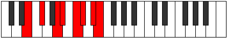

# Mode Kocrian

## Links

- [Documentation](index.md)
- [Scales Index](Scales.md)
- [Modes Index](Modes.md)
- [Chords Index](Chords.md)

## Parent Scale

[Mycrian](ScaleMycrian.md)

## Number

[2917](https://ianring.com/musictheory/scales/2917)

## Perfection

- 3 Perfect notes
- 4 Perfect notes

## Perfection Profile

[false true true false false false true]

## Permutations

| Tonic | Notes | Signature | Illustration | Audio |
|-------|-------|-----------|--------------|-------|
| [C](ModeCNaturalKocrian.md) | **C**, D, E#, **F#**, **G#**, **A**, B, **C** | C |  | [midi](ModeCNaturalKocrian.mid) [ogg](ModeCNaturalKocrian.ogg) |
| [C#](ModeCSharpKocrian.md) | **C#**, D#, E##, **F##**, **G##**, **A#**, B#, **C#** | C |  | [midi](ModeCSharpKocrian.mid) [ogg](ModeCSharpKocrian.ogg) |
| [Db](ModeDFlatKocrian.md) | **Db**, Eb, F#, **G**, **A**, **Bb**, C, **Db** | C |  | [midi](ModeDFlatKocrian.mid) [ogg](ModeDFlatKocrian.ogg) |
| [D](ModeDNaturalKocrian.md) | **D**, E, F##, **G#**, **A#**, **B**, C#, **D** | C |  | [midi](ModeDNaturalKocrian.mid) [ogg](ModeDNaturalKocrian.ogg) |
| [D#](ModeDSharpKocrian.md) | **D#**, E#, F###, **G##**, **A##**, **B#**, C##, **D#** | C |  | [midi](ModeDSharpKocrian.mid) [ogg](ModeDSharpKocrian.ogg) |
| [Eb](ModeEFlatKocrian.md) | **Eb**, F, G#, **A**, **B**, **C**, D, **Eb** | C |  | [midi](ModeEFlatKocrian.mid) [ogg](ModeEFlatKocrian.ogg) |
| [E](ModeENaturalKocrian.md) | **E**, F#, G##, **A#**, **B#**, **C#**, D#, **E** | C |  | [midi](ModeENaturalKocrian.mid) [ogg](ModeENaturalKocrian.ogg) |
| [F](ModeFNaturalKocrian.md) | **F**, G, A#, **B**, **C#**, **D**, E, **F** | C |  | [midi](ModeFNaturalKocrian.mid) [ogg](ModeFNaturalKocrian.ogg) |
| [F#](ModeFSharpKocrian.md) | **F#**, G#, A##, **B#**, **C##**, **D#**, E#, **F#** | C |  | [midi](ModeFSharpKocrian.mid) [ogg](ModeFSharpKocrian.ogg) |
| [Gb](ModeGFlatKocrian.md) | **Gb**, Ab, B, **C**, **D**, **Eb**, F, **Gb** | C |  | [midi](ModeGFlatKocrian.mid) [ogg](ModeGFlatKocrian.ogg) |
| [G](ModeGNaturalKocrian.md) | **G**, A, B#, **C#**, **D#**, **E**, F#, **G** | C |  | [midi](ModeGNaturalKocrian.mid) [ogg](ModeGNaturalKocrian.ogg) |
| [G#](ModeGSharpKocrian.md) | **G#**, A#, B##, **C##**, **D##**, **E#**, F##, **G#** | C |  | [midi](ModeGSharpKocrian.mid) [ogg](ModeGSharpKocrian.ogg) |
| [Ab](ModeAFlatKocrian.md) | **Ab**, Bb, C#, **D**, **E**, **F**, G, **Ab** | C |  | [midi](ModeAFlatKocrian.mid) [ogg](ModeAFlatKocrian.ogg) |
| [A](ModeANaturalKocrian.md) | **A**, B, C##, **D#**, **E#**, **F#**, G#, **A** | C |  | [midi](ModeANaturalKocrian.mid) [ogg](ModeANaturalKocrian.ogg) |
| [A#](ModeASharpKocrian.md) | **A#**, B#, C###, **D##**, **E##**, **F##**, G##, **A#** | C |  | [midi](ModeASharpKocrian.mid) [ogg](ModeASharpKocrian.ogg) |
| [Bb](ModeBFlatKocrian.md) | **Bb**, C, D#, **E**, **F#**, **G**, A, **Bb** | C |  | [midi](ModeBFlatKocrian.mid) [ogg](ModeBFlatKocrian.ogg) |
| [B](ModeBNaturalKocrian.md) | **B**, C#, D##, **E#**, **F##**, **G#**, A#, **B** | C |  | [midi](ModeBNaturalKocrian.mid) [ogg](ModeBNaturalKocrian.ogg) |
