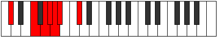

# Mode Kocrimic

## Links

- [Documentation](index.md)
- [Scales Index](Scales.md)
- [Modes Index](Modes.md)
- [Chords Index](Chords.md)

## Parent Scale

[Kocrimic](ScaleKocrimic.md)

## Number

[977](https://ianring.com/musictheory/scales/977)

## Interval Pattern

4, 2, 1, 1, 1, 3

## Chord Pattern

## Perfection

- 2 Perfect notes
- 4 Perfect notes

## Perfection Profile

[true false false false false true]

## Permutations

| Tonic | Notes | Signature | Illustration | Audio |
|-------|-------|-----------|--------------|-------|
| [C](ModeCNaturalKocrimic.md) | C, **D##**, **E##**, **F##**, **G#**, A, C | C |  | [midi](https://github.com/edipermadi/music/blob/main/docs/ModeCNaturalKocrimic.mid?raw=true) |
| [C#](ModeCSharpKocrimic.md) | C#, **D###**, **E###**, **F###**, **G##**, A#, C# | C |  | [midi](https://github.com/edipermadi/music/blob/main/docs/ModeCSharpKocrimic.mid?raw=true) |
| [Db](ModeDFlatKocrimic.md) | Db, **E#**, **F##**, **G#**, **A**, Bb, Db | C |  | [midi](https://github.com/edipermadi/music/blob/main/docs/ModeDFlatKocrimic.mid?raw=true) |
| [D](ModeDNaturalKocrimic.md) | D, **E##**, **F###**, **G##**, **A#**, B, D | C |  | [midi](https://github.com/edipermadi/music/blob/main/docs/ModeDNaturalKocrimic.mid?raw=true) |
| [D#](ModeDSharpKocrimic.md) | D#, **E###**, **Cbbb**, **Cbb**, **Dbbb**, Dbb, D# | C |  | [midi](https://github.com/edipermadi/music/blob/main/docs/ModeDSharpKocrimic.mid?raw=true) |
| [Eb](ModeEFlatKocrimic.md) | Eb, **F##**, **G##**, **A#**, **B**, C, Eb | C |  | [midi](https://github.com/edipermadi/music/blob/main/docs/ModeEFlatKocrimic.mid?raw=true) |
| [E](ModeENaturalKocrimic.md) | E, **F###**, **G###**, **A##**, **B#**, C#, E | C |  | [midi](https://github.com/edipermadi/music/blob/main/docs/ModeENaturalKocrimic.mid?raw=true) |
| [F](ModeFNaturalKocrimic.md) | F, **G##**, **A##**, **B#**, **C#**, D, F | C |  | [midi](https://github.com/edipermadi/music/blob/main/docs/ModeFNaturalKocrimic.mid?raw=true) |
| [F#](ModeFSharpKocrimic.md) | F#, **G###**, **A###**, **B##**, **C##**, D#, F# | C |  | [midi](https://github.com/edipermadi/music/blob/main/docs/ModeFSharpKocrimic.mid?raw=true) |
| [Gb](ModeGFlatKocrimic.md) | Gb, **A#**, **B#**, **C#**, **D**, Eb, Gb | C |  | [midi](https://github.com/edipermadi/music/blob/main/docs/ModeGFlatKocrimic.mid?raw=true) |
| [G](ModeGNaturalKocrimic.md) | G, **A##**, **B##**, **C##**, **D#**, E, G | C |  | [midi](https://github.com/edipermadi/music/blob/main/docs/ModeGNaturalKocrimic.mid?raw=true) |
| [G#](ModeGSharpKocrimic.md) | G#, **A###**, **B###**, **C###**, **D##**, E#, G# | C |  | [midi](https://github.com/edipermadi/music/blob/main/docs/ModeGSharpKocrimic.mid?raw=true) |
| [Ab](ModeAFlatKocrimic.md) | Ab, **B#**, **C##**, **D#**, **E**, F, Ab | C |  | [midi](https://github.com/edipermadi/music/blob/main/docs/ModeAFlatKocrimic.mid?raw=true) |
| [A](ModeANaturalKocrimic.md) | A, **B##**, **C###**, **D##**, **E#**, F#, A | C |  | [midi](https://github.com/edipermadi/music/blob/main/docs/ModeANaturalKocrimic.mid?raw=true) |
| [A#](ModeASharpKocrimic.md) | A#, **B###**, **D##**, **E#**, **F#**, G, A# | C |  | [midi](https://github.com/edipermadi/music/blob/main/docs/ModeASharpKocrimic.mid?raw=true) |
| [Bb](ModeBFlatKocrimic.md) | Bb, **C##**, **D##**, **E#**, **F#**, G, Bb | C |  | [midi](https://github.com/edipermadi/music/blob/main/docs/ModeBFlatKocrimic.mid?raw=true) |
| [B](ModeBNaturalKocrimic.md) | B, **C###**, **D###**, **E##**, **F##**, G#, B | C |  | [midi](https://github.com/edipermadi/music/blob/main/docs/ModeBNaturalKocrimic.mid?raw=true) |
