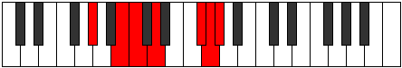

# Mode Kodimic

## Links

- [Documentation](index.md)
- [Scales Index](Scales.md)
- [Modes Index](Modes.md)
- [Chords Index](Chords.md)

## Parent Scale

[Bolimic](ScaleBolimic.md)

## Number

[3161](https://ianring.com/musictheory/scales/3161)

## Perfection

- 3 Perfect notes
- 3 Perfect notes

## Perfection Profile

[false true true false false true]

## Permutations

| Tonic | Notes | Signature | Illustration | Audio |
|-------|-------|-----------|--------------|-------|
| [C](ModeCNaturalKodimic.md) | **C**, D#, E, **F#**, **G###**, A##, **C** | C |  | [midi](ModeCNaturalKodimic.mid) [ogg](ModeCNaturalKodimic.ogg) |
| [C#](ModeCSharpKodimic.md) | **C#**, D##, E#, **F##**, **Cb**, Dbb, **C#** | C |  | [midi](ModeCSharpKodimic.mid) [ogg](ModeCSharpKodimic.ogg) |
| [Db](ModeDFlatKodimic.md) | **Db**, E, F, **G**, **A##**, B#, **Db** | C |  | [midi](ModeDFlatKodimic.mid) [ogg](ModeDFlatKodimic.ogg) |
| [D](ModeDNaturalKodimic.md) | **D**, E#, F#, **G#**, **A###**, B##, **D** | C |  | [midi](ModeDNaturalKodimic.mid) [ogg](ModeDNaturalKodimic.ogg) |
| [D#](ModeDSharpKodimic.md) | **D#**, E##, F##, **G##**, **Db**, Ebb, **D#** | C |  | [midi](ModeDSharpKodimic.mid) [ogg](ModeDSharpKodimic.ogg) |
| [Eb](ModeEFlatKodimic.md) | **Eb**, F#, G, **A**, **B##**, C##, **Eb** | C |  | [midi](ModeEFlatKodimic.mid) [ogg](ModeEFlatKodimic.ogg) |
| [E](ModeENaturalKodimic.md) | **E**, F##, G#, **A#**, **B###**, C###, **E** | C |  | [midi](ModeENaturalKodimic.mid) [ogg](ModeENaturalKodimic.ogg) |
| [F](ModeFNaturalKodimic.md) | **F**, G#, A, **B**, **C###**, D##, **F** | C |  | [midi](ModeFNaturalKodimic.mid) [ogg](ModeFNaturalKodimic.ogg) |
| [F#](ModeFSharpKodimic.md) | **F#**, G##, A#, **B#**, **D##**, E#, **F#** | C |  | [midi](ModeFSharpKodimic.mid) [ogg](ModeFSharpKodimic.ogg) |
| [Gb](ModeGFlatKodimic.md) | **Gb**, A, Bb, **C**, **D##**, E#, **Gb** | C |  | [midi](ModeGFlatKodimic.mid) [ogg](ModeGFlatKodimic.ogg) |
| [G](ModeGNaturalKodimic.md) | **G**, A#, B, **C#**, **D###**, E##, **G** | C |  | [midi](ModeGNaturalKodimic.mid) [ogg](ModeGNaturalKodimic.ogg) |
| [G#](ModeGSharpKodimic.md) | **G#**, A##, B#, **C##**, **E##**, F##, **G#** | C |  | [midi](ModeGSharpKodimic.mid) [ogg](ModeGSharpKodimic.ogg) |
| [Ab](ModeAFlatKodimic.md) | **Ab**, B, C, **D**, **E##**, F##, **Ab** | C |  | [midi](ModeAFlatKodimic.mid) [ogg](ModeAFlatKodimic.ogg) |
| [A](ModeANaturalKodimic.md) | **A**, B#, C#, **D#**, **E###**, F###, **A** | C |  | [midi](ModeANaturalKodimic.mid) [ogg](ModeANaturalKodimic.ogg) |
| [A#](ModeASharpKodimic.md) | **A#**, B##, C##, **D##**, **F###**, G##, **A#** | C |  | [midi](ModeASharpKodimic.mid) [ogg](ModeASharpKodimic.ogg) |
| [Bb](ModeBFlatKodimic.md) | **Bb**, C#, D, **E**, **F###**, G##, **Bb** | C |  | [midi](ModeBFlatKodimic.mid) [ogg](ModeBFlatKodimic.ogg) |
| [B](ModeBNaturalKodimic.md) | **B**, C##, D#, **E#**, **Cbbb**, Cbb, **B** | C |  | [midi](ModeBNaturalKodimic.mid) [ogg](ModeBNaturalKodimic.ogg) |
