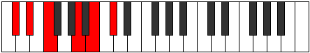

# Mode Koditonic

## Links

- [Documentation](index.md)
- [Scales Index](Scales.md)
- [Modes Index](Modes.md)
- [Chords Index](Chords.md)

## Parent Scale

[Bolitonic](ScaleBolitonic.md)

## Number

[1301](https://ianring.com/musictheory/scales/1301)

## Perfection

- 0 Perfect notes
- 5 Perfect notes

## Perfection Profile

[false false false false false]

## Permutations

| Tonic | Notes | Signature | Illustration | Audio |
|-------|-------|-----------|--------------|-------|
| [C](ModeCNaturalKoditonic.md) | **C**, **D**, **E**, **G#**, **A#**, **C** | C |  | [midi](ModeCNaturalKoditonic.mid) [ogg](ModeCNaturalKoditonic.ogg) |
| [C#](ModeCSharpKoditonic.md) | **C#**, **D#**, **F**, **A**, **B**, **C#** | C |  | [midi](ModeCSharpKoditonic.mid) [ogg](ModeCSharpKoditonic.ogg) |
| [Db](ModeDFlatKoditonic.md) | **Db**, **Eb**, **F**, **A**, **B**, **Db** | C |  | [midi](ModeDFlatKoditonic.mid) [ogg](ModeDFlatKoditonic.ogg) |
| [D](ModeDNaturalKoditonic.md) | **D**, **E**, **F#**, **A#**, **C**, **D** | C |  | [midi](ModeDNaturalKoditonic.mid) [ogg](ModeDNaturalKoditonic.ogg) |
| [D#](ModeDSharpKoditonic.md) | **D#**, **F**, **G**, **B**, **C#**, **D#** | C |  | [midi](ModeDSharpKoditonic.mid) [ogg](ModeDSharpKoditonic.ogg) |
| [Eb](ModeEFlatKoditonic.md) | **Eb**, **F**, **G**, **B**, **Db**, **Eb** | C |  | [midi](ModeEFlatKoditonic.mid) [ogg](ModeEFlatKoditonic.ogg) |
| [E](ModeENaturalKoditonic.md) | **E**, **F#**, **G#**, **C**, **D**, **E** | C |  | [midi](ModeENaturalKoditonic.mid) [ogg](ModeENaturalKoditonic.ogg) |
| [F](ModeFNaturalKoditonic.md) | **F**, **G**, **A**, **C#**, **D#**, **F** | C |  | [midi](ModeFNaturalKoditonic.mid) [ogg](ModeFNaturalKoditonic.ogg) |
| [F#](ModeFSharpKoditonic.md) | **F#**, **G#**, **A#**, **D**, **E**, **F#** | C |  | [midi](ModeFSharpKoditonic.mid) [ogg](ModeFSharpKoditonic.ogg) |
| [Gb](ModeGFlatKoditonic.md) | **Gb**, **Ab**, **Bb**, **D**, **E**, **Gb** | C |  | [midi](ModeGFlatKoditonic.mid) [ogg](ModeGFlatKoditonic.ogg) |
| [G](ModeGNaturalKoditonic.md) | **G**, **A**, **B**, **D#**, **F**, **G** | C |  | [midi](ModeGNaturalKoditonic.mid) [ogg](ModeGNaturalKoditonic.ogg) |
| [G#](ModeGSharpKoditonic.md) | **G#**, **A#**, **C**, **E**, **F#**, **G#** | C |  | [midi](ModeGSharpKoditonic.mid) [ogg](ModeGSharpKoditonic.ogg) |
| [Ab](ModeAFlatKoditonic.md) | **Ab**, **Bb**, **C**, **E**, **Gb**, **Ab** | C |  | [midi](ModeAFlatKoditonic.mid) [ogg](ModeAFlatKoditonic.ogg) |
| [A](ModeANaturalKoditonic.md) | **A**, **B**, **C#**, **F**, **G**, **A** | C |  | [midi](ModeANaturalKoditonic.mid) [ogg](ModeANaturalKoditonic.ogg) |
| [A#](ModeASharpKoditonic.md) | **A#**, **C**, **D**, **F#**, **G#**, **A#** | C |  | [midi](ModeASharpKoditonic.mid) [ogg](ModeASharpKoditonic.ogg) |
| [Bb](ModeBFlatKoditonic.md) | **Bb**, **C**, **D**, **Gb**, **Ab**, **Bb** | C |  | [midi](ModeBFlatKoditonic.mid) [ogg](ModeBFlatKoditonic.ogg) |
| [B](ModeBNaturalKoditonic.md) | **B**, **C#**, **D#**, **G**, **A**, **B** | C |  | [midi](ModeBNaturalKoditonic.mid) [ogg](ModeBNaturalKoditonic.ogg) |
