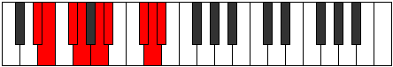

# Mode Kodyllic

## Links

- [Documentation](index.md)
- [Scales Index](Scales.md)
- [Modes Index](Modes.md)
- [Chords Index](Chords.md)

## Parent Scale

[Aeolathyllic](ScaleAeolathyllic.md)

## Number

[3291](https://ianring.com/musictheory/scales/3291)

## Perfection

- 5 Perfect notes
- 3 Perfect notes

## Perfection Profile

[true false true true true false false true]

## Permutations

| Tonic | Notes | Signature | Illustration | Audio |
|-------|-------|-----------|--------------|-------|
| [C](ModeCNaturalKodyllic.md) | C, **C#**, D#, E, F#, **G**, **A#**, B, C | C |  | [midi](ModeCNaturalKodyllic.mid) [ogg](ModeCNaturalKodyllic.ogg) |
| [C#](ModeCSharpKodyllic.md) | C#, **D**, E, F, G, **G#**, **B**, C, C# | C |  | [midi](ModeCSharpKodyllic.mid) [ogg](ModeCSharpKodyllic.ogg) |
| [Db](ModeDFlatKodyllic.md) | Db, **D**, E, F, G, **Ab**, **B**, C, Db | C |  | [midi](ModeDFlatKodyllic.mid) [ogg](ModeDFlatKodyllic.ogg) |
| [D](ModeDNaturalKodyllic.md) | D, **D#**, F, F#, G#, **A**, **C**, C#, D | C |  | [midi](ModeDNaturalKodyllic.mid) [ogg](ModeDNaturalKodyllic.ogg) |
| [D#](ModeDSharpKodyllic.md) | D#, **E**, F#, G, A, **A#**, **C#**, D, D# | C |  | [midi](ModeDSharpKodyllic.mid) [ogg](ModeDSharpKodyllic.ogg) |
| [Eb](ModeEFlatKodyllic.md) | Eb, **E**, Gb, G, A, **Bb**, **Db**, D, Eb | C |  | [midi](ModeEFlatKodyllic.mid) [ogg](ModeEFlatKodyllic.ogg) |
| [E](ModeENaturalKodyllic.md) | E, **F**, G, G#, A#, **B**, **D**, D#, E | C |  | [midi](ModeENaturalKodyllic.mid) [ogg](ModeENaturalKodyllic.ogg) |
| [F](ModeFNaturalKodyllic.md) | F, **F#**, G#, A, B, **C**, **D#**, E, F | C |  | [midi](ModeFNaturalKodyllic.mid) [ogg](ModeFNaturalKodyllic.ogg) |
| [F#](ModeFSharpKodyllic.md) | F#, **G**, A, A#, C, **C#**, **E**, F, F# | C |  | [midi](ModeFSharpKodyllic.mid) [ogg](ModeFSharpKodyllic.ogg) |
| [Gb](ModeGFlatKodyllic.md) | Gb, **G**, A, Bb, C, **Db**, **E**, F, Gb | C |  | [midi](ModeGFlatKodyllic.mid) [ogg](ModeGFlatKodyllic.ogg) |
| [G](ModeGNaturalKodyllic.md) | G, **G#**, A#, B, C#, **D**, **F**, F#, G | C |  | [midi](ModeGNaturalKodyllic.mid) [ogg](ModeGNaturalKodyllic.ogg) |
| [G#](ModeGSharpKodyllic.md) | G#, **A**, B, C, D, **D#**, **F#**, G, G# | C |  | [midi](ModeGSharpKodyllic.mid) [ogg](ModeGSharpKodyllic.ogg) |
| [Ab](ModeAFlatKodyllic.md) | Ab, **A**, B, C, D, **Eb**, **Gb**, G, Ab | C |  | [midi](ModeAFlatKodyllic.mid) [ogg](ModeAFlatKodyllic.ogg) |
| [A](ModeANaturalKodyllic.md) | A, **A#**, C, C#, D#, **E**, **G**, G#, A | C |  | [midi](ModeANaturalKodyllic.mid) [ogg](ModeANaturalKodyllic.ogg) |
| [A#](ModeASharpKodyllic.md) | A#, **B**, C#, D, E, **F**, **G#**, A, A# | C |  | [midi](ModeASharpKodyllic.mid) [ogg](ModeASharpKodyllic.ogg) |
| [Bb](ModeBFlatKodyllic.md) | Bb, **B**, Db, D, E, **F**, **Ab**, A, Bb | C |  | [midi](ModeBFlatKodyllic.mid) [ogg](ModeBFlatKodyllic.ogg) |
| [B](ModeBNaturalKodyllic.md) | B, **C**, D, D#, F, **F#**, **A**, A#, B | C |  | [midi](ModeBNaturalKodyllic.mid) [ogg](ModeBNaturalKodyllic.ogg) |
