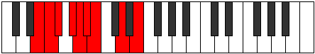
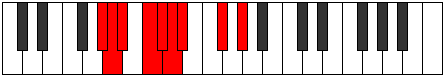

# Mode Kolyllic

## Links

- [Documentation](index.md)
- [Scales Index](Scales.md)
- [Modes Index](Modes.md)
- [Chords Index](Chords.md)

## Parent Scale

[Zoryllic](ScaleZoryllic.md)

## Number

[1271](https://ianring.com/musictheory/scales/1271)

## Perfection

- 5 Perfect notes
- 3 Perfect notes

## Perfection Profile

[true false false false true true true true]

## Permutations

| Tonic | Notes | Signature | Illustration | Audio |
|-------|-------|-----------|--------------|-------|
| [C](ModeCNaturalKolyllic.md) | C, **C#**, **D**, **E**, F, F#, G, A#, C | C |  | [midi](ModeCNaturalKolyllic.mid) [ogg](ModeCNaturalKolyllic.ogg) |
| [C#](ModeCSharpKolyllic.md) | C#, **D**, **D#**, **F**, F#, G, G#, B, C# | C |  | [midi](ModeCSharpKolyllic.mid) [ogg](ModeCSharpKolyllic.ogg) |
| [Db](ModeDFlatKolyllic.md) | Db, **D**, **Eb**, **F**, Gb, G, Ab, B, Db | C |  | [midi](ModeDFlatKolyllic.mid) [ogg](ModeDFlatKolyllic.ogg) |
| [D](ModeDNaturalKolyllic.md) | D, **D#**, **E**, **F#**, G, G#, A, C, D | C |  | [midi](ModeDNaturalKolyllic.mid) [ogg](ModeDNaturalKolyllic.ogg) |
| [D#](ModeDSharpKolyllic.md) | D#, **E**, **F**, **G**, G#, A, A#, C#, D# | C |  | [midi](ModeDSharpKolyllic.mid) [ogg](ModeDSharpKolyllic.ogg) |
| [Eb](ModeEFlatKolyllic.md) | Eb, **E**, **F**, **G**, Ab, A, Bb, Db, Eb | C |  | [midi](ModeEFlatKolyllic.mid) [ogg](ModeEFlatKolyllic.ogg) |
| [E](ModeENaturalKolyllic.md) | E, **F**, **F#**, **G#**, A, A#, B, D, E | C |  | [midi](ModeENaturalKolyllic.mid) [ogg](ModeENaturalKolyllic.ogg) |
| [F](ModeFNaturalKolyllic.md) | F, **F#**, **G**, **A**, A#, B, C, D#, F | C |  | [midi](ModeFNaturalKolyllic.mid) [ogg](ModeFNaturalKolyllic.ogg) |
| [F#](ModeFSharpKolyllic.md) | F#, **G**, **G#**, **A#**, B, C, C#, E, F# | C |  | [midi](ModeFSharpKolyllic.mid) [ogg](ModeFSharpKolyllic.ogg) |
| [Gb](ModeGFlatKolyllic.md) | Gb, **G**, **Ab**, **Bb**, B, C, Db, E, Gb | C |  | [midi](ModeGFlatKolyllic.mid) [ogg](ModeGFlatKolyllic.ogg) |
| [G](ModeGNaturalKolyllic.md) | G, **G#**, **A**, **B**, C, C#, D, F, G | C |  | [midi](ModeGNaturalKolyllic.mid) [ogg](ModeGNaturalKolyllic.ogg) |
| [G#](ModeGSharpKolyllic.md) | G#, **A**, **A#**, **C**, C#, D, D#, F#, G# | C |  | [midi](ModeGSharpKolyllic.mid) [ogg](ModeGSharpKolyllic.ogg) |
| [Ab](ModeAFlatKolyllic.md) | Ab, **A**, **Bb**, **C**, Db, D, Eb, Gb, Ab | C |  | [midi](ModeAFlatKolyllic.mid) [ogg](ModeAFlatKolyllic.ogg) |
| [A](ModeANaturalKolyllic.md) | A, **A#**, **B**, **C#**, D, D#, E, G, A | C |  | [midi](ModeANaturalKolyllic.mid) [ogg](ModeANaturalKolyllic.ogg) |
| [A#](ModeASharpKolyllic.md) | A#, **B**, **C**, **D**, D#, E, F, G#, A# | C |  | [midi](ModeASharpKolyllic.mid) [ogg](ModeASharpKolyllic.ogg) |
| [Bb](ModeBFlatKolyllic.md) | Bb, **B**, **C**, **D**, Eb, E, F, Ab, Bb | C |  | [midi](ModeBFlatKolyllic.mid) [ogg](ModeBFlatKolyllic.ogg) |
| [B](ModeBNaturalKolyllic.md) | B, **C**, **C#**, **D#**, E, F, F#, A, B | C |  | [midi](ModeBNaturalKolyllic.mid) [ogg](ModeBNaturalKolyllic.ogg) |
