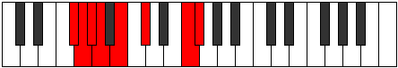
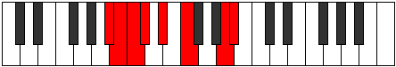

# Mode Konian

## Links

- [Documentation](index.md)
- [Scales Index](Scales.md)
- [Modes Index](Modes.md)
- [Chords Index](Chords.md)

## Parent Scale

[Stanian](ScaleStanian.md)

## Number

[2223](https://ianring.com/musictheory/scales/2223)

## Perfection

- 3 Perfect notes
- 4 Perfect notes

## Perfection Profile

[true false false false true true false]

## Permutations

| Tonic | Notes | Signature | Illustration | Audio |
|-------|-------|-----------|--------------|-------|
| [C](ModeCNaturalKonian.md) | C, **Db**, **Ebb**, **Fbb**, Gbb, Abb, **B**, C | C |  | [midi](ModeCNaturalKonian.mid) [ogg](ModeCNaturalKonian.ogg) |
| [C#](ModeCSharpKonian.md) | C#, **D**, **Eb**, **Fb**, Gb, Ab, **B#**, C# | C |  | [midi](ModeCSharpKonian.mid) [ogg](ModeCSharpKonian.ogg) |
| [Db](ModeDFlatKonian.md) | Db, **Ebb**, **Fbb**, **Gbbb**, Abbb, Bbbb, **C**, Db | C |  | [midi](ModeDFlatKonian.mid) [ogg](ModeDFlatKonian.ogg) |
| [D](ModeDNaturalKonian.md) | D, **Eb**, **Fb**, **Gbb**, Abb, Bbb, **C#**, D | C |  | [midi](ModeDNaturalKonian.mid) [ogg](ModeDNaturalKonian.ogg) |
| [D#](ModeDSharpKonian.md) | D#, **E**, **F**, **Gb**, Ab, Bb, **C##**, D# | C |  | [midi](ModeDSharpKonian.mid) [ogg](ModeDSharpKonian.ogg) |
| [Eb](ModeEFlatKonian.md) | Eb, **Fb**, **Gbb**, **Abbb**, Bbbb, Cbb, **D**, Eb | C |  | [midi](ModeEFlatKonian.mid) [ogg](ModeEFlatKonian.ogg) |
| [E](ModeENaturalKonian.md) | E, **F**, **Gb**, **Abb**, Bbb, Cb, **D#**, E | C |  | [midi](ModeENaturalKonian.mid) [ogg](ModeENaturalKonian.ogg) |
| [F](ModeFNaturalKonian.md) | F, **Gb**, **Abb**, **Bbbb**, Cbb, Dbb, **E**, F | C |  | [midi](ModeFNaturalKonian.mid) [ogg](ModeFNaturalKonian.ogg) |
| [F#](ModeFSharpKonian.md) | F#, **G**, **Ab**, **Bbb**, Cb, Db, **E#**, F# | C |  | [midi](ModeFSharpKonian.mid) [ogg](ModeFSharpKonian.ogg) |
| [Gb](ModeGFlatKonian.md) | Gb, **Abb**, **Bbbb**, **Cbbb**, Dbbb, Ebbb, **F**, Gb | C |  | [midi](ModeGFlatKonian.mid) [ogg](ModeGFlatKonian.ogg) |
| [G](ModeGNaturalKonian.md) | G, **Ab**, **Bbb**, **Cbb**, Dbb, Ebb, **F#**, G | C |  | [midi](ModeGNaturalKonian.mid) [ogg](ModeGNaturalKonian.ogg) |
| [G#](ModeGSharpKonian.md) | G#, **A**, **Bb**, **Cb**, Db, Eb, **F##**, G# | C |  | [midi](ModeGSharpKonian.mid) [ogg](ModeGSharpKonian.ogg) |
| [Ab](ModeAFlatKonian.md) | Ab, **Bbb**, **Cbb**, **Dbbb**, Ebbb, Fbb, **G**, Ab | C |  | [midi](ModeAFlatKonian.mid) [ogg](ModeAFlatKonian.ogg) |
| [A](ModeANaturalKonian.md) | A, **Bb**, **Cb**, **Dbb**, Ebb, Fb, **G#**, A | C |  | [midi](ModeANaturalKonian.mid) [ogg](ModeANaturalKonian.ogg) |
| [A#](ModeASharpKonian.md) | A#, **B**, **C**, **Db**, Eb, F, **G##**, A# | C |  | [midi](ModeASharpKonian.mid) [ogg](ModeASharpKonian.ogg) |
| [Bb](ModeBFlatKonian.md) | Bb, **Cb**, **Dbb**, **Ebbb**, Fbb, Gbb, **A**, Bb | C |  | [midi](ModeBFlatKonian.mid) [ogg](ModeBFlatKonian.ogg) |
| [B](ModeBNaturalKonian.md) | B, **C**, **Db**, **Ebb**, Fb, Gb, **A#**, B | C |  | [midi](ModeBNaturalKonian.mid) [ogg](ModeBNaturalKonian.ogg) |
