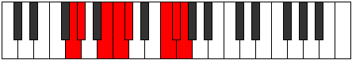

# Mode Koptian

## Links

- [Documentation](README.md)
- [Scales Index](Scales.md)
- [Modes Index](Modes.md)
- [Chords Index](Chords.md)

## Parent Scale

[Aeolacrian](ScaleAeolacrian.md)

## Number

[3187](https://ianring.com/musictheory/scales/3187)

## Luminosity

-1

## Transposition

1, 3, 1, 1, 4, 1, 1

## Chord Pattern

Ib5, vi⁰b3, vii⁰b3

## Perfection

- 5 Perfect notes
- 2 Perfect notes

## Perfection Profile

false, false, true, true, true, true, true

## Permutations

| Tonic | Notes | Signature | Illustration | Audio |
|-------|-------|-----------|--------------|-------|
| [C](ModeCNaturalKoptian.md) | **C**, **Db**, E, F, Gb, A#, B, **C** | C |  | [midi](https://github.com/edipermadi/music/blob/main/docs/ModeCNaturalKoptian.mid?raw=true) |
| [C#](ModeCSharpKoptian.md) | **C#**, **D**, E#, F#, G, A##, B#, **C#** | C |  | [midi](https://github.com/edipermadi/music/blob/main/docs/ModeCSharpKoptian.mid?raw=true) |
| [Db](ModeDFlatKoptian.md) | **Db**, **Ebb**, F, Gb, Abb, B, C, **Db** | C |  | [midi](https://github.com/edipermadi/music/blob/main/docs/ModeDFlatKoptian.mid?raw=true) |
| [D](ModeDNaturalKoptian.md) | **D**, **Eb**, F#, G, Ab, B#, C#, **D** | C |  | [midi](https://github.com/edipermadi/music/blob/main/docs/ModeDNaturalKoptian.mid?raw=true) |
| [D#](ModeDSharpKoptian.md) | **D#**, **E**, F##, G#, A, B##, C##, **D#** | C |  | [midi](https://github.com/edipermadi/music/blob/main/docs/ModeDSharpKoptian.mid?raw=true) |
| [Eb](ModeEFlatKoptian.md) | **Eb**, **Fb**, G, Ab, Bbb, C#, D, **Eb** | C |  | [midi](https://github.com/edipermadi/music/blob/main/docs/ModeEFlatKoptian.mid?raw=true) |
| [E](ModeENaturalKoptian.md) | **E**, **F**, G#, A, Bb, C##, D#, **E** | C |  | [midi](https://github.com/edipermadi/music/blob/main/docs/ModeENaturalKoptian.mid?raw=true) |
| [F](ModeFNaturalKoptian.md) | **F**, **Gb**, A, Bb, Cb, D#, E, **F** | C |  | [midi](https://github.com/edipermadi/music/blob/main/docs/ModeFNaturalKoptian.mid?raw=true) |
| [F#](ModeFSharpKoptian.md) | **F#**, **G**, A#, B, C, D##, E#, **F#** | C |  | [midi](https://github.com/edipermadi/music/blob/main/docs/ModeFSharpKoptian.mid?raw=true) |
| [Gb](ModeGFlatKoptian.md) | **Gb**, **Abb**, Bb, Cb, Dbb, E, F, **Gb** | C |  | [midi](https://github.com/edipermadi/music/blob/main/docs/ModeGFlatKoptian.mid?raw=true) |
| [G](ModeGNaturalKoptian.md) | **G**, **Ab**, B, C, Db, E#, F#, **G** | C |  | [midi](https://github.com/edipermadi/music/blob/main/docs/ModeGNaturalKoptian.mid?raw=true) |
| [G#](ModeGSharpKoptian.md) | **G#**, **A**, B#, C#, D, E##, F##, **G#** | C |  | [midi](https://github.com/edipermadi/music/blob/main/docs/ModeGSharpKoptian.mid?raw=true) |
| [Ab](ModeAFlatKoptian.md) | **Ab**, **Bbb**, C, Db, Ebb, F#, G, **Ab** | C |  | [midi](https://github.com/edipermadi/music/blob/main/docs/ModeAFlatKoptian.mid?raw=true) |
| [A](ModeANaturalKoptian.md) | **A**, **Bb**, C#, D, Eb, F##, G#, **A** | C |  | [midi](https://github.com/edipermadi/music/blob/main/docs/ModeANaturalKoptian.mid?raw=true) |
| [A#](ModeASharpKoptian.md) | **A#**, **B**, C##, D#, E, F###, G##, **A#** | C |  | [midi](https://github.com/edipermadi/music/blob/main/docs/ModeASharpKoptian.mid?raw=true) |
| [Bb](ModeBFlatKoptian.md) | **Bb**, **Cb**, D, Eb, Fb, G#, A, **Bb** | C |  | [midi](https://github.com/edipermadi/music/blob/main/docs/ModeBFlatKoptian.mid?raw=true) |
| [B](ModeBNaturalKoptian.md) | **B**, **C**, D#, E, F, G##, A#, **B** | C |  | [midi](https://github.com/edipermadi/music/blob/main/docs/ModeBNaturalKoptian.mid?raw=true) |
