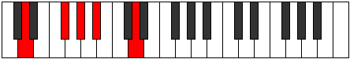
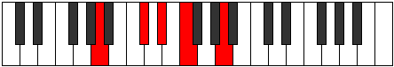

# Mode Koptic

## Links

- [Documentation](README.md)
- [Scales Index](Scales.md)
- [Modes Index](Modes.md)
- [Chords Index](Chords.md)

## Parent Scale

[Aeolic](ScaleAeolic.md)

## Number

[337](https://ianring.com/musictheory/scales/337)

## Luminosity

-1

## Transposition

4, 2, 2, 4

## Chord Pattern

## Perfection

- 0 Perfect notes
- 4 Perfect notes

## Perfection Profile

false, false, false, false

## Permutations

| Tonic | Notes | Signature | Illustration | Audio |
|-------|-------|-----------|--------------|-------|
| [C](ModeCNaturalKoptic.md) | **C**, **E**, **F#**, **G#**, **C** | C |  | [midi](https://github.com/edipermadi/music/blob/main/docs/ModeCNaturalKoptic.mid?raw=true) |
| [C#](ModeCSharpKoptic.md) | **C#**, **F**, **G**, **A**, **C#** | C |  | [midi](https://github.com/edipermadi/music/blob/main/docs/ModeCSharpKoptic.mid?raw=true) |
| [Db](ModeDFlatKoptic.md) | **Db**, **F**, **G**, **A**, **Db** | C |  | [midi](https://github.com/edipermadi/music/blob/main/docs/ModeDFlatKoptic.mid?raw=true) |
| [D](ModeDNaturalKoptic.md) | **D**, **F#**, **G#**, **A#**, **D** | C |  | [midi](https://github.com/edipermadi/music/blob/main/docs/ModeDNaturalKoptic.mid?raw=true) |
| [D#](ModeDSharpKoptic.md) | **D#**, **G**, **A**, **B**, **D#** | C |  | [midi](https://github.com/edipermadi/music/blob/main/docs/ModeDSharpKoptic.mid?raw=true) |
| [Eb](ModeEFlatKoptic.md) | **Eb**, **G**, **A**, **B**, **Eb** | C |  | [midi](https://github.com/edipermadi/music/blob/main/docs/ModeEFlatKoptic.mid?raw=true) |
| [E](ModeENaturalKoptic.md) | **E**, **G#**, **A#**, **C**, **E** | C |  | [midi](https://github.com/edipermadi/music/blob/main/docs/ModeENaturalKoptic.mid?raw=true) |
| [F](ModeFNaturalKoptic.md) | **F**, **A**, **B**, **C#**, **F** | C |  | [midi](https://github.com/edipermadi/music/blob/main/docs/ModeFNaturalKoptic.mid?raw=true) |
| [F#](ModeFSharpKoptic.md) | **F#**, **A#**, **C**, **D**, **F#** | C |  | [midi](https://github.com/edipermadi/music/blob/main/docs/ModeFSharpKoptic.mid?raw=true) |
| [Gb](ModeGFlatKoptic.md) | **Gb**, **Bb**, **C**, **D**, **Gb** | C |  | [midi](https://github.com/edipermadi/music/blob/main/docs/ModeGFlatKoptic.mid?raw=true) |
| [G](ModeGNaturalKoptic.md) | **G**, **B**, **C#**, **D#**, **G** | C |  | [midi](https://github.com/edipermadi/music/blob/main/docs/ModeGNaturalKoptic.mid?raw=true) |
| [G#](ModeGSharpKoptic.md) | **G#**, **C**, **D**, **E**, **G#** | C |  | [midi](https://github.com/edipermadi/music/blob/main/docs/ModeGSharpKoptic.mid?raw=true) |
| [Ab](ModeAFlatKoptic.md) | **Ab**, **C**, **D**, **E**, **Ab** | C |  | [midi](https://github.com/edipermadi/music/blob/main/docs/ModeAFlatKoptic.mid?raw=true) |
| [A](ModeANaturalKoptic.md) | **A**, **C#**, **D#**, **F**, **A** | C |  | [midi](https://github.com/edipermadi/music/blob/main/docs/ModeANaturalKoptic.mid?raw=true) |
| [A#](ModeASharpKoptic.md) | **A#**, **D**, **E**, **F#**, **A#** | C |  | [midi](https://github.com/edipermadi/music/blob/main/docs/ModeASharpKoptic.mid?raw=true) |
| [Bb](ModeBFlatKoptic.md) | **Bb**, **D**, **E**, **Gb**, **Bb** | C |  | [midi](https://github.com/edipermadi/music/blob/main/docs/ModeBFlatKoptic.mid?raw=true) |
| [B](ModeBNaturalKoptic.md) | **B**, **D#**, **F**, **G**, **B** | C |  | [midi](https://github.com/edipermadi/music/blob/main/docs/ModeBNaturalKoptic.mid?raw=true) |
