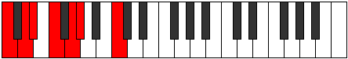
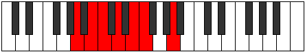
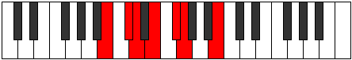

# Mode Koptimic

## Links

- [Documentation](index.md)
- [Scales Index](Scales.md)
- [Modes Index](Modes.md)
- [Chords Index](Chords.md)

## Parent Scale

[Dyrimic](ScaleDyrimic.md)

## Number

[429](https://ianring.com/musictheory/scales/429)

## Interval Pattern

2, 1, 2, 2, 1, 4

## Chord Pattern

i, ii⁰, iv, VI

## Perfection

- 4 Perfect notes
- 2 Perfect notes

## Perfection Profile

[true false false true true true]

## Permutations

| Tonic | Notes | Signature | Illustration | Audio |
|-------|-------|-----------|--------------|-------|
| [C](ModeCNaturalKoptimic.md) | C, **D**, **Eb**, F, G, Ab, C | C |  | [midi](https://github.com/edipermadi/music/blob/main/docs/ModeCNaturalKoptimic.mid?raw=true) |
| [C#](ModeCSharpKoptimic.md) | C#, **D#**, **E**, F#, G#, A, C# | C |  | [midi](https://github.com/edipermadi/music/blob/main/docs/ModeCSharpKoptimic.mid?raw=true) |
| [Db](ModeDFlatKoptimic.md) | Db, **Eb**, **Fb**, Gb, Ab, Bbb, Db | C |  | [midi](https://github.com/edipermadi/music/blob/main/docs/ModeDFlatKoptimic.mid?raw=true) |
| [D](ModeDNaturalKoptimic.md) | D, **E**, **F**, G, A, Bb, D | C |  | [midi](https://github.com/edipermadi/music/blob/main/docs/ModeDNaturalKoptimic.mid?raw=true) |
| [D#](ModeDSharpKoptimic.md) | D#, **E#**, **F#**, G#, A#, B, D# | C |  | [midi](https://github.com/edipermadi/music/blob/main/docs/ModeDSharpKoptimic.mid?raw=true) |
| [Eb](ModeEFlatKoptimic.md) | Eb, **F**, **Gb**, Ab, Bb, Cb, Eb | C |  | [midi](https://github.com/edipermadi/music/blob/main/docs/ModeEFlatKoptimic.mid?raw=true) |
| [E](ModeENaturalKoptimic.md) | E, **F#**, **G**, A, B, C, E | C |  | [midi](https://github.com/edipermadi/music/blob/main/docs/ModeENaturalKoptimic.mid?raw=true) |
| [F](ModeFNaturalKoptimic.md) | F, **G**, **Ab**, Bb, C, Db, F | C |  | [midi](https://github.com/edipermadi/music/blob/main/docs/ModeFNaturalKoptimic.mid?raw=true) |
| [F#](ModeFSharpKoptimic.md) | F#, **G#**, **A**, B, C#, D, F# | C |  | [midi](https://github.com/edipermadi/music/blob/main/docs/ModeFSharpKoptimic.mid?raw=true) |
| [Gb](ModeGFlatKoptimic.md) | Gb, **Ab**, **Bbb**, Cb, Db, Ebb, Gb | C |  | [midi](https://github.com/edipermadi/music/blob/main/docs/ModeGFlatKoptimic.mid?raw=true) |
| [G](ModeGNaturalKoptimic.md) | G, **A**, **Bb**, C, D, Eb, G | C |  | [midi](https://github.com/edipermadi/music/blob/main/docs/ModeGNaturalKoptimic.mid?raw=true) |
| [G#](ModeGSharpKoptimic.md) | G#, **A#**, **B**, C#, D#, E, G# | C |  | [midi](https://github.com/edipermadi/music/blob/main/docs/ModeGSharpKoptimic.mid?raw=true) |
| [Ab](ModeAFlatKoptimic.md) | Ab, **Bb**, **Cb**, Db, Eb, Fb, Ab | C |  | [midi](https://github.com/edipermadi/music/blob/main/docs/ModeAFlatKoptimic.mid?raw=true) |
| [A](ModeANaturalKoptimic.md) | A, **B**, **C**, D, E, F, A | C |  | [midi](https://github.com/edipermadi/music/blob/main/docs/ModeANaturalKoptimic.mid?raw=true) |
| [A#](ModeASharpKoptimic.md) | A#, **B#**, **C#**, D#, E#, F#, A# | C |  | [midi](https://github.com/edipermadi/music/blob/main/docs/ModeASharpKoptimic.mid?raw=true) |
| [Bb](ModeBFlatKoptimic.md) | Bb, **C**, **Db**, Eb, F, Gb, Bb | C |  | [midi](https://github.com/edipermadi/music/blob/main/docs/ModeBFlatKoptimic.mid?raw=true) |
| [B](ModeBNaturalKoptimic.md) | B, **C#**, **D**, E, F#, G, B | C |  | [midi](https://github.com/edipermadi/music/blob/main/docs/ModeBNaturalKoptimic.mid?raw=true) |
