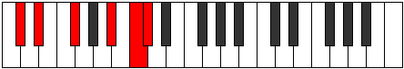
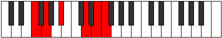

# Mode Koptitonic

## Links

- [Documentation](index.md)
- [Scales Index](Scales.md)
- [Modes Index](Modes.md)
- [Chords Index](Chords.md)

## Parent Scale

[Aeolacritonic](ScaleAeolacritonic.md)

## Number

[2597](https://ianring.com/musictheory/scales/2597)

## Perfection

- 2 Perfect notes
- 3 Perfect notes

## Perfection Profile

[false true true false false]

## Permutations

| Tonic | Notes | Signature | Illustration | Audio |
|-------|-------|-----------|--------------|-------|
| [C](ModeCNaturalKoptitonic.md) | **C**, D, F, **A**, **B**, **C** | C |  | [midi](https://github.com/edipermadi/music/blob/main/docs/ModeCNaturalKoptitonic.mid?raw=true) |
| [C#](ModeCSharpKoptitonic.md) | **C#**, D#, F#, **A#**, **C**, **C#** | C |  | [midi](https://github.com/edipermadi/music/blob/main/docs/ModeCSharpKoptitonic.mid?raw=true) |
| [Db](ModeDFlatKoptitonic.md) | **Db**, Eb, Gb, **Bb**, **C**, **Db** | C |  | [midi](https://github.com/edipermadi/music/blob/main/docs/ModeDFlatKoptitonic.mid?raw=true) |
| [D](ModeDNaturalKoptitonic.md) | **D**, E, G, **B**, **C#**, **D** | C |  | [midi](https://github.com/edipermadi/music/blob/main/docs/ModeDNaturalKoptitonic.mid?raw=true) |
| [D#](ModeDSharpKoptitonic.md) | **D#**, F, G#, **C**, **D**, **D#** | C |  | [midi](https://github.com/edipermadi/music/blob/main/docs/ModeDSharpKoptitonic.mid?raw=true) |
| [Eb](ModeEFlatKoptitonic.md) | **Eb**, F, Ab, **C**, **D**, **Eb** | C |  | [midi](https://github.com/edipermadi/music/blob/main/docs/ModeEFlatKoptitonic.mid?raw=true) |
| [E](ModeENaturalKoptitonic.md) | **E**, F#, A, **C#**, **D#**, **E** | C |  | [midi](https://github.com/edipermadi/music/blob/main/docs/ModeENaturalKoptitonic.mid?raw=true) |
| [F](ModeFNaturalKoptitonic.md) | **F**, G, A#, **D**, **E**, **F** | C |  | [midi](https://github.com/edipermadi/music/blob/main/docs/ModeFNaturalKoptitonic.mid?raw=true) |
| [F#](ModeFSharpKoptitonic.md) | **F#**, G#, B, **D#**, **F**, **F#** | C |  | [midi](https://github.com/edipermadi/music/blob/main/docs/ModeFSharpKoptitonic.mid?raw=true) |
| [Gb](ModeGFlatKoptitonic.md) | **Gb**, Ab, B, **Eb**, **F**, **Gb** | C |  | [midi](https://github.com/edipermadi/music/blob/main/docs/ModeGFlatKoptitonic.mid?raw=true) |
| [G](ModeGNaturalKoptitonic.md) | **G**, A, C, **E**, **F#**, **G** | C |  | [midi](https://github.com/edipermadi/music/blob/main/docs/ModeGNaturalKoptitonic.mid?raw=true) |
| [G#](ModeGSharpKoptitonic.md) | **G#**, A#, C#, **F**, **G**, **G#** | C |  | [midi](https://github.com/edipermadi/music/blob/main/docs/ModeGSharpKoptitonic.mid?raw=true) |
| [Ab](ModeAFlatKoptitonic.md) | **Ab**, Bb, Db, **F**, **G**, **Ab** | C |  | [midi](https://github.com/edipermadi/music/blob/main/docs/ModeAFlatKoptitonic.mid?raw=true) |
| [A](ModeANaturalKoptitonic.md) | **A**, B, D, **F#**, **G#**, **A** | C |  | [midi](https://github.com/edipermadi/music/blob/main/docs/ModeANaturalKoptitonic.mid?raw=true) |
| [A#](ModeASharpKoptitonic.md) | **A#**, C, D#, **G**, **A**, **A#** | C |  | [midi](https://github.com/edipermadi/music/blob/main/docs/ModeASharpKoptitonic.mid?raw=true) |
| [Bb](ModeBFlatKoptitonic.md) | **Bb**, C, Eb, **G**, **A**, **Bb** | C |  | [midi](https://github.com/edipermadi/music/blob/main/docs/ModeBFlatKoptitonic.mid?raw=true) |
| [B](ModeBNaturalKoptitonic.md) | **B**, C#, E, **G#**, **A#**, **B** | C |  | [midi](https://github.com/edipermadi/music/blob/main/docs/ModeBNaturalKoptitonic.mid?raw=true) |
