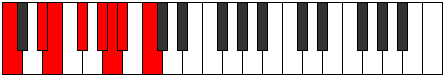

# Mode Korian

## Links

- [Documentation](index.md)
- [Scales Index](Scales.md)
- [Modes Index](Modes.md)
- [Chords Index](Chords.md)

## Parent Scale

[Korian](ScaleKorian.md)

## Number

[1881](https://ianring.com/musictheory/scales/1881)

## Perfection

- 3 Perfect notes
- 4 Perfect notes

## Perfection Profile

[false true false false true true false]

## Permutations

| Tonic | Notes | Signature | Illustration | Audio |
|-------|-------|-----------|--------------|-------|
| [C](ModeCNaturalKorian.md) | **C**, D#, **E**, **F#**, G#, A, **Bb**, **C** | C |  | [midi](ModeCNaturalKorian.mid) [ogg](ModeCNaturalKorian.ogg) |
| [C#](ModeCSharpKorian.md) | **C#**, D##, **E#**, **F##**, G##, A#, **B**, **C#** | C |  | [midi](ModeCSharpKorian.mid) [ogg](ModeCSharpKorian.ogg) |
| [Db](ModeDFlatKorian.md) | **Db**, E, **F**, **G**, A, Bb, **Cb**, **Db** | C |  | [midi](ModeDFlatKorian.mid) [ogg](ModeDFlatKorian.ogg) |
| [D](ModeDNaturalKorian.md) | **D**, E#, **F#**, **G#**, A#, B, **C**, **D** | C |  | [midi](ModeDNaturalKorian.mid) [ogg](ModeDNaturalKorian.ogg) |
| [D#](ModeDSharpKorian.md) | **D#**, E##, **F##**, **G##**, A##, B#, **C#**, **D#** | C |  | [midi](ModeDSharpKorian.mid) [ogg](ModeDSharpKorian.ogg) |
| [Eb](ModeEFlatKorian.md) | **Eb**, F#, **G**, **A**, B, C, **Db**, **Eb** | C |  | [midi](ModeEFlatKorian.mid) [ogg](ModeEFlatKorian.ogg) |
| [E](ModeENaturalKorian.md) | **E**, F##, **G#**, **A#**, B#, C#, **D**, **E** | C |  | [midi](ModeENaturalKorian.mid) [ogg](ModeENaturalKorian.ogg) |
| [F](ModeFNaturalKorian.md) | **F**, G#, **A**, **B**, C#, D, **Eb**, **F** | C |  | [midi](ModeFNaturalKorian.mid) [ogg](ModeFNaturalKorian.ogg) |
| [F#](ModeFSharpKorian.md) | **F#**, G##, **A#**, **B#**, C##, D#, **E**, **F#** | C |  | [midi](ModeFSharpKorian.mid) [ogg](ModeFSharpKorian.ogg) |
| [Gb](ModeGFlatKorian.md) | **Gb**, A, **Bb**, **C**, D, Eb, **Fb**, **Gb** | C |  | [midi](ModeGFlatKorian.mid) [ogg](ModeGFlatKorian.ogg) |
| [G](ModeGNaturalKorian.md) | **G**, A#, **B**, **C#**, D#, E, **F**, **G** | C |  | [midi](ModeGNaturalKorian.mid) [ogg](ModeGNaturalKorian.ogg) |
| [G#](ModeGSharpKorian.md) | **G#**, A##, **B#**, **C##**, D##, E#, **F#**, **G#** | C |  | [midi](ModeGSharpKorian.mid) [ogg](ModeGSharpKorian.ogg) |
| [Ab](ModeAFlatKorian.md) | **Ab**, B, **C**, **D**, E, F, **Gb**, **Ab** | C |  | [midi](ModeAFlatKorian.mid) [ogg](ModeAFlatKorian.ogg) |
| [A](ModeANaturalKorian.md) | **A**, B#, **C#**, **D#**, E#, F#, **G**, **A** | C |  | [midi](ModeANaturalKorian.mid) [ogg](ModeANaturalKorian.ogg) |
| [A#](ModeASharpKorian.md) | **A#**, B##, **C##**, **D##**, E##, F##, **G#**, **A#** | C |  | [midi](ModeASharpKorian.mid) [ogg](ModeASharpKorian.ogg) |
| [Bb](ModeBFlatKorian.md) | **Bb**, C#, **D**, **E**, F#, G, **Ab**, **Bb** | C |  | [midi](ModeBFlatKorian.mid) [ogg](ModeBFlatKorian.ogg) |
| [B](ModeBNaturalKorian.md) | **B**, C##, **D#**, **E#**, F##, G#, **A**, **B** | C |  | [midi](ModeBNaturalKorian.mid) [ogg](ModeBNaturalKorian.ogg) |
