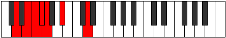
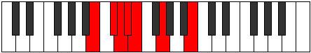

# Mode Korimic

## Links

- [Documentation](index.md)
- [Scales Index](Scales.md)
- [Modes Index](Modes.md)
- [Chords Index](Chords.md)

## Parent Scale

[Kocrimic](ScaleKocrimic.md)

## Number

[317](https://ianring.com/musictheory/scales/317)

## Perfection

- 2 Perfect notes
- 4 Perfect notes

## Perfection Profile

[false false false false true true]

## Permutations

| Tonic | Notes | Signature | Illustration | Audio |
|-------|-------|-----------|--------------|-------|
| [C](ModeCNaturalKorimic.md) | **C**, **D**, **Eb**, **Fb**, Gbb, Ab, **C** | C |  | [midi](ModeCNaturalKorimic.mid) [ogg](ModeCNaturalKorimic.ogg) |
| [C#](ModeCSharpKorimic.md) | **C#**, **D#**, **E**, **F**, Gb, A, **C#** | C |  | [midi](ModeCSharpKorimic.mid) [ogg](ModeCSharpKorimic.ogg) |
| [Db](ModeDFlatKorimic.md) | **Db**, **Eb**, **Fb**, **Gbb**, Abbb, Bbb, **Db** | C |  | [midi](ModeDFlatKorimic.mid) [ogg](ModeDFlatKorimic.ogg) |
| [D](ModeDNaturalKorimic.md) | **D**, **E**, **F**, **Gb**, Abb, Bb, **D** | C |  | [midi](ModeDNaturalKorimic.mid) [ogg](ModeDNaturalKorimic.ogg) |
| [D#](ModeDSharpKorimic.md) | **D#**, **E#**, **F#**, **G**, Ab, B, **D#** | C |  | [midi](ModeDSharpKorimic.mid) [ogg](ModeDSharpKorimic.ogg) |
| [Eb](ModeEFlatKorimic.md) | **Eb**, **F**, **Gb**, **Abb**, Bbbb, Cb, **Eb** | C |  | [midi](ModeEFlatKorimic.mid) [ogg](ModeEFlatKorimic.ogg) |
| [E](ModeENaturalKorimic.md) | **E**, **F#**, **G**, **Ab**, Bbb, C, **E** | C |  | [midi](ModeENaturalKorimic.mid) [ogg](ModeENaturalKorimic.ogg) |
| [F](ModeFNaturalKorimic.md) | **F**, **G**, **Ab**, **Bbb**, Cbb, Db, **F** | C |  | [midi](ModeFNaturalKorimic.mid) [ogg](ModeFNaturalKorimic.ogg) |
| [F#](ModeFSharpKorimic.md) | **F#**, **G#**, **A**, **Bb**, Cb, D, **F#** | C |  | [midi](ModeFSharpKorimic.mid) [ogg](ModeFSharpKorimic.ogg) |
| [Gb](ModeGFlatKorimic.md) | **Gb**, **Ab**, **Bbb**, **Cbb**, Dbbb, Ebb, **Gb** | C |  | [midi](ModeGFlatKorimic.mid) [ogg](ModeGFlatKorimic.ogg) |
| [G](ModeGNaturalKorimic.md) | **G**, **A**, **Bb**, **Cb**, Dbb, Eb, **G** | C |  | [midi](ModeGNaturalKorimic.mid) [ogg](ModeGNaturalKorimic.ogg) |
| [G#](ModeGSharpKorimic.md) | **G#**, **A#**, **B**, **C**, Db, E, **G#** | C |  | [midi](ModeGSharpKorimic.mid) [ogg](ModeGSharpKorimic.ogg) |
| [Ab](ModeAFlatKorimic.md) | **Ab**, **Bb**, **Cb**, **Dbb**, Ebbb, Fb, **Ab** | C |  | [midi](ModeAFlatKorimic.mid) [ogg](ModeAFlatKorimic.ogg) |
| [A](ModeANaturalKorimic.md) | **A**, **B**, **C**, **Db**, Ebb, F, **A** | C |  | [midi](ModeANaturalKorimic.mid) [ogg](ModeANaturalKorimic.ogg) |
| [A#](ModeASharpKorimic.md) | **A#**, **B#**, **C#**, **D**, Eb, F#, **A#** | C |  | [midi](ModeASharpKorimic.mid) [ogg](ModeASharpKorimic.ogg) |
| [Bb](ModeBFlatKorimic.md) | **Bb**, **C**, **Db**, **Ebb**, Fbb, Gb, **Bb** | C |  | [midi](ModeBFlatKorimic.mid) [ogg](ModeBFlatKorimic.ogg) |
| [B](ModeBNaturalKorimic.md) | **B**, **C#**, **D**, **Eb**, Fb, G, **B** | C |  | [midi](ModeBNaturalKorimic.mid) [ogg](ModeBNaturalKorimic.ogg) |
