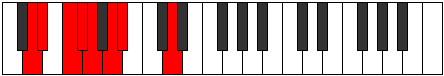

# Mode Kothian

## Links

- [Documentation](README.md)
- [Scales Index](Scales.md)
- [Modes Index](Modes.md)
- [Chords Index](Chords.md)

## Parent Scale

[Stythian](ScaleStythian.md)

## Number

[443](https://ianring.com/musictheory/scales/443)

## Interval Pattern

1, 2, 1, 1, 2, 1, 4

## Chord Pattern

ii⁰

## Perfection

- 4 Perfect notes
- 3 Perfect notes

## Perfection Profile

[true true false false true false true]

## Permutations

| Tonic | Notes | Signature | Illustration | Audio |
|-------|-------|-----------|--------------|-------|
| [C](ModeCNaturalKothian.md) | C, Db, **Eb**, **Fb**, Gbb, **Abb**, Bbbb, C | C |  | [midi](https://github.com/edipermadi/music/blob/main/docs/ModeCNaturalKothian.mid?raw=true) |
| [C#](ModeCSharpKothian.md) | C#, D, **E**, **F**, Gb, **Ab**, Bbb, C# | C |  | [midi](https://github.com/edipermadi/music/blob/main/docs/ModeCSharpKothian.mid?raw=true) |
| [Db](ModeDFlatKothian.md) | Db, Ebb, **Fb**, **Gbb**, Abbb, **Bbbb**, Cbbb, Db | C |  | [midi](https://github.com/edipermadi/music/blob/main/docs/ModeDFlatKothian.mid?raw=true) |
| [D](ModeDNaturalKothian.md) | D, Eb, **F**, **Gb**, Abb, **Bbb**, Cbb, D | C |  | [midi](https://github.com/edipermadi/music/blob/main/docs/ModeDNaturalKothian.mid?raw=true) |
| [D#](ModeDSharpKothian.md) | D#, E, **F#**, **G**, Ab, **Bb**, Cb, D# | C |  | [midi](https://github.com/edipermadi/music/blob/main/docs/ModeDSharpKothian.mid?raw=true) |
| [Eb](ModeEFlatKothian.md) | Eb, Fb, **Gb**, **Abb**, Bbbb, **Cbb**, Dbbb, Eb | C |  | [midi](https://github.com/edipermadi/music/blob/main/docs/ModeEFlatKothian.mid?raw=true) |
| [E](ModeENaturalKothian.md) | E, F, **G**, **Ab**, Bbb, **Cb**, Dbb, E | C |  | [midi](https://github.com/edipermadi/music/blob/main/docs/ModeENaturalKothian.mid?raw=true) |
| [F](ModeFNaturalKothian.md) | F, Gb, **Ab**, **Bbb**, Cbb, **Dbb**, Ebbb, F | C |  | [midi](https://github.com/edipermadi/music/blob/main/docs/ModeFNaturalKothian.mid?raw=true) |
| [F#](ModeFSharpKothian.md) | F#, G, **A**, **Bb**, Cb, **Db**, Ebb, F# | C |  | [midi](https://github.com/edipermadi/music/blob/main/docs/ModeFSharpKothian.mid?raw=true) |
| [Gb](ModeGFlatKothian.md) | Gb, Abb, **Bbb**, **Cbb**, Dbbb, **Ebbb**, Fbbb, Gb | C |  | [midi](https://github.com/edipermadi/music/blob/main/docs/ModeGFlatKothian.mid?raw=true) |
| [G](ModeGNaturalKothian.md) | G, Ab, **Bb**, **Cb**, Dbb, **Ebb**, Fbb, G | C |  | [midi](https://github.com/edipermadi/music/blob/main/docs/ModeGNaturalKothian.mid?raw=true) |
| [G#](ModeGSharpKothian.md) | G#, A, **B**, **C**, Db, **Eb**, Fb, G# | C |  | [midi](https://github.com/edipermadi/music/blob/main/docs/ModeGSharpKothian.mid?raw=true) |
| [Ab](ModeAFlatKothian.md) | Ab, Bbb, **Cb**, **Dbb**, Ebbb, **Fbb**, Gbbb, Ab | C |  | [midi](https://github.com/edipermadi/music/blob/main/docs/ModeAFlatKothian.mid?raw=true) |
| [A](ModeANaturalKothian.md) | A, Bb, **C**, **Db**, Ebb, **Fb**, Gbb, A | C |  | [midi](https://github.com/edipermadi/music/blob/main/docs/ModeANaturalKothian.mid?raw=true) |
| [A#](ModeASharpKothian.md) | A#, B, **C#**, **D**, Eb, **F**, Gb, A# | C |  | [midi](https://github.com/edipermadi/music/blob/main/docs/ModeASharpKothian.mid?raw=true) |
| [Bb](ModeBFlatKothian.md) | Bb, Cb, **Db**, **Ebb**, Fbb, **Gbb**, Abbb, Bb | C |  | [midi](https://github.com/edipermadi/music/blob/main/docs/ModeBFlatKothian.mid?raw=true) |
| [B](ModeBNaturalKothian.md) | B, C, **D**, **Eb**, Fb, **Gb**, Abb, B | C |  | [midi](https://github.com/edipermadi/music/blob/main/docs/ModeBNaturalKothian.mid?raw=true) |
