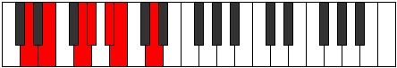
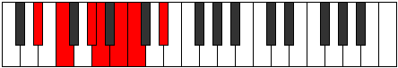

# Mode Kothimic

## Links

- [Documentation](README.md)
- [Scales Index](Scales.md)
- [Modes Index](Modes.md)
- [Chords Index](Chords.md)

## Parent Scale

[Stythimic](ScaleStythimic.md)

## Number

[869](https://ianring.com/musictheory/scales/869)

## Luminosity

5

## Transposition

2, 3, 1, 2, 1, 3

## Chord Pattern

II, iii

## Perfection

- 2 Perfect notes
- 4 Perfect notes

## Perfection Profile

false, true, true, false, false, false

## Permutations

| Tonic | Notes | Signature | Illustration | Audio |
|-------|-------|-----------|--------------|-------|
| [C](ModeCNaturalKothimic.md) | **C**, D, E#, **F#**, **G#**, **A**, **C** | C |  | [midi](https://github.com/edipermadi/music/blob/main/docs/ModeCNaturalKothimic.mid?raw=true) |
| [C#](ModeCSharpKothimic.md) | **C#**, D#, E##, **F##**, **G##**, **A#**, **C#** | C |  | [midi](https://github.com/edipermadi/music/blob/main/docs/ModeCSharpKothimic.mid?raw=true) |
| [Db](ModeDFlatKothimic.md) | **Db**, Eb, F#, **G**, **A**, **Bb**, **Db** | C |  | [midi](https://github.com/edipermadi/music/blob/main/docs/ModeDFlatKothimic.mid?raw=true) |
| [D](ModeDNaturalKothimic.md) | **D**, E, F##, **G#**, **A#**, **B**, **D** | C |  | [midi](https://github.com/edipermadi/music/blob/main/docs/ModeDNaturalKothimic.mid?raw=true) |
| [D#](ModeDSharpKothimic.md) | **D#**, E#, F###, **G##**, **A##**, **B#**, **D#** | C |  | [midi](https://github.com/edipermadi/music/blob/main/docs/ModeDSharpKothimic.mid?raw=true) |
| [Eb](ModeEFlatKothimic.md) | **Eb**, F, G#, **A**, **B**, **C**, **Eb** | C |  | [midi](https://github.com/edipermadi/music/blob/main/docs/ModeEFlatKothimic.mid?raw=true) |
| [E](ModeENaturalKothimic.md) | **E**, F#, G##, **A#**, **B#**, **C#**, **E** | C |  | [midi](https://github.com/edipermadi/music/blob/main/docs/ModeENaturalKothimic.mid?raw=true) |
| [F](ModeFNaturalKothimic.md) | **F**, G, A#, **B**, **C#**, **D**, **F** | C |  | [midi](https://github.com/edipermadi/music/blob/main/docs/ModeFNaturalKothimic.mid?raw=true) |
| [F#](ModeFSharpKothimic.md) | **F#**, G#, A##, **B#**, **C##**, **D#**, **F#** | C |  | [midi](https://github.com/edipermadi/music/blob/main/docs/ModeFSharpKothimic.mid?raw=true) |
| [Gb](ModeGFlatKothimic.md) | **Gb**, Ab, B, **C**, **D**, **Eb**, **Gb** | C |  | [midi](https://github.com/edipermadi/music/blob/main/docs/ModeGFlatKothimic.mid?raw=true) |
| [G](ModeGNaturalKothimic.md) | **G**, A, B#, **C#**, **D#**, **E**, **G** | C |  | [midi](https://github.com/edipermadi/music/blob/main/docs/ModeGNaturalKothimic.mid?raw=true) |
| [G#](ModeGSharpKothimic.md) | **G#**, A#, B##, **C##**, **D##**, **E#**, **G#** | C |  | [midi](https://github.com/edipermadi/music/blob/main/docs/ModeGSharpKothimic.mid?raw=true) |
| [Ab](ModeAFlatKothimic.md) | **Ab**, Bb, C#, **D**, **E**, **F**, **Ab** | C |  | [midi](https://github.com/edipermadi/music/blob/main/docs/ModeAFlatKothimic.mid?raw=true) |
| [A](ModeANaturalKothimic.md) | **A**, B, C##, **D#**, **E#**, **F#**, **A** | C |  | [midi](https://github.com/edipermadi/music/blob/main/docs/ModeANaturalKothimic.mid?raw=true) |
| [A#](ModeASharpKothimic.md) | **A#**, B#, C###, **D##**, **E##**, **F##**, **A#** | C |  | [midi](https://github.com/edipermadi/music/blob/main/docs/ModeASharpKothimic.mid?raw=true) |
| [Bb](ModeBFlatKothimic.md) | **Bb**, C, D#, **E**, **F#**, **G**, **Bb** | C |  | [midi](https://github.com/edipermadi/music/blob/main/docs/ModeBFlatKothimic.mid?raw=true) |
| [B](ModeBNaturalKothimic.md) | **B**, C#, D##, **E#**, **F##**, **G#**, **B** | C |  | [midi](https://github.com/edipermadi/music/blob/main/docs/ModeBNaturalKothimic.mid?raw=true) |
