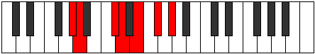

# Mode Kycrimic

## Links

- [Documentation](README.md)
- [Scales Index](Scales.md)
- [Modes Index](Modes.md)
- [Chords Index](Chords.md)

## Parent Scale

[Bylimic](ScaleBylimic.md)

## Number

[1379](https://ianring.com/musictheory/scales/1379)

## Interval Pattern

1, 4, 1, 2, 2, 2

## Chord Pattern

iii, IV

## Perfection

- 4 Perfect notes
- 2 Perfect notes

## Perfection Profile

[false true true true false true]

## Permutations

| Tonic | Notes | Signature | Illustration | Audio |
|-------|-------|-----------|--------------|-------|
| [C](ModeCNaturalKycrimic.md) | **C**, Db, E#, F#, **G#**, A#, **C** | C |  | [midi](https://github.com/edipermadi/music/blob/main/docs/ModeCNaturalKycrimic.mid?raw=true) |
| [C#](ModeCSharpKycrimic.md) | **C#**, D, E##, F##, **G##**, A##, **C#** | C |  | [midi](https://github.com/edipermadi/music/blob/main/docs/ModeCSharpKycrimic.mid?raw=true) |
| [Db](ModeDFlatKycrimic.md) | **Db**, Ebb, F#, G, **A**, B, **Db** | C |  | [midi](https://github.com/edipermadi/music/blob/main/docs/ModeDFlatKycrimic.mid?raw=true) |
| [D](ModeDNaturalKycrimic.md) | **D**, Eb, F##, G#, **A#**, B#, **D** | C |  | [midi](https://github.com/edipermadi/music/blob/main/docs/ModeDNaturalKycrimic.mid?raw=true) |
| [D#](ModeDSharpKycrimic.md) | **D#**, E, F###, G##, **A##**, B##, **D#** | C |  | [midi](https://github.com/edipermadi/music/blob/main/docs/ModeDSharpKycrimic.mid?raw=true) |
| [Eb](ModeEFlatKycrimic.md) | **Eb**, Fb, G#, A, **B**, C#, **Eb** | C |  | [midi](https://github.com/edipermadi/music/blob/main/docs/ModeEFlatKycrimic.mid?raw=true) |
| [E](ModeENaturalKycrimic.md) | **E**, F, G##, A#, **B#**, C##, **E** | C |  | [midi](https://github.com/edipermadi/music/blob/main/docs/ModeENaturalKycrimic.mid?raw=true) |
| [F](ModeFNaturalKycrimic.md) | **F**, Gb, A#, B, **C#**, D#, **F** | C |  | [midi](https://github.com/edipermadi/music/blob/main/docs/ModeFNaturalKycrimic.mid?raw=true) |
| [F#](ModeFSharpKycrimic.md) | **F#**, G, A##, B#, **C##**, D##, **F#** | C |  | [midi](https://github.com/edipermadi/music/blob/main/docs/ModeFSharpKycrimic.mid?raw=true) |
| [Gb](ModeGFlatKycrimic.md) | **Gb**, Abb, B, C, **D**, E, **Gb** | C |  | [midi](https://github.com/edipermadi/music/blob/main/docs/ModeGFlatKycrimic.mid?raw=true) |
| [G](ModeGNaturalKycrimic.md) | **G**, Ab, B#, C#, **D#**, E#, **G** | C |  | [midi](https://github.com/edipermadi/music/blob/main/docs/ModeGNaturalKycrimic.mid?raw=true) |
| [G#](ModeGSharpKycrimic.md) | **G#**, A, B##, C##, **D##**, E##, **G#** | C |  | [midi](https://github.com/edipermadi/music/blob/main/docs/ModeGSharpKycrimic.mid?raw=true) |
| [Ab](ModeAFlatKycrimic.md) | **Ab**, Bbb, C#, D, **E**, F#, **Ab** | C |  | [midi](https://github.com/edipermadi/music/blob/main/docs/ModeAFlatKycrimic.mid?raw=true) |
| [A](ModeANaturalKycrimic.md) | **A**, Bb, C##, D#, **E#**, F##, **A** | C |  | [midi](https://github.com/edipermadi/music/blob/main/docs/ModeANaturalKycrimic.mid?raw=true) |
| [A#](ModeASharpKycrimic.md) | **A#**, B, C###, D##, **E##**, F###, **A#** | C |  | [midi](https://github.com/edipermadi/music/blob/main/docs/ModeASharpKycrimic.mid?raw=true) |
| [Bb](ModeBFlatKycrimic.md) | **Bb**, Cb, D#, E, **F#**, G#, **Bb** | C |  | [midi](https://github.com/edipermadi/music/blob/main/docs/ModeBFlatKycrimic.mid?raw=true) |
| [B](ModeBNaturalKycrimic.md) | **B**, C, D##, E#, **F##**, G##, **B** | C |  | [midi](https://github.com/edipermadi/music/blob/main/docs/ModeBNaturalKycrimic.mid?raw=true) |
