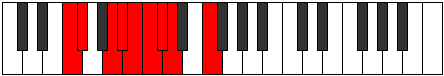

# Mode Kycryllic

## Links

- [Documentation](README.md)
- [Scales Index](Scales.md)
- [Modes Index](Modes.md)
- [Chords Index](Chords.md)

## Parent Scale

[Ioniptyllic](ScaleIoniptyllic.md)

## Number

[1011](https://ianring.com/musictheory/scales/1011)

## Transposition

1, 3, 1, 1, 1, 1, 1, 3

## Chord Pattern

Ib5, IIb5, IIb5, v⁰b3, v⁰b3, vi⁰b3, VII⁺, VII⁺, VIII⁺

## Perfection

- 5 Perfect notes
- 3 Perfect notes

## Perfection Profile

[true true false true true false false true]

## Permutations

| Tonic | Notes | Signature | Illustration | Audio |
|-------|-------|-----------|--------------|-------|
| [C](ModeCNaturalKycryllic.md) | C, C#, **E**, F, F#, **G**, **G#**, A, C | C |  | [midi](https://github.com/edipermadi/music/blob/main/docs/ModeCNaturalKycryllic.mid?raw=true) |
| [C#](ModeCSharpKycryllic.md) | C#, D, **F**, F#, G, **G#**, **A**, A#, C# | C |  | [midi](https://github.com/edipermadi/music/blob/main/docs/ModeCSharpKycryllic.mid?raw=true) |
| [Db](ModeDFlatKycryllic.md) | Db, D, **F**, Gb, G, **Ab**, **A**, Bb, Db | C |  | [midi](https://github.com/edipermadi/music/blob/main/docs/ModeDFlatKycryllic.mid?raw=true) |
| [D](ModeDNaturalKycryllic.md) | D, D#, **F#**, G, G#, **A**, **A#**, B, D | C |  | [midi](https://github.com/edipermadi/music/blob/main/docs/ModeDNaturalKycryllic.mid?raw=true) |
| [D#](ModeDSharpKycryllic.md) | D#, E, **G**, G#, A, **A#**, **B**, C, D# | C |  | [midi](https://github.com/edipermadi/music/blob/main/docs/ModeDSharpKycryllic.mid?raw=true) |
| [Eb](ModeEFlatKycryllic.md) | Eb, E, **G**, Ab, A, **Bb**, **B**, C, Eb | C |  | [midi](https://github.com/edipermadi/music/blob/main/docs/ModeEFlatKycryllic.mid?raw=true) |
| [E](ModeENaturalKycryllic.md) | E, F, **G#**, A, A#, **B**, **C**, C#, E | C |  | [midi](https://github.com/edipermadi/music/blob/main/docs/ModeENaturalKycryllic.mid?raw=true) |
| [F](ModeFNaturalKycryllic.md) | F, F#, **A**, A#, B, **C**, **C#**, D, F | C |  | [midi](https://github.com/edipermadi/music/blob/main/docs/ModeFNaturalKycryllic.mid?raw=true) |
| [F#](ModeFSharpKycryllic.md) | F#, G, **A#**, B, C, **C#**, **D**, D#, F# | C |  | [midi](https://github.com/edipermadi/music/blob/main/docs/ModeFSharpKycryllic.mid?raw=true) |
| [Gb](ModeGFlatKycryllic.md) | Gb, G, **Bb**, B, C, **Db**, **D**, Eb, Gb | C |  | [midi](https://github.com/edipermadi/music/blob/main/docs/ModeGFlatKycryllic.mid?raw=true) |
| [G](ModeGNaturalKycryllic.md) | G, G#, **B**, C, C#, **D**, **D#**, E, G | C |  | [midi](https://github.com/edipermadi/music/blob/main/docs/ModeGNaturalKycryllic.mid?raw=true) |
| [G#](ModeGSharpKycryllic.md) | G#, A, **C**, C#, D, **D#**, **E**, F, G# | C |  | [midi](https://github.com/edipermadi/music/blob/main/docs/ModeGSharpKycryllic.mid?raw=true) |
| [Ab](ModeAFlatKycryllic.md) | Ab, A, **C**, Db, D, **Eb**, **E**, F, Ab | C |  | [midi](https://github.com/edipermadi/music/blob/main/docs/ModeAFlatKycryllic.mid?raw=true) |
| [A](ModeANaturalKycryllic.md) | A, A#, **C#**, D, D#, **E**, **F**, F#, A | C |  | [midi](https://github.com/edipermadi/music/blob/main/docs/ModeANaturalKycryllic.mid?raw=true) |
| [A#](ModeASharpKycryllic.md) | A#, B, **D**, D#, E, **F**, **F#**, G, A# | C |  | [midi](https://github.com/edipermadi/music/blob/main/docs/ModeASharpKycryllic.mid?raw=true) |
| [Bb](ModeBFlatKycryllic.md) | Bb, B, **D**, Eb, E, **F**, **Gb**, G, Bb | C |  | [midi](https://github.com/edipermadi/music/blob/main/docs/ModeBFlatKycryllic.mid?raw=true) |
| [B](ModeBNaturalKycryllic.md) | B, C, **D#**, E, F, **F#**, **G**, G#, B | C |  | [midi](https://github.com/edipermadi/music/blob/main/docs/ModeBNaturalKycryllic.mid?raw=true) |
