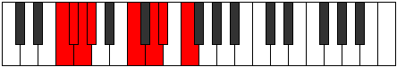

# Mode Kydian

## Links

- [Documentation](README.md)
- [Scales Index](Scales.md)
- [Modes Index](Modes.md)
- [Chords Index](Chords.md)

## Parent Scale

[Aeopian](ScaleAeopian.md)

## Number

[1679](https://ianring.com/musictheory/scales/1679)

## Interval Pattern

1, 1, 1, 4, 2, 1, 2

## Chord Pattern

v⁰

## Perfection

- 4 Perfect notes
- 3 Perfect notes

## Perfection Profile

[true false true true true false false]

## Permutations

| Tonic | Notes | Signature | Illustration | Audio |
|-------|-------|-----------|--------------|-------|
| [C](ModeCNaturalKydian.md) | C, **Db**, Ebb, Fbb, G, **A**, **Bb**, C | C |  | [midi](https://github.com/edipermadi/music/blob/main/docs/ModeCNaturalKydian.mid?raw=true) |
| [C#](ModeCSharpKydian.md) | C#, **D**, Eb, Fb, G#, **A#**, **B**, C# | C |  | [midi](https://github.com/edipermadi/music/blob/main/docs/ModeCSharpKydian.mid?raw=true) |
| [Db](ModeDFlatKydian.md) | Db, **Ebb**, Fbb, Gbbb, Ab, **Bb**, **Cb**, Db | C |  | [midi](https://github.com/edipermadi/music/blob/main/docs/ModeDFlatKydian.mid?raw=true) |
| [D](ModeDNaturalKydian.md) | D, **Eb**, Fb, Gbb, A, **B**, **C**, D | C |  | [midi](https://github.com/edipermadi/music/blob/main/docs/ModeDNaturalKydian.mid?raw=true) |
| [D#](ModeDSharpKydian.md) | D#, **E**, F, Gb, A#, **B#**, **C#**, D# | C |  | [midi](https://github.com/edipermadi/music/blob/main/docs/ModeDSharpKydian.mid?raw=true) |
| [Eb](ModeEFlatKydian.md) | Eb, **Fb**, Gbb, Abbb, Bb, **C**, **Db**, Eb | C |  | [midi](https://github.com/edipermadi/music/blob/main/docs/ModeEFlatKydian.mid?raw=true) |
| [E](ModeENaturalKydian.md) | E, **F**, Gb, Abb, B, **C#**, **D**, E | C |  | [midi](https://github.com/edipermadi/music/blob/main/docs/ModeENaturalKydian.mid?raw=true) |
| [F](ModeFNaturalKydian.md) | F, **Gb**, Abb, Bbbb, C, **D**, **Eb**, F | C |  | [midi](https://github.com/edipermadi/music/blob/main/docs/ModeFNaturalKydian.mid?raw=true) |
| [F#](ModeFSharpKydian.md) | F#, **G**, Ab, Bbb, C#, **D#**, **E**, F# | C |  | [midi](https://github.com/edipermadi/music/blob/main/docs/ModeFSharpKydian.mid?raw=true) |
| [Gb](ModeGFlatKydian.md) | Gb, **Abb**, Bbbb, Cbbb, Db, **Eb**, **Fb**, Gb | C |  | [midi](https://github.com/edipermadi/music/blob/main/docs/ModeGFlatKydian.mid?raw=true) |
| [G](ModeGNaturalKydian.md) | G, **Ab**, Bbb, Cbb, D, **E**, **F**, G | C |  | [midi](https://github.com/edipermadi/music/blob/main/docs/ModeGNaturalKydian.mid?raw=true) |
| [G#](ModeGSharpKydian.md) | G#, **A**, Bb, Cb, D#, **E#**, **F#**, G# | C |  | [midi](https://github.com/edipermadi/music/blob/main/docs/ModeGSharpKydian.mid?raw=true) |
| [Ab](ModeAFlatKydian.md) | Ab, **Bbb**, Cbb, Dbbb, Eb, **F**, **Gb**, Ab | C |  | [midi](https://github.com/edipermadi/music/blob/main/docs/ModeAFlatKydian.mid?raw=true) |
| [A](ModeANaturalKydian.md) | A, **Bb**, Cb, Dbb, E, **F#**, **G**, A | C |  | [midi](https://github.com/edipermadi/music/blob/main/docs/ModeANaturalKydian.mid?raw=true) |
| [A#](ModeASharpKydian.md) | A#, **B**, C, Db, E#, **F##**, **G#**, A# | C |  | [midi](https://github.com/edipermadi/music/blob/main/docs/ModeASharpKydian.mid?raw=true) |
| [Bb](ModeBFlatKydian.md) | Bb, **Cb**, Dbb, Ebbb, F, **G**, **Ab**, Bb | C |  | [midi](https://github.com/edipermadi/music/blob/main/docs/ModeBFlatKydian.mid?raw=true) |
| [B](ModeBNaturalKydian.md) | B, **C**, Db, Ebb, F#, **G#**, **A**, B | C |  | [midi](https://github.com/edipermadi/music/blob/main/docs/ModeBNaturalKydian.mid?raw=true) |
