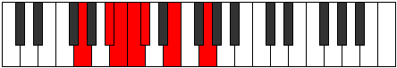

# Mode Kydimic

## Links

- [Documentation](README.md)
- [Scales Index](Scales.md)
- [Modes Index](Modes.md)
- [Chords Index](Chords.md)

## Parent Scale

[Epynimic](ScaleEpynimic.md)

## Number

[633](https://ianring.com/musictheory/scales/633)

## Interval Pattern

3, 1, 1, 1, 3, 3

## Chord Pattern

Ib5, ii⁰b3

## Perfection

- 2 Perfect notes
- 4 Perfect notes

## Perfection Profile

[false false false true false true]

## Permutations

| Tonic | Notes | Signature | Illustration | Audio |
|-------|-------|-----------|--------------|-------|
| [C](ModeCNaturalKydimic.md) | **C**, **D#**, **E**, F, **Gb**, A, **C** | C |  | [midi](https://github.com/edipermadi/music/blob/main/docs/ModeCNaturalKydimic.mid?raw=true) |
| [C#](ModeCSharpKydimic.md) | **C#**, **D##**, **E#**, F#, **G**, A#, **C#** | C |  | [midi](https://github.com/edipermadi/music/blob/main/docs/ModeCSharpKydimic.mid?raw=true) |
| [Db](ModeDFlatKydimic.md) | **Db**, **E**, **F**, Gb, **Abb**, Bb, **Db** | C |  | [midi](https://github.com/edipermadi/music/blob/main/docs/ModeDFlatKydimic.mid?raw=true) |
| [D](ModeDNaturalKydimic.md) | **D**, **E#**, **F#**, G, **Ab**, B, **D** | C |  | [midi](https://github.com/edipermadi/music/blob/main/docs/ModeDNaturalKydimic.mid?raw=true) |
| [D#](ModeDSharpKydimic.md) | **D#**, **E##**, **F##**, G#, **A**, B#, **D#** | C |  | [midi](https://github.com/edipermadi/music/blob/main/docs/ModeDSharpKydimic.mid?raw=true) |
| [Eb](ModeEFlatKydimic.md) | **Eb**, **F#**, **G**, Ab, **Bbb**, C, **Eb** | C |  | [midi](https://github.com/edipermadi/music/blob/main/docs/ModeEFlatKydimic.mid?raw=true) |
| [E](ModeENaturalKydimic.md) | **E**, **F##**, **G#**, A, **Bb**, C#, **E** | C |  | [midi](https://github.com/edipermadi/music/blob/main/docs/ModeENaturalKydimic.mid?raw=true) |
| [F](ModeFNaturalKydimic.md) | **F**, **G#**, **A**, Bb, **Cb**, D, **F** | C |  | [midi](https://github.com/edipermadi/music/blob/main/docs/ModeFNaturalKydimic.mid?raw=true) |
| [F#](ModeFSharpKydimic.md) | **F#**, **G##**, **A#**, B, **C**, D#, **F#** | C |  | [midi](https://github.com/edipermadi/music/blob/main/docs/ModeFSharpKydimic.mid?raw=true) |
| [Gb](ModeGFlatKydimic.md) | **Gb**, **A**, **Bb**, Cb, **Dbb**, Eb, **Gb** | C |  | [midi](https://github.com/edipermadi/music/blob/main/docs/ModeGFlatKydimic.mid?raw=true) |
| [G](ModeGNaturalKydimic.md) | **G**, **A#**, **B**, C, **Db**, E, **G** | C |  | [midi](https://github.com/edipermadi/music/blob/main/docs/ModeGNaturalKydimic.mid?raw=true) |
| [G#](ModeGSharpKydimic.md) | **G#**, **A##**, **B#**, C#, **D**, E#, **G#** | C |  | [midi](https://github.com/edipermadi/music/blob/main/docs/ModeGSharpKydimic.mid?raw=true) |
| [Ab](ModeAFlatKydimic.md) | **Ab**, **B**, **C**, Db, **Ebb**, F, **Ab** | C |  | [midi](https://github.com/edipermadi/music/blob/main/docs/ModeAFlatKydimic.mid?raw=true) |
| [A](ModeANaturalKydimic.md) | **A**, **B#**, **C#**, D, **Eb**, F#, **A** | C |  | [midi](https://github.com/edipermadi/music/blob/main/docs/ModeANaturalKydimic.mid?raw=true) |
| [A#](ModeASharpKydimic.md) | **A#**, **B##**, **C##**, D#, **E**, F##, **A#** | C |  | [midi](https://github.com/edipermadi/music/blob/main/docs/ModeASharpKydimic.mid?raw=true) |
| [Bb](ModeBFlatKydimic.md) | **Bb**, **C#**, **D**, Eb, **Fb**, G, **Bb** | C |  | [midi](https://github.com/edipermadi/music/blob/main/docs/ModeBFlatKydimic.mid?raw=true) |
| [B](ModeBNaturalKydimic.md) | **B**, **C##**, **D#**, E, **F**, G#, **B** | C |  | [midi](https://github.com/edipermadi/music/blob/main/docs/ModeBNaturalKydimic.mid?raw=true) |
