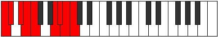

# Mode Kydyllic

## Links

- [Documentation](README.md)
- [Scales Index](Scales.md)
- [Modes Index](Modes.md)
- [Chords Index](Chords.md)

## Parent Scale

[Aeoladyllic](ScaleAeoladyllic.md)

## Number

[3643](https://ianring.com/musictheory/scales/3643)

## Interval Pattern

1, 2, 1, 1, 4, 1, 1, 1

## Chord Pattern

## Perfection

- 5 Perfect notes
- 3 Perfect notes

## Perfection Profile

[false false true true true true true false]

## Permutations

| Tonic | Notes | Signature | Illustration | Audio |
|-------|-------|-----------|--------------|-------|
| [C](ModeCNaturalKydyllic.md) | **C**, **C#**, D#, E, F, A, A#, **B**, **C** | C |  | [midi](https://github.com/edipermadi/music/blob/main/docs/ModeCNaturalKydyllic.mid?raw=true) |
| [C#](ModeCSharpKydyllic.md) | **C#**, **D**, E, F, F#, A#, B, **C**, **C#** | C |  | [midi](https://github.com/edipermadi/music/blob/main/docs/ModeCSharpKydyllic.mid?raw=true) |
| [Db](ModeDFlatKydyllic.md) | **Db**, **D**, E, F, Gb, Bb, B, **C**, **Db** | C |  | [midi](https://github.com/edipermadi/music/blob/main/docs/ModeDFlatKydyllic.mid?raw=true) |
| [D](ModeDNaturalKydyllic.md) | **D**, **D#**, F, F#, G, B, C, **C#**, **D** | C |  | [midi](https://github.com/edipermadi/music/blob/main/docs/ModeDNaturalKydyllic.mid?raw=true) |
| [D#](ModeDSharpKydyllic.md) | **D#**, **E**, F#, G, G#, C, C#, **D**, **D#** | C |  | [midi](https://github.com/edipermadi/music/blob/main/docs/ModeDSharpKydyllic.mid?raw=true) |
| [Eb](ModeEFlatKydyllic.md) | **Eb**, **E**, Gb, G, Ab, C, Db, **D**, **Eb** | C |  | [midi](https://github.com/edipermadi/music/blob/main/docs/ModeEFlatKydyllic.mid?raw=true) |
| [E](ModeENaturalKydyllic.md) | **E**, **F**, G, G#, A, C#, D, **D#**, **E** | C |  | [midi](https://github.com/edipermadi/music/blob/main/docs/ModeENaturalKydyllic.mid?raw=true) |
| [F](ModeFNaturalKydyllic.md) | **F**, **F#**, G#, A, A#, D, D#, **E**, **F** | C |  | [midi](https://github.com/edipermadi/music/blob/main/docs/ModeFNaturalKydyllic.mid?raw=true) |
| [F#](ModeFSharpKydyllic.md) | **F#**, **G**, A, A#, B, D#, E, **F**, **F#** | C |  | [midi](https://github.com/edipermadi/music/blob/main/docs/ModeFSharpKydyllic.mid?raw=true) |
| [Gb](ModeGFlatKydyllic.md) | **Gb**, **G**, A, Bb, B, Eb, E, **F**, **Gb** | C |  | [midi](https://github.com/edipermadi/music/blob/main/docs/ModeGFlatKydyllic.mid?raw=true) |
| [G](ModeGNaturalKydyllic.md) | **G**, **G#**, A#, B, C, E, F, **F#**, **G** | C |  | [midi](https://github.com/edipermadi/music/blob/main/docs/ModeGNaturalKydyllic.mid?raw=true) |
| [G#](ModeGSharpKydyllic.md) | **G#**, **A**, B, C, C#, F, F#, **G**, **G#** | C |  | [midi](https://github.com/edipermadi/music/blob/main/docs/ModeGSharpKydyllic.mid?raw=true) |
| [Ab](ModeAFlatKydyllic.md) | **Ab**, **A**, B, C, Db, F, Gb, **G**, **Ab** | C |  | [midi](https://github.com/edipermadi/music/blob/main/docs/ModeAFlatKydyllic.mid?raw=true) |
| [A](ModeANaturalKydyllic.md) | **A**, **A#**, C, C#, D, F#, G, **G#**, **A** | C |  | [midi](https://github.com/edipermadi/music/blob/main/docs/ModeANaturalKydyllic.mid?raw=true) |
| [A#](ModeASharpKydyllic.md) | **A#**, **B**, C#, D, D#, G, G#, **A**, **A#** | C |  | [midi](https://github.com/edipermadi/music/blob/main/docs/ModeASharpKydyllic.mid?raw=true) |
| [Bb](ModeBFlatKydyllic.md) | **Bb**, **B**, Db, D, Eb, G, Ab, **A**, **Bb** | C |  | [midi](https://github.com/edipermadi/music/blob/main/docs/ModeBFlatKydyllic.mid?raw=true) |
| [B](ModeBNaturalKydyllic.md) | **B**, **C**, D, D#, E, G#, A, **A#**, **B** | C |  | [midi](https://github.com/edipermadi/music/blob/main/docs/ModeBNaturalKydyllic.mid?raw=true) |
