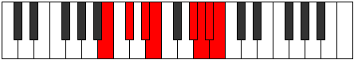

# Mode Kygian

## Links

- [Documentation](README.md)
- [Scales Index](Scales.md)
- [Modes Index](Modes.md)
- [Chords Index](Chords.md)

## Parent Scale

[Zogian](ScaleZogian.md)

## Number

[3637](https://ianring.com/musictheory/scales/3637)

## Transposition

2, 2, 1, 4, 1, 1, 1

## Chord Pattern

vi⁰b3, vi⁰b3, vii⁰

## Perfection

- 5 Perfect notes
- 2 Perfect notes

## Perfection Profile

[false true true true true true false]

## Permutations

| Tonic | Notes | Signature | Illustration | Audio |
|-------|-------|-----------|--------------|-------|
| [C](ModeCNaturalKygian.md) | **C**, D, E, F, G##, A#, **B**, **C** | C |  | [midi](https://github.com/edipermadi/music/blob/main/docs/ModeCNaturalKygian.mid?raw=true) |
| [C#](ModeCSharpKygian.md) | **C#**, D#, E#, F#, G###, A##, **B#**, **C#** | C |  | [midi](https://github.com/edipermadi/music/blob/main/docs/ModeCSharpKygian.mid?raw=true) |
| [Db](ModeDFlatKygian.md) | **Db**, Eb, F, Gb, A#, B, **C**, **Db** | C |  | [midi](https://github.com/edipermadi/music/blob/main/docs/ModeDFlatKygian.mid?raw=true) |
| [D](ModeDNaturalKygian.md) | **D**, E, F#, G, A##, B#, **C#**, **D** | C |  | [midi](https://github.com/edipermadi/music/blob/main/docs/ModeDNaturalKygian.mid?raw=true) |
| [D#](ModeDSharpKygian.md) | **D#**, E#, F##, G#, A###, B##, **C##**, **D#** | C |  | [midi](https://github.com/edipermadi/music/blob/main/docs/ModeDSharpKygian.mid?raw=true) |
| [Eb](ModeEFlatKygian.md) | **Eb**, F, G, Ab, B#, C#, **D**, **Eb** | C |  | [midi](https://github.com/edipermadi/music/blob/main/docs/ModeEFlatKygian.mid?raw=true) |
| [E](ModeENaturalKygian.md) | **E**, F#, G#, A, B##, C##, **D#**, **E** | C |  | [midi](https://github.com/edipermadi/music/blob/main/docs/ModeENaturalKygian.mid?raw=true) |
| [F](ModeFNaturalKygian.md) | **F**, G, A, Bb, C##, D#, **E**, **F** | C |  | [midi](https://github.com/edipermadi/music/blob/main/docs/ModeFNaturalKygian.mid?raw=true) |
| [F#](ModeFSharpKygian.md) | **F#**, G#, A#, B, C###, D##, **E#**, **F#** | C |  | [midi](https://github.com/edipermadi/music/blob/main/docs/ModeFSharpKygian.mid?raw=true) |
| [Gb](ModeGFlatKygian.md) | **Gb**, Ab, Bb, Cb, D#, E, **F**, **Gb** | C |  | [midi](https://github.com/edipermadi/music/blob/main/docs/ModeGFlatKygian.mid?raw=true) |
| [G](ModeGNaturalKygian.md) | **G**, A, B, C, D##, E#, **F#**, **G** | C |  | [midi](https://github.com/edipermadi/music/blob/main/docs/ModeGNaturalKygian.mid?raw=true) |
| [G#](ModeGSharpKygian.md) | **G#**, A#, B#, C#, D###, E##, **F##**, **G#** | C |  | [midi](https://github.com/edipermadi/music/blob/main/docs/ModeGSharpKygian.mid?raw=true) |
| [Ab](ModeAFlatKygian.md) | **Ab**, Bb, C, Db, E#, F#, **G**, **Ab** | C |  | [midi](https://github.com/edipermadi/music/blob/main/docs/ModeAFlatKygian.mid?raw=true) |
| [A](ModeANaturalKygian.md) | **A**, B, C#, D, E##, F##, **G#**, **A** | C |  | [midi](https://github.com/edipermadi/music/blob/main/docs/ModeANaturalKygian.mid?raw=true) |
| [A#](ModeASharpKygian.md) | **A#**, B#, C##, D#, E###, F###, **G##**, **A#** | C |  | [midi](https://github.com/edipermadi/music/blob/main/docs/ModeASharpKygian.mid?raw=true) |
| [Bb](ModeBFlatKygian.md) | **Bb**, C, D, Eb, F##, G#, **A**, **Bb** | C |  | [midi](https://github.com/edipermadi/music/blob/main/docs/ModeBFlatKygian.mid?raw=true) |
| [B](ModeBNaturalKygian.md) | **B**, C#, D#, E, F###, G##, **A#**, **B** | C |  | [midi](https://github.com/edipermadi/music/blob/main/docs/ModeBNaturalKygian.mid?raw=true) |
