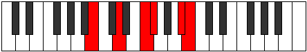

# Mode Kygitonic

## Links

- [Documentation](index.md)
- [Scales Index](Scales.md)
- [Modes Index](Modes.md)
- [Chords Index](Chords.md)

## Parent Scale

[Lycritonic](ScaleLycritonic.md)

## Number

[2249](https://ianring.com/musictheory/scales/2249)

## Perfection

- 2 Perfect notes
- 3 Perfect notes

## Perfection Profile

[true false false false true]

## Permutations

| Tonic | Notes | Signature | Illustration | Audio |
|-------|-------|-----------|--------------|-------|
| [C](ModeCNaturalKygitonic.md) | C, **D#**, **F#**, **G**, B, C | C |  | [midi](ModeCNaturalKygitonic.mid) [ogg](ModeCNaturalKygitonic.ogg) |
| [C#](ModeCSharpKygitonic.md) | C#, **E**, **G**, **G#**, C, C# | C |  | [midi](ModeCSharpKygitonic.mid) [ogg](ModeCSharpKygitonic.ogg) |
| [Db](ModeDFlatKygitonic.md) | Db, **E**, **G**, **Ab**, C, Db | C |  | [midi](ModeDFlatKygitonic.mid) [ogg](ModeDFlatKygitonic.ogg) |
| [D](ModeDNaturalKygitonic.md) | D, **F**, **G#**, **A**, C#, D | C |  | [midi](ModeDNaturalKygitonic.mid) [ogg](ModeDNaturalKygitonic.ogg) |
| [D#](ModeDSharpKygitonic.md) | D#, **F#**, **A**, **A#**, D, D# | C |  | [midi](ModeDSharpKygitonic.mid) [ogg](ModeDSharpKygitonic.ogg) |
| [Eb](ModeEFlatKygitonic.md) | Eb, **Gb**, **A**, **Bb**, D, Eb | C |  | [midi](ModeEFlatKygitonic.mid) [ogg](ModeEFlatKygitonic.ogg) |
| [E](ModeENaturalKygitonic.md) | E, **G**, **A#**, **B**, D#, E | C |  | [midi](ModeENaturalKygitonic.mid) [ogg](ModeENaturalKygitonic.ogg) |
| [F](ModeFNaturalKygitonic.md) | F, **G#**, **B**, **C**, E, F | C |  | [midi](ModeFNaturalKygitonic.mid) [ogg](ModeFNaturalKygitonic.ogg) |
| [F#](ModeFSharpKygitonic.md) | F#, **A**, **C**, **C#**, F, F# | C |  | [midi](ModeFSharpKygitonic.mid) [ogg](ModeFSharpKygitonic.ogg) |
| [Gb](ModeGFlatKygitonic.md) | Gb, **A**, **C**, **Db**, F, Gb | C |  | [midi](ModeGFlatKygitonic.mid) [ogg](ModeGFlatKygitonic.ogg) |
| [G](ModeGNaturalKygitonic.md) | G, **A#**, **C#**, **D**, F#, G | C |  | [midi](ModeGNaturalKygitonic.mid) [ogg](ModeGNaturalKygitonic.ogg) |
| [G#](ModeGSharpKygitonic.md) | G#, **B**, **D**, **D#**, G, G# | C |  | [midi](ModeGSharpKygitonic.mid) [ogg](ModeGSharpKygitonic.ogg) |
| [Ab](ModeAFlatKygitonic.md) | Ab, **B**, **D**, **Eb**, G, Ab | C |  | [midi](ModeAFlatKygitonic.mid) [ogg](ModeAFlatKygitonic.ogg) |
| [A](ModeANaturalKygitonic.md) | A, **C**, **D#**, **E**, G#, A | C |  | [midi](ModeANaturalKygitonic.mid) [ogg](ModeANaturalKygitonic.ogg) |
| [A#](ModeASharpKygitonic.md) | A#, **C#**, **E**, **F**, A, A# | C |  | [midi](ModeASharpKygitonic.mid) [ogg](ModeASharpKygitonic.ogg) |
| [Bb](ModeBFlatKygitonic.md) | Bb, **Db**, **E**, **F**, A, Bb | C |  | [midi](ModeBFlatKygitonic.mid) [ogg](ModeBFlatKygitonic.ogg) |
| [B](ModeBNaturalKygitonic.md) | B, **D**, **F**, **F#**, A#, B | C |  | [midi](ModeBNaturalKygitonic.mid) [ogg](ModeBNaturalKygitonic.ogg) |
