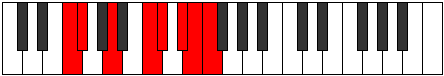

# Mode Kylian

## Links

- [Documentation](index.md)
- [Scales Index](Scales.md)
- [Modes Index](Modes.md)
- [Chords Index](Chords.md)

## Parent Scale

[Epagian](ScaleEpagian.md)

## Number

[3475](https://ianring.com/musictheory/scales/3475)

## Perfection

- 3 Perfect notes
- 4 Perfect notes

## Perfection Profile

[true true true false false false false]

## Permutations

| Tonic | Notes | Signature | Illustration | Audio |
|-------|-------|-----------|--------------|-------|
| [C](ModeCNaturalKylian.md) | C, Db, E, **F##**, **G#**, **A#**, **B**, C | C |  | [midi](ModeCNaturalKylian.mid) [ogg](ModeCNaturalKylian.ogg) |
| [C#](ModeCSharpKylian.md) | C#, D, E#, **F###**, **G##**, **A##**, **B#**, C# | C |  | [midi](ModeCSharpKylian.mid) [ogg](ModeCSharpKylian.ogg) |
| [Db](ModeDFlatKylian.md) | Db, Ebb, F, **G#**, **A**, **B**, **C**, Db | C |  | [midi](ModeDFlatKylian.mid) [ogg](ModeDFlatKylian.ogg) |
| [D](ModeDNaturalKylian.md) | D, Eb, F#, **G##**, **A#**, **B#**, **C#**, D | C |  | [midi](ModeDNaturalKylian.mid) [ogg](ModeDNaturalKylian.ogg) |
| [D#](ModeDSharpKylian.md) | D#, E, F##, **G###**, **A##**, **B##**, **C##**, D# | C |  | [midi](ModeDSharpKylian.mid) [ogg](ModeDSharpKylian.ogg) |
| [Eb](ModeEFlatKylian.md) | Eb, Fb, G, **A#**, **B**, **C#**, **D**, Eb | C |  | [midi](ModeEFlatKylian.mid) [ogg](ModeEFlatKylian.ogg) |
| [E](ModeENaturalKylian.md) | E, F, G#, **A##**, **B#**, **C##**, **D#**, E | C |  | [midi](ModeENaturalKylian.mid) [ogg](ModeENaturalKylian.ogg) |
| [F](ModeFNaturalKylian.md) | F, Gb, A, **B#**, **C#**, **D#**, **E**, F | C |  | [midi](ModeFNaturalKylian.mid) [ogg](ModeFNaturalKylian.ogg) |
| [F#](ModeFSharpKylian.md) | F#, G, A#, **B##**, **C##**, **D##**, **E#**, F# | C |  | [midi](ModeFSharpKylian.mid) [ogg](ModeFSharpKylian.ogg) |
| [Gb](ModeGFlatKylian.md) | Gb, Abb, Bb, **C#**, **D**, **E**, **F**, Gb | C |  | [midi](ModeGFlatKylian.mid) [ogg](ModeGFlatKylian.ogg) |
| [G](ModeGNaturalKylian.md) | G, Ab, B, **C##**, **D#**, **E#**, **F#**, G | C |  | [midi](ModeGNaturalKylian.mid) [ogg](ModeGNaturalKylian.ogg) |
| [G#](ModeGSharpKylian.md) | G#, A, B#, **C###**, **D##**, **E##**, **F##**, G# | C |  | [midi](ModeGSharpKylian.mid) [ogg](ModeGSharpKylian.ogg) |
| [Ab](ModeAFlatKylian.md) | Ab, Bbb, C, **D#**, **E**, **F#**, **G**, Ab | C |  | [midi](ModeAFlatKylian.mid) [ogg](ModeAFlatKylian.ogg) |
| [A](ModeANaturalKylian.md) | A, Bb, C#, **D##**, **E#**, **F##**, **G#**, A | C |  | [midi](ModeANaturalKylian.mid) [ogg](ModeANaturalKylian.ogg) |
| [A#](ModeASharpKylian.md) | A#, B, C##, **D###**, **E##**, **F###**, **G##**, A# | C |  | [midi](ModeASharpKylian.mid) [ogg](ModeASharpKylian.ogg) |
| [Bb](ModeBFlatKylian.md) | Bb, Cb, D, **E#**, **F#**, **G#**, **A**, Bb | C |  | [midi](ModeBFlatKylian.mid) [ogg](ModeBFlatKylian.ogg) |
| [B](ModeBNaturalKylian.md) | B, C, D#, **E##**, **F##**, **G##**, **A#**, B | C |  | [midi](ModeBNaturalKylian.mid) [ogg](ModeBNaturalKylian.ogg) |
