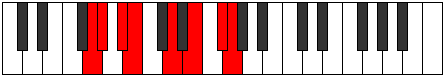

# Mode Kynian

## Links

- [Documentation](index.md)
- [Scales Index](Scales.md)
- [Modes Index](Modes.md)
- [Chords Index](Chords.md)

## Parent Scale

[Epacrian](ScaleEpacrian.md)

## Number

[2715](https://ianring.com/musictheory/scales/2715)

## Perfection

- 3 Perfect notes
- 4 Perfect notes

## Perfection Profile

[true false false true false true false]

## Permutations

| Tonic | Notes | Signature | Illustration | Audio |
|-------|-------|-----------|--------------|-------|
| [C](ModeCNaturalKynian.md) | C, **Db**, **Eb**, Fb, **G**, A, **B**, C | C |  | [midi](ModeCNaturalKynian.mid) [ogg](ModeCNaturalKynian.ogg) |
| [C#](ModeCSharpKynian.md) | C#, **D**, **E**, F, **G#**, A#, **B#**, C# | C |  | [midi](ModeCSharpKynian.mid) [ogg](ModeCSharpKynian.ogg) |
| [Db](ModeDFlatKynian.md) | Db, **Ebb**, **Fb**, Gbb, **Ab**, Bb, **C**, Db | C |  | [midi](ModeDFlatKynian.mid) [ogg](ModeDFlatKynian.ogg) |
| [D](ModeDNaturalKynian.md) | D, **Eb**, **F**, Gb, **A**, B, **C#**, D | C |  | [midi](ModeDNaturalKynian.mid) [ogg](ModeDNaturalKynian.ogg) |
| [D#](ModeDSharpKynian.md) | D#, **E**, **F#**, G, **A#**, B#, **C##**, D# | C |  | [midi](ModeDSharpKynian.mid) [ogg](ModeDSharpKynian.ogg) |
| [Eb](ModeEFlatKynian.md) | Eb, **Fb**, **Gb**, Abb, **Bb**, C, **D**, Eb | C |  | [midi](ModeEFlatKynian.mid) [ogg](ModeEFlatKynian.ogg) |
| [E](ModeENaturalKynian.md) | E, **F**, **G**, Ab, **B**, C#, **D#**, E | C |  | [midi](ModeENaturalKynian.mid) [ogg](ModeENaturalKynian.ogg) |
| [F](ModeFNaturalKynian.md) | F, **Gb**, **Ab**, Bbb, **C**, D, **E**, F | C |  | [midi](ModeFNaturalKynian.mid) [ogg](ModeFNaturalKynian.ogg) |
| [F#](ModeFSharpKynian.md) | F#, **G**, **A**, Bb, **C#**, D#, **E#**, F# | C |  | [midi](ModeFSharpKynian.mid) [ogg](ModeFSharpKynian.ogg) |
| [Gb](ModeGFlatKynian.md) | Gb, **Abb**, **Bbb**, Cbb, **Db**, Eb, **F**, Gb | C |  | [midi](ModeGFlatKynian.mid) [ogg](ModeGFlatKynian.ogg) |
| [G](ModeGNaturalKynian.md) | G, **Ab**, **Bb**, Cb, **D**, E, **F#**, G | C |  | [midi](ModeGNaturalKynian.mid) [ogg](ModeGNaturalKynian.ogg) |
| [G#](ModeGSharpKynian.md) | G#, **A**, **B**, C, **D#**, E#, **F##**, G# | C |  | [midi](ModeGSharpKynian.mid) [ogg](ModeGSharpKynian.ogg) |
| [Ab](ModeAFlatKynian.md) | Ab, **Bbb**, **Cb**, Dbb, **Eb**, F, **G**, Ab | C |  | [midi](ModeAFlatKynian.mid) [ogg](ModeAFlatKynian.ogg) |
| [A](ModeANaturalKynian.md) | A, **Bb**, **C**, Db, **E**, F#, **G#**, A | C |  | [midi](ModeANaturalKynian.mid) [ogg](ModeANaturalKynian.ogg) |
| [A#](ModeASharpKynian.md) | A#, **B**, **C#**, D, **E#**, F##, **G##**, A# | C |  | [midi](ModeASharpKynian.mid) [ogg](ModeASharpKynian.ogg) |
| [Bb](ModeBFlatKynian.md) | Bb, **Cb**, **Db**, Ebb, **F**, G, **A**, Bb | C |  | [midi](ModeBFlatKynian.mid) [ogg](ModeBFlatKynian.ogg) |
| [B](ModeBNaturalKynian.md) | B, **C**, **D**, Eb, **F#**, G#, **A#**, B | C |  | [midi](ModeBNaturalKynian.mid) [ogg](ModeBNaturalKynian.ogg) |
