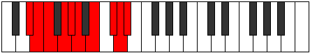

# Mode Kynygic

## Links

- [Documentation](README.md)
- [Scales Index](Scales.md)
- [Modes Index](Modes.md)
- [Chords Index](Chords.md)

## Parent Scale

[Kaptygic](ScaleKaptygic.md)

## Number

[3447](https://ianring.com/musictheory/scales/3447)

## Transposition

1, 1, 2, 1, 1, 2, 2, 1, 1

## Chord Pattern

iii⁰, iv⁰b3, v⁰, VIb5, VIb5

## Perfection

- 6 Perfect notes
- 3 Perfect notes

## Perfection Profile

[false true false true true true false true true]

## Permutations

| Tonic | Notes | Signature | Illustration | Audio |
|-------|-------|-----------|--------------|-------|
| [C](ModeCNaturalKynygic.md) | **C**, C#, **D**, E, F, F#, **G#**, A#, B, **C** | C |  | [midi](https://github.com/edipermadi/music/blob/main/docs/ModeCNaturalKynygic.mid?raw=true) |
| [C#](ModeCSharpKynygic.md) | **C#**, D, **D#**, F, F#, G, **A**, B, C, **C#** | C |  | [midi](https://github.com/edipermadi/music/blob/main/docs/ModeCSharpKynygic.mid?raw=true) |
| [Db](ModeDFlatKynygic.md) | **Db**, D, **Eb**, F, Gb, G, **A**, B, C, **Db** | C |  | [midi](https://github.com/edipermadi/music/blob/main/docs/ModeDFlatKynygic.mid?raw=true) |
| [D](ModeDNaturalKynygic.md) | **D**, D#, **E**, F#, G, G#, **A#**, C, C#, **D** | C |  | [midi](https://github.com/edipermadi/music/blob/main/docs/ModeDNaturalKynygic.mid?raw=true) |
| [D#](ModeDSharpKynygic.md) | **D#**, E, **F**, G, G#, A, **B**, C#, D, **D#** | C |  | [midi](https://github.com/edipermadi/music/blob/main/docs/ModeDSharpKynygic.mid?raw=true) |
| [Eb](ModeEFlatKynygic.md) | **Eb**, E, **F**, G, Ab, A, **B**, Db, D, **Eb** | C |  | [midi](https://github.com/edipermadi/music/blob/main/docs/ModeEFlatKynygic.mid?raw=true) |
| [E](ModeENaturalKynygic.md) | **E**, F, **F#**, G#, A, A#, **C**, D, D#, **E** | C |  | [midi](https://github.com/edipermadi/music/blob/main/docs/ModeENaturalKynygic.mid?raw=true) |
| [F](ModeFNaturalKynygic.md) | **F**, F#, **G**, A, A#, B, **C#**, D#, E, **F** | C |  | [midi](https://github.com/edipermadi/music/blob/main/docs/ModeFNaturalKynygic.mid?raw=true) |
| [F#](ModeFSharpKynygic.md) | **F#**, G, **G#**, A#, B, C, **D**, E, F, **F#** | C |  | [midi](https://github.com/edipermadi/music/blob/main/docs/ModeFSharpKynygic.mid?raw=true) |
| [Gb](ModeGFlatKynygic.md) | **Gb**, G, **Ab**, Bb, B, C, **D**, E, F, **Gb** | C |  | [midi](https://github.com/edipermadi/music/blob/main/docs/ModeGFlatKynygic.mid?raw=true) |
| [G](ModeGNaturalKynygic.md) | **G**, G#, **A**, B, C, C#, **D#**, F, F#, **G** | C |  | [midi](https://github.com/edipermadi/music/blob/main/docs/ModeGNaturalKynygic.mid?raw=true) |
| [G#](ModeGSharpKynygic.md) | **G#**, A, **A#**, C, C#, D, **E**, F#, G, **G#** | C |  | [midi](https://github.com/edipermadi/music/blob/main/docs/ModeGSharpKynygic.mid?raw=true) |
| [Ab](ModeAFlatKynygic.md) | **Ab**, A, **Bb**, C, Db, D, **E**, Gb, G, **Ab** | C |  | [midi](https://github.com/edipermadi/music/blob/main/docs/ModeAFlatKynygic.mid?raw=true) |
| [A](ModeANaturalKynygic.md) | **A**, A#, **B**, C#, D, D#, **F**, G, G#, **A** | C |  | [midi](https://github.com/edipermadi/music/blob/main/docs/ModeANaturalKynygic.mid?raw=true) |
| [A#](ModeASharpKynygic.md) | **A#**, B, **C**, D, D#, E, **F#**, G#, A, **A#** | C |  | [midi](https://github.com/edipermadi/music/blob/main/docs/ModeASharpKynygic.mid?raw=true) |
| [Bb](ModeBFlatKynygic.md) | **Bb**, B, **C**, D, Eb, E, **Gb**, Ab, A, **Bb** | C |  | [midi](https://github.com/edipermadi/music/blob/main/docs/ModeBFlatKynygic.mid?raw=true) |
| [B](ModeBNaturalKynygic.md) | **B**, C, **C#**, D#, E, F, **G**, A, A#, **B** | C |  | [midi](https://github.com/edipermadi/music/blob/main/docs/ModeBNaturalKynygic.mid?raw=true) |
