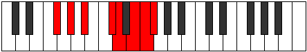

# Mode Kyptian

## Links

- [Documentation](index.md)
- [Scales Index](Scales.md)
- [Modes Index](Modes.md)
- [Chords Index](Chords.md)

## Parent Scale

[Ionanian](ScaleIonanian.md)

## Number

[3477](https://ianring.com/musictheory/scales/3477)

## Perfection

- 3 Perfect notes
- 4 Perfect notes

## Perfection Profile

[true false true true false false false]

## Permutations

| Tonic | Notes | Signature | Illustration | Audio |
|-------|-------|-----------|--------------|-------|
| [C](ModeCNaturalKyptian.md) | C, **D**, E, F##, **G#**, **A#**, **B**, C | C |  | [midi](ModeCNaturalKyptian.mid) [ogg](ModeCNaturalKyptian.ogg) |
| [C#](ModeCSharpKyptian.md) | C#, **D#**, E#, F###, **G##**, **A##**, **B#**, C# | C |  | [midi](ModeCSharpKyptian.mid) [ogg](ModeCSharpKyptian.ogg) |
| [Db](ModeDFlatKyptian.md) | Db, **Eb**, F, G#, **A**, **B**, **C**, Db | C |  | [midi](ModeDFlatKyptian.mid) [ogg](ModeDFlatKyptian.ogg) |
| [D](ModeDNaturalKyptian.md) | D, **E**, F#, G##, **A#**, **B#**, **C#**, D | C |  | [midi](ModeDNaturalKyptian.mid) [ogg](ModeDNaturalKyptian.ogg) |
| [D#](ModeDSharpKyptian.md) | D#, **E#**, F##, G###, **A##**, **B##**, **C##**, D# | C |  | [midi](ModeDSharpKyptian.mid) [ogg](ModeDSharpKyptian.ogg) |
| [Eb](ModeEFlatKyptian.md) | Eb, **F**, G, A#, **B**, **C#**, **D**, Eb | C |  | [midi](ModeEFlatKyptian.mid) [ogg](ModeEFlatKyptian.ogg) |
| [E](ModeENaturalKyptian.md) | E, **F#**, G#, A##, **B#**, **C##**, **D#**, E | C |  | [midi](ModeENaturalKyptian.mid) [ogg](ModeENaturalKyptian.ogg) |
| [F](ModeFNaturalKyptian.md) | F, **G**, A, B#, **C#**, **D#**, **E**, F | C |  | [midi](ModeFNaturalKyptian.mid) [ogg](ModeFNaturalKyptian.ogg) |
| [F#](ModeFSharpKyptian.md) | F#, **G#**, A#, B##, **C##**, **D##**, **E#**, F# | C |  | [midi](ModeFSharpKyptian.mid) [ogg](ModeFSharpKyptian.ogg) |
| [Gb](ModeGFlatKyptian.md) | Gb, **Ab**, Bb, C#, **D**, **E**, **F**, Gb | C |  | [midi](ModeGFlatKyptian.mid) [ogg](ModeGFlatKyptian.ogg) |
| [G](ModeGNaturalKyptian.md) | G, **A**, B, C##, **D#**, **E#**, **F#**, G | C |  | [midi](ModeGNaturalKyptian.mid) [ogg](ModeGNaturalKyptian.ogg) |
| [G#](ModeGSharpKyptian.md) | G#, **A#**, B#, C###, **D##**, **E##**, **F##**, G# | C |  | [midi](ModeGSharpKyptian.mid) [ogg](ModeGSharpKyptian.ogg) |
| [Ab](ModeAFlatKyptian.md) | Ab, **Bb**, C, D#, **E**, **F#**, **G**, Ab | C |  | [midi](ModeAFlatKyptian.mid) [ogg](ModeAFlatKyptian.ogg) |
| [A](ModeANaturalKyptian.md) | A, **B**, C#, D##, **E#**, **F##**, **G#**, A | C |  | [midi](ModeANaturalKyptian.mid) [ogg](ModeANaturalKyptian.ogg) |
| [A#](ModeASharpKyptian.md) | A#, **B#**, C##, D###, **E##**, **F###**, **G##**, A# | C |  | [midi](ModeASharpKyptian.mid) [ogg](ModeASharpKyptian.ogg) |
| [Bb](ModeBFlatKyptian.md) | Bb, **C**, D, E#, **F#**, **G#**, **A**, Bb | C |  | [midi](ModeBFlatKyptian.mid) [ogg](ModeBFlatKyptian.ogg) |
| [B](ModeBNaturalKyptian.md) | B, **C#**, D#, E##, **F##**, **G##**, **A#**, B | C |  | [midi](ModeBNaturalKyptian.mid) [ogg](ModeBNaturalKyptian.ogg) |
