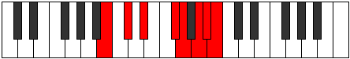

# Mode Kyptian

## Links

- [Documentation](README.md)
- [Scales Index](Scales.md)
- [Modes Index](Modes.md)
- [Chords Index](Chords.md)

## Parent Scale

[Ionanian](ScaleIonanian.md)

## Number

[3477](https://ianring.com/musictheory/scales/3477)

## Transposition

2, 2, 3, 1, 2, 1, 1

## Chord Pattern

I⁺, III, v⁰, vi⁰b3

## Perfection

- 3 Perfect notes
- 4 Perfect notes

## Perfection Profile

true, false, true, true, false, false, false

## Permutations

| Tonic | Notes | Signature | Illustration | Audio |
|-------|-------|-----------|--------------|-------|
| [C](ModeCNaturalKyptian.md) | C, **D**, E, F##, **G#**, **A#**, **B**, C | C |  | [midi](https://github.com/edipermadi/music/blob/main/docs/ModeCNaturalKyptian.mid?raw=true) |
| [C#](ModeCSharpKyptian.md) | C#, **D#**, E#, F###, **G##**, **A##**, **B#**, C# | C |  | [midi](https://github.com/edipermadi/music/blob/main/docs/ModeCSharpKyptian.mid?raw=true) |
| [Db](ModeDFlatKyptian.md) | Db, **Eb**, F, G#, **A**, **B**, **C**, Db | C |  | [midi](https://github.com/edipermadi/music/blob/main/docs/ModeDFlatKyptian.mid?raw=true) |
| [D](ModeDNaturalKyptian.md) | D, **E**, F#, G##, **A#**, **B#**, **C#**, D | C |  | [midi](https://github.com/edipermadi/music/blob/main/docs/ModeDNaturalKyptian.mid?raw=true) |
| [D#](ModeDSharpKyptian.md) | D#, **E#**, F##, G###, **A##**, **B##**, **C##**, D# | C |  | [midi](https://github.com/edipermadi/music/blob/main/docs/ModeDSharpKyptian.mid?raw=true) |
| [Eb](ModeEFlatKyptian.md) | Eb, **F**, G, A#, **B**, **C#**, **D**, Eb | C |  | [midi](https://github.com/edipermadi/music/blob/main/docs/ModeEFlatKyptian.mid?raw=true) |
| [E](ModeENaturalKyptian.md) | E, **F#**, G#, A##, **B#**, **C##**, **D#**, E | C |  | [midi](https://github.com/edipermadi/music/blob/main/docs/ModeENaturalKyptian.mid?raw=true) |
| [F](ModeFNaturalKyptian.md) | F, **G**, A, B#, **C#**, **D#**, **E**, F | C |  | [midi](https://github.com/edipermadi/music/blob/main/docs/ModeFNaturalKyptian.mid?raw=true) |
| [F#](ModeFSharpKyptian.md) | F#, **G#**, A#, B##, **C##**, **D##**, **E#**, F# | C |  | [midi](https://github.com/edipermadi/music/blob/main/docs/ModeFSharpKyptian.mid?raw=true) |
| [Gb](ModeGFlatKyptian.md) | Gb, **Ab**, Bb, C#, **D**, **E**, **F**, Gb | C |  | [midi](https://github.com/edipermadi/music/blob/main/docs/ModeGFlatKyptian.mid?raw=true) |
| [G](ModeGNaturalKyptian.md) | G, **A**, B, C##, **D#**, **E#**, **F#**, G | C |  | [midi](https://github.com/edipermadi/music/blob/main/docs/ModeGNaturalKyptian.mid?raw=true) |
| [G#](ModeGSharpKyptian.md) | G#, **A#**, B#, C###, **D##**, **E##**, **F##**, G# | C |  | [midi](https://github.com/edipermadi/music/blob/main/docs/ModeGSharpKyptian.mid?raw=true) |
| [Ab](ModeAFlatKyptian.md) | Ab, **Bb**, C, D#, **E**, **F#**, **G**, Ab | C |  | [midi](https://github.com/edipermadi/music/blob/main/docs/ModeAFlatKyptian.mid?raw=true) |
| [A](ModeANaturalKyptian.md) | A, **B**, C#, D##, **E#**, **F##**, **G#**, A | C |  | [midi](https://github.com/edipermadi/music/blob/main/docs/ModeANaturalKyptian.mid?raw=true) |
| [A#](ModeASharpKyptian.md) | A#, **B#**, C##, D###, **E##**, **F###**, **G##**, A# | C |  | [midi](https://github.com/edipermadi/music/blob/main/docs/ModeASharpKyptian.mid?raw=true) |
| [Bb](ModeBFlatKyptian.md) | Bb, **C**, D, E#, **F#**, **G#**, **A**, Bb | C |  | [midi](https://github.com/edipermadi/music/blob/main/docs/ModeBFlatKyptian.mid?raw=true) |
| [B](ModeBNaturalKyptian.md) | B, **C#**, D#, E##, **F##**, **G##**, **A#**, B | C |  | [midi](https://github.com/edipermadi/music/blob/main/docs/ModeBNaturalKyptian.mid?raw=true) |
