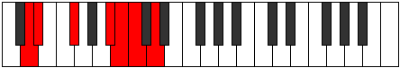

# Mode Kyptimic

## Links

- [Documentation](index.md)
- [Scales Index](Scales.md)
- [Modes Index](Modes.md)
- [Chords Index](Chords.md)

## Parent Scale

[Aerothimic](ScaleAerothimic.md)

## Number

[1811](https://ianring.com/musictheory/scales/1811)

## Perfection

- 2 Perfect notes
- 4 Perfect notes

## Perfection Profile

[false true false false true false]

## Permutations

| Tonic | Notes | Signature | Illustration | Audio |
|-------|-------|-----------|--------------|-------|
| [C](ModeCNaturalKyptimic.md) | **C**, Db, **E**, **F###**, G##, **A#**, **C** | C |  | [midi](ModeCNaturalKyptimic.mid) [ogg](ModeCNaturalKyptimic.ogg) |
| [C#](ModeCSharpKyptimic.md) | **C#**, D, **E#**, **Cbbb**, Cbb, **Dbbb**, **C#** | C |  | [midi](ModeCSharpKyptimic.mid) [ogg](ModeCSharpKyptimic.ogg) |
| [Db](ModeDFlatKyptimic.md) | **Db**, Ebb, **F**, **G##**, A#, **B**, **Db** | C |  | [midi](ModeDFlatKyptimic.mid) [ogg](ModeDFlatKyptimic.ogg) |
| [D](ModeDNaturalKyptimic.md) | **D**, Eb, **F#**, **G###**, A##, **B#**, **D** | C |  | [midi](ModeDNaturalKyptimic.mid) [ogg](ModeDNaturalKyptimic.ogg) |
| [D#](ModeDSharpKyptimic.md) | **D#**, E, **F##**, **Cb**, Dbb, **Ebbb**, **D#** | C |  | [midi](ModeDSharpKyptimic.mid) [ogg](ModeDSharpKyptimic.ogg) |
| [Eb](ModeEFlatKyptimic.md) | **Eb**, Fb, **G**, **A##**, B#, **C#**, **Eb** | C |  | [midi](ModeEFlatKyptimic.mid) [ogg](ModeEFlatKyptimic.ogg) |
| [E](ModeENaturalKyptimic.md) | **E**, F, **G#**, **A###**, B##, **C##**, **E** | C |  | [midi](ModeENaturalKyptimic.mid) [ogg](ModeENaturalKyptimic.ogg) |
| [F](ModeFNaturalKyptimic.md) | **F**, Gb, **A**, **B##**, C##, **D#**, **F** | C |  | [midi](ModeFNaturalKyptimic.mid) [ogg](ModeFNaturalKyptimic.ogg) |
| [F#](ModeFSharpKyptimic.md) | **F#**, G, **A#**, **B###**, C###, **D##**, **F#** | C |  | [midi](ModeFSharpKyptimic.mid) [ogg](ModeFSharpKyptimic.ogg) |
| [Gb](ModeGFlatKyptimic.md) | **Gb**, Abb, **Bb**, **C##**, D#, **E**, **Gb** | C |  | [midi](ModeGFlatKyptimic.mid) [ogg](ModeGFlatKyptimic.ogg) |
| [G](ModeGNaturalKyptimic.md) | **G**, Ab, **B**, **C###**, D##, **E#**, **G** | C |  | [midi](ModeGNaturalKyptimic.mid) [ogg](ModeGNaturalKyptimic.ogg) |
| [G#](ModeGSharpKyptimic.md) | **G#**, A, **B#**, **D##**, E#, **F#**, **G#** | C |  | [midi](ModeGSharpKyptimic.mid) [ogg](ModeGSharpKyptimic.ogg) |
| [Ab](ModeAFlatKyptimic.md) | **Ab**, Bbb, **C**, **D##**, E#, **F#**, **Ab** | C |  | [midi](ModeAFlatKyptimic.mid) [ogg](ModeAFlatKyptimic.ogg) |
| [A](ModeANaturalKyptimic.md) | **A**, Bb, **C#**, **D###**, E##, **F##**, **A** | C |  | [midi](ModeANaturalKyptimic.mid) [ogg](ModeANaturalKyptimic.ogg) |
| [A#](ModeASharpKyptimic.md) | **A#**, B, **C##**, **E##**, F##, **G#**, **A#** | C |  | [midi](ModeASharpKyptimic.mid) [ogg](ModeASharpKyptimic.ogg) |
| [Bb](ModeBFlatKyptimic.md) | **Bb**, Cb, **D**, **E##**, F##, **G#**, **Bb** | C |  | [midi](ModeBFlatKyptimic.mid) [ogg](ModeBFlatKyptimic.ogg) |
| [B](ModeBNaturalKyptimic.md) | **B**, C, **D#**, **E###**, F###, **G##**, **B** | C |  | [midi](ModeBNaturalKyptimic.mid) [ogg](ModeBNaturalKyptimic.ogg) |
